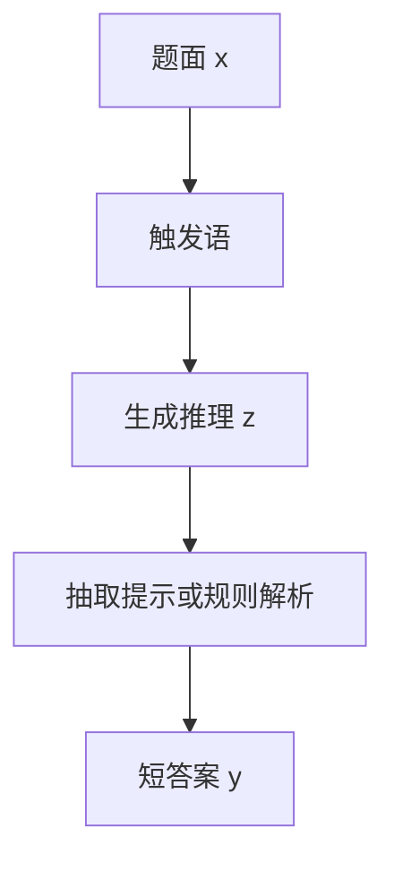

# Zero-shot CoT

不必提供带推理过程的示范，只需在答案前加上「让我们一步步思考」，就足以触发大模型写出中间步骤。

<footer>—— Kojima et al., Large Language Models are Zero-Shot Reasoners, NeurIPS 2022</footer>

[Wei 等人的思维链](/llm/chain-of-thought)依赖精心编写的少样本轨迹，每换一个任务就要重写示范。Kojima 等人问：触发逐步推理，是否必须看见同类题目的 $z$？他们发现，在题面后追加一句固定的英语指令——「Let's think step by step」——许多已指令化或足够大的模型会自发写出推理链，再从链上抽出答案。这就是零样本思维链（Zero-shot CoT）。它把 CoT 从「任务相关的示范工程」收成「一条与任务无关的触发语」，代价是失去对步骤粒度与格式的示范控制，抽取必须另做一轮或另加约束。

## 问题

少样本 CoT 的工程负担有三。一是示范要按任务写对中间量，写错一条会污染整个条件分布。二是每条 $z$ 很长，多任务系统难以在同一窗口里塞进所有领域的轨迹。三是示范会泄漏题型，评测增益里混进了「教会了这八题的写法」。若逐步推理已经存在于预训练分布里，真正缺的也许只是一个把模型从「直接答」模式推进「先写过程」模式的开关。

零样本触发要回答的不是「模型会不会算术」，而是「在没有同任务 $z$ 的条件下，一条短指令能否改变输出的 *形态*，使 $p(z,y\mid x)$ 被采样到」。若能，CoT 就不再绑定标注好的推理轨迹；若不能，则 Wei 的示范仍是必需品。Kojima 等人用同一句触发语扫过算术、符号、常识，说明形态切换在足够大的模型上是跨任务的。

### 直接答是默认模式

多数任务的训练与指令数据奖励短答案。不加触发时，模型倾向于输出一个数字、一个选项、一句结论。这不是因为中间计算不存在，而是因为解码从高似然的短回答开始。触发语的作用是把第一步 token 从「42」一类答案，改写成「首先…」一类过程词，从而进入逐步续写的盆地。小模型上这个盆地可能不存在：触发之后写出的是空洞的「让我们一步步思考」回声，随后仍是错答案。

中文场景不要迷信英文原句不可翻译。关键是触发 *逐步展开* 而不是触发某个固定字符串。但评测复现时应声明用的是原句还是译文：表面词会影响第一步 token，从而影响整条链。

## 方法

Kojima 等人的标准流程是两阶段。第一阶段：把题面与触发语拼接，生成推理文本 $z$（常含最终答案的自然语言形式）。第二阶段：把 $z$ 再送回模型，追问「Therefore, the answer is」一类抽取提示，让模型吐出短 $y$。两阶段是为了解耦「写过程」和「收束答案」：单次生成里，$y$ 可能埋在段落中、或与过程矛盾。线上系统可以把第二阶段换成规则解析（最后一个数字、boxed 跨度），不必再付一次完整前向。

触发语是超参。原论文比较了多条零样本指令，「Let's think step by step」在当时的模型上最稳。后来的系统把类似句子写进系统提示或聊天模板，与用户题面分离。不要把触发语和系统人设混成一团：人设管语气与拒答，触发语管是否展开 $z$。两者叠在一起时，应确认模型仍先写步骤再答，而不是先答再事后合理化。

### 两阶段：先写过程再抽答案

第一阶段应用较高的最大长度，否则 $z$ 被截断，第二阶段只能从残缺链里猜。温度在零样本 CoT 上通常偏低：没有多样本投票时，随机性只会让 $z$ 更散。若要多样性，应显式改走[自洽](/llm/self-consistency)，而不是把零样本单链的温度随便抬高。第二阶段必须 *只* 做抽取：提示里不要再引入新推理，否则会覆盖第一阶段已算对的中间量。把 $z$ 截断后只留最后几句再抽，是常见的省 token 办法，但若最终数字出现在中段会被漏掉。

与少样本 CoT 的接口差异在于：没有示范约束 $z$ 的编号、算式格式、收束句。因此解析器要更宽，或在触发语里额外加一句「最后用『答案：』标出」——这已经是零样本加格式约束，不再是纯触发。工程上往往值得加；论文对照则应分开报。

## 机制

触发语改变的是解码轨迹的起始方向。语言模型的条件分布在「问答」和「讲解」两个模式之间是可切换的；预训练语料里大量习题解答以「逐步」开头。短指令把质量推到讲解模式，后续 token 在该模式下对中间量建模。这不是从权重里「解锁」了一种新能力，而是选择了已有的生成模式。因此，若预训练与指令数据里几乎没有逐步解答，触发无效。

两阶段抽取承认 $z$ 不是结构化对象。自然语言过程对人类可读，对程序脆弱。第二阶段等于用同一个模型当解析器，把自由文本投影到答案空间。解析器也会错：它可能「总结」出 $z$ 里没有的数字。更稳的做法是在 $z$ 上跑确定性抽取，失败再回退到第二阶段。这与 PAL 把计算交给解释器是同一方向：能不用模型做的机械步骤，就不要再用一次采样。

零样本 CoT 的对照基线应是「同一模型、无触发、直接答」，而不是少样本 CoT。和 Wei 等人比的是 *要不要示范*，不是「零样本一定更强」。许多任务上 8-shot CoT 仍然更高，只是贵在写示范。

### 触发语与示范谁在起作用

把触发语叠在少样本 CoT 上，并不总是正增益。示范已经规定了步骤形态时，再加「一步步思考」可能只是多一句套话。反过来，零样本触发之后再给一条格式示例（不是完整领域轨迹），常常能稳住收束句，而不引入题型泄漏。这是中间形态：零样本负责启动 $z$，一条极短的格式示范负责抽取。评测要写清用了哪一层，否则「零样本」名不副实。

规模仍然关键。Kojima 等人同样看到小模型上触发之后过程空洞。指令微调改变了曲线：今天许多 7B 级聊天模型无需原句也能逐步写，因为 SFT 数据里充满了逐步解答。此时零样本 CoT 变成默认行为，真正的开关变成「是否要求短答」。产品上要区分「模型被训成了爱写过程」和「运行时追加了 Kojima 触发」。

## 边界与工程取舍

零样本 CoT 降低了示范成本，适合任务多、来不及写轨迹、或示范会污染评测的场景。它不提供搜索、不提供工具、不保证 $z$ 可执行。多跳事实仍会幻觉；算术仍可能在某步算错。需要稳定中间量时，少样本示范、[最小到最大](/llm/least-to-most) 分解、或 [PAL](/llm/pal-pot) 更合适。

触发语会与安全策略冲突：有的拒答模板要求先给短结论，与「先写长过程」对着干。也有模型把「一步步思考」写成对用户可见的内心独白，泄漏推理中的敏感假设。应在系统层决定 $z$ 是否展示。不要把零样本 CoT 写成「不用提示工程」：选哪一句触发、要不要第二阶段、如何解析，仍然是提示工程，只是从写八条轨迹变成调一条开关。

「Let's think step by step」不是魔法公式。换模型、换语言、换聊天模板后必须重测。把它写进默认系统提示之前，至少在目标任务上看直接答与触发后的准确率、长度与拒答率。

## 小结

- 零样本 CoT 用一条与任务无关的触发语，把输出从短答案推进逐步推理。
- 标准实现是两阶段：先生成 $z$，再抽取 $y$；抽取也可用规则代替第二次生成。
- 它不替代少样本示范：示范仍能控制粒度与格式，许多任务上仍然更强。
- 触发改变的是生成模式，不是新能力；小模型或缺少逐步语料时无效。
- 解析脆弱、无外部真值、无回溯，后续常接到自洽或工具形态上。
- 出处：Kojima et al., *Large Language Models are Zero-Shot Reasoners*, NeurIPS 2022。
