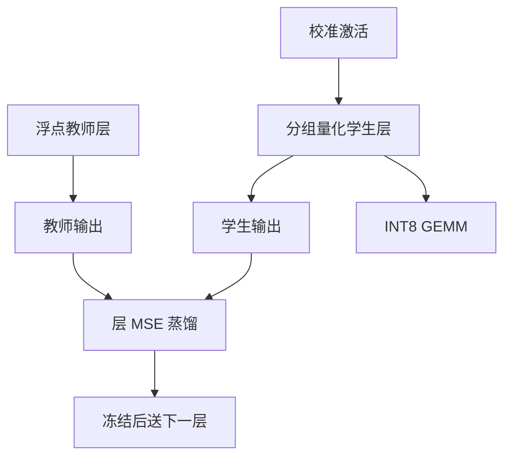

# ZeroQuant

    
大模型的训练数据往往拿不到，全网蒸馏又太贵；把权重量化到更细的分组，把激活按 token 各自取尺度，再逐层用教师输出当监督，PTQ 才能在百亿参数上买得起。

    <footer>—— Yao 等，ZeroQuant: Efficient and Affordable Post-Training Quantization for Large-Scale Transformers，NeurIPS 2022</footer>

Zhewei Yao、Reza Yazdani Aminabadi、Minjia Zhang、Xiaoxia Wu、Conglong Li 与 Yuxiong He（Microsoft DeepSpeed）的 NeurIPS 2022 论文（arXiv:2206.01861）是 GPT-3 量级 Transformer 上较早把 **W8A8 式 PTQ** 写成可负担流程的工作之一。时间上它与 [LLM.int8()](/llm/llm-int8) 同年，早于 [SmoothQuant](/llm/xiao-smoothquant) 的 ICML 版本。贡献有三块：**分组权重量化**、**逐 token 激活量化**、**层知识蒸馏（LKD）**——用原层当教师、量化层当学生，不访问原预训练语料。后续 ZeroQuant-V2、ZeroQuant-FP 不在本篇展开。原文没有解决后来被称为「涌现通道异常值」的全部精度问题，175B 上的整数激活路径因此被后作改写。

## 问题

2022 年能公开讨论的最大生成模型已经到 175B。FP16 权重三百多 GB，单节点装不下；decode 还要扫这些字节。QAT 要回传全网，数据与算力都「买不起」（标题里的 affordable）。朴素逐张量 INT8：权重尚可，激活被个别大值绑死。逐通道权重尺度更好，但对超宽层仍粗。知识蒸馏能补量化误差，可是传统蒸馏要整网学生、要任务数据、要长时间训练，与 PTQ 的定位冲突。

ZeroQuant 面对的部署目标是：INT8 权重（及部分 INT4 权重实验）加 INT8 激活，GEMM 走整数单元；校准或蒸馏只准用少量无标签文本的前向。BERT 编码器与 GPT 解码器都要能跑，因为 DeepSpeed 的客户栈两边都有。问题不是发明新格子，而是把**粒度**和**逐层拟合**做到 175B 的墙钟与显存预算里。

### 分组权重量化是粒度，不是新网格

同一输出通道内，沿输入维每 $g$ 个权重共享一个尺度（论文常用组大小 64/128 量级）。比逐张量细、比逐元素元数据便宜。组内仍是均匀仿射量化。收益来自：大权重若集中在某些输入片段，不会污染整行的尺度。这与后来 GPTQ / AWQ 的分组 INT4 是同一类工程旋钮，但 ZeroQuant 当时的主位宽是 8-bit，分组是为了让 INT8 更准、让 INT4 权重实验不立刻崩，而不是为了端侧 4-bit 核生态。

引用写 Yao, Aminabadi, Zhang, Wu, Li, He，NeurIPS 2022。DeepSpeed 后来的 ZeroQuant-V2 引入低秩补偿，ZeroQuant-FP 走浮点 8-bit，都不要写回这篇的 INT 配方。

## 方法

权重：分组对称或仿射 INT8 / INT4。激活：每个 token 一条尺度（token-wise），覆盖该 token 隐向量的 max，避免一个序列里某个激增 token 绑架整批。推理时 decode 每步自然带一个尺度；prefill 则按行量化。累加到 INT32 再反量化。没有通道平滑、没有混合精度拆出异常维——这是与同年 LLM.int8()、次年 SmoothQuant 的分界。

LKD：对第 $\ell$ 层，缓存（或在线计算）浮点教师层在校准输入上的输出，训练量化学生层去拟合该输出，损失为 MSE 一类重建，只更新该层量化相关参数或学生权重。拟合完冻结，把学生输出送下一层当输入。不需要原训练标签，也不需要把 175B 的反向图一次性展开。校准文本可以是公开语料切片。BERT-base 上 INT8 接近无损；GPT 家族上 8-bit 可用，INT4 权重需要 LKD 才不至于崩。175B 的实验展示「买得起」的量化流程与内存收益，精度条款比后作的「几乎对齐 FP16 的 W8A8」更谨慎。

### 层蒸馏避免碰原训练数据

全网蒸馏要把学生整网装进优化器，175B 不可行；也常需要任务 logits。LKD 把问题缩成「这一层的函数逼近」，优化变量是一层的量化尺度或微调权重，激活来自上一层已经量化的前向，误差路径与推理一致。代价是教师信号只是层输出，没有任务损失去纠正语义。量化噪声若在某层被 LKD 拟合进「校准句特有的方向」，下一层会继承。因此 LKD 不是免费午餐：它用校准域的重建换精度，过拟合风险与 GPTQ 同类，只是优化器从闭式 Hessian 换成了短时 SGD。

## 机制

INT8 GEMM 要求两边都是整数。分组权重降低尺度绑架；逐 token 激活跟踪时间轴上的动态范围。两者都假设：**共享尺度的那一包元素内部相对同质**。通道异常值破坏的是激活包内部的同质性——同一个 token 的向量里，少数维比其余大一个数量级，逐 token 的 max 仍被这些维定死。ZeroQuant 没有迁通道或拆通道，所以在异常值尚未「涌现」的 BERT / 小 GPT 上好看，在 6.7B 以上 OPT/BLOOM 上会碰到 LLM.int8() 同年指出的墙。这不是实现失败，是 2022 年论文对激活结构的假设被后作证伪了一半。

LKD 的机制是局部函数回归。量化算子不可微，训练用 STE。它能把落在格子缝里的权重推开一点，类似于极短的逐层 QAT，但没有下游梯度。对 INT4 权重，格子粗，LKD 的收益比 INT8 更明显——原文把蒸馏和 INT4 绑在一起写，不是偶然。

「Zero」不表示零数据、零校准。它表示不必原训练数据、不必全网训练。校准句和教师前向都要。把它写成无数据量化，会与后来真正的零样本尺度估计算法混淆。

### 175B 上它还没解决的异常值

LLM.int8() 用混合精度证明：不处理异常通道，纯 INT8 激活会在尺度涌现之后掉点。SmoothQuant 用对角缩放让纯 INT8 重新可行。ZeroQuant 的 175B 数字应读成「分组 + 逐 token + 可选 LKD 的 INT8 流程能跑、能省内存」，而不是「已经给出最终 W8A8 精度解」。后作在 DeepSpeed 栈里继续打补丁，引用时按版本号。把 2024 年 SmoothQuant + INT8 核的加速写进 2022 年 ZeroQuant 表格，时间线错误。

## 边界与工程取舍

### 粒度、蒸馏、整数核要分列签字

只有分组量化、没有整数核，省的是存储。只有 LKD、粒度仍逐张量，激活异常值仍在。三者同时出现才是原文配方。BERT 的 GLUE 与 GPT 的 PPL 必须分列。INT4 权重实验依赖 LKD，不能把 INT8 的「几乎无损」抄到 INT4。没有 DeepSpeed / 对应 kernel 时，token-wise 激活量化可能退化成先反量化再 FP16 乘，W8A8 名存实亡。

层蒸馏的教师必须是**同一结构的浮点层**。用另一检查点当教师，拟合的是错误函数。逐层进行时，前层量化误差进入后层输入，与「每层对 FP16 输入独立蒸馏」是两种实验，论文采用哪一种要在复现时看清。ZeroQuant 不管 KV 量化、不管旋转、不管 2-bit 码本。服务 decode 的 4-bit 权重生态后来被 GPTQ/AWQ 主导；ZeroQuant 的历史位置是 **W8A8 PTQ 流程与 DeepSpeed 工程化**，不是 4-bit 端侧。

出处：Yao et al.，*ZeroQuant: Efficient and Affordable Post-Training Quantization for Large-Scale Transformers*，NeurIPS 2022（arXiv:2206.01861）。作者均 Microsoft。续作分篇。

## 小结

- ZeroQuant 用分组权重量化、逐 token 激活量化与层蒸馏，做买得起的大模型 PTQ。
- 主位宽是 INT8 GEMM；INT4 权重依赖 LKD，不能与 INT8 精度条款混用。
- 不迁通道、不拆异常维，故未解决后来 175B W8A8 的通道异常值精度核。
- 「Affordable」指不必原训练数据、不必全网 QAT，不是零校准。
- 出处：Yao et al.，NeurIPS 2022。
