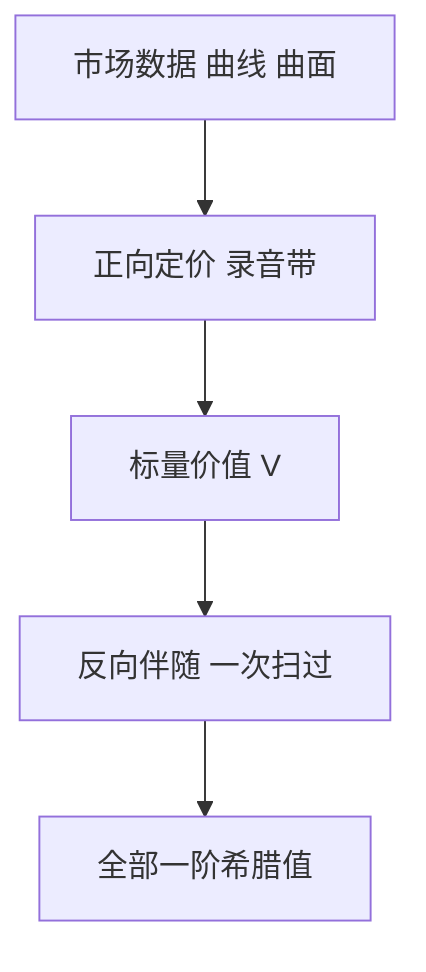

# 伴随算法微分 AAD

一次伴随反向扫过，可以得到价值对所有输入的梯度；成本与一次定价同阶，而不是与参数个数成正比。

<footer>—— Giles and Glasserman, Smoking Adjoints, Risk, 2006</footer>

[上一课](/quant/structured-notes)把结构拆成腿。缺口立刻变成：**腿一多、参数一多，有限差分希腊值爆算力。** 伴随算法微分（adjoint algorithmic differentiation, AAD）把计算图倒过来，一次反向传播给出全部一阶敏感度。后课路径导数与似然比写的是蒙特卡洛里另一套梯度；本课先把伴随当工程默认，不把自动微分当成「深度学习课」。

## 问题

Bump-and-revalue：每个 Vega 桶、每个曲线节点 bump 一次，定价次数随参数维数 $n$ 线性涨。结构票据、XVA、保证金的输入是整条曲面与整条利率曲线，$n$ 成百上千。问题是梯度的计算图已经在定价时建过一遍：每一步算术都有局部偏导，反向把 $\partial V/\partial(\mathrm{output})$ 乘回去，得到 $\partial V/\partial(\mathrm{input})$。Giles–Glasserman 把这套从计算数学引进蒙特卡洛定价，对象是金融里的「一阶希腊值全要」。

AAD 给的是**同一条实现路径（或同一棵树上）价值对输入的导数**，不是新的风险测度。模型错了，伴随只是把错的价值微分得更快。

### 正向与反向的成本不对称

正向模式（tangent）适合输入少、输出多；反向模式（adjoint）适合输入多、输出少。定价几乎总是标量输出 $V$，输入是市场数据向量，故反向是对的。实现要保存正向的中间量（磁带），内存与检查点是工程约束，不是理论装饰。

AAD 的一阶不自动给出稳定的二阶。Gamma、Vanna 要用二阶伴随、前向-反向混合，或对伴随再做一次差分。把一阶伴随当 Hessian 用会静默地错。

## 方法

对定价函数做算子重载或源码变换，每条算术记录局部 Jacobian。反向从 $\bar V=1$ 扫到市场数据。蒙特卡洛：每条路径反向，再平均——这是路径wise 梯度的伴随实现，与后课的路径导数同一对象，只是算得更快。间断支付（数字、障碍）的路径wise 导数在触发处失效，要平滑、或改用似然比，或把数字换成价差。

曲线与曲面应以节点为输入，伴随直接给出桶风险，不必再对每个节点 bump。这与后课 [Vega 桶](/quant/vega-buckets) 的报告层对齐。

## 机制

链式法则把 $\mathrm{d}V$ 写成中间变量微分的线性组合。正向积累切向量，反向积累伴随向量。金融定价的计算图深（模拟步、折现、聚合），但宽度主要在市场数据，反向一次扫过就够。与机器学习里的反向传播是同一数学，应用对象是希腊值与校准的 Jacobian，不是神经网络权重。

## 边界

间断、停时、最小/最大、提前行权的指示函数会让路径wise 导数偏或方差爆炸。美式回归的伴随要穿过回归系数，实现复杂。并行与检查点、GPU 上的磁带，是工程瓶颈。监管报告若要求独立的 bump 验证，AAD 与差分应对账，不能只交伴随数字。

本课不把 AAD 写成可以替代模型审查。它加速的是已选定模型的导数。

## 小结

- 反向伴随一次给出价值对全部输入的一阶导数，成本与一次定价同阶。
- 间断支付要平滑或改方法；二阶不是免费的。
- 输出是桶风险的自然来源，接到 Vega 桶与校准。
- 出处：Giles and Glasserman, *Risk*, 2006；算法微分见 Griewank and Walther, *Evaluating Derivatives*。
