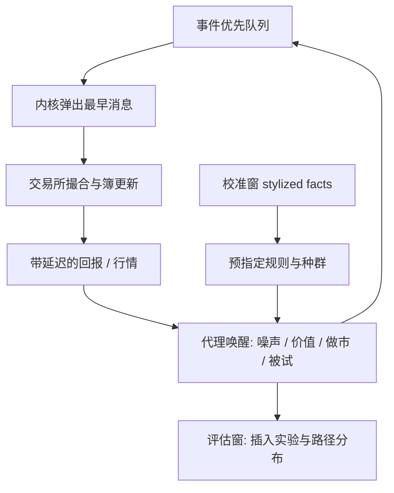

# ABIDES 事件驱动仿真

    
市场是消息的离散事件系统：代理在自己的唤醒时刻提交、撤销或改价，交易所按规则撮合，时钟由事件队列推进，而不是由固定的 bar 推进。

    <footer>—— Byrd, Hybinette and Balch, ABIDES: Towards High-Fidelity Multi-Agent Market Simulation, 2019/2020</footer>

回放历史限价簿，等于假设你的订单不影响随后的路径。执行、做市、冲击和多代理交互一旦进入问题，回放就不够。ABIDES（Agent-Based Interactive Discrete Event Simulation）把交易所、噪声交易者、价值交易者、趋势代理和做市商放进同一条事件队列：每个代理登记下一次唤醒，内核弹出最早事件，投递消息，代理再决定是否发单。Byrd、Hybinette 与 Balch 以及后续的 ABIDES-Markets / Gym 接口，把这一内核写成可重复实验的研究平台。它回答「在给定代理种群与撮合规则下，市场路径长什么样、我的代理插入后路径如何变」，不回答「历史 alpha 有多高」。与 [事件驱动回测](/quant/event-driven-backtest) 的差别是：后者通常仍吃历史事件流，ABIDES 可以让事件流本身由代理内生生成。

## 问题

历史回放的反事实是错的：你在 $t$ 插入一笔吃单，真实历史上 $t$ 之后的撤单与补货并不会原样发生。冲击模型用函数去补这一截，但函数不会对你的策略做出策略性反应。多智能体仿真要补的是反应：做市商看到队列被削会撤、噪声代理按自己的时钟继续到、套利代理在价格偏离时出现。问题变成设定而不是估计：代理规则、延迟、手续费、涨跌停是否打开，全部进入数据生成过程。ABIDES 的技术问题是如何在高保真消息层上把这些设定跑成可复现的轨迹，并让研究者的学习代理通过标准环境接口接入，而不把撮合写成学习代码的副作用。

第二个问题是校准。没有校准的代理种群可以生成看起来很忙的簿，却对不上真实的价差、深度、自相关和冲击曲线。仿真器于是变成自洽的电子游戏。ABIDES 本身不自动校准；它只提供内核。校准是研究者的责任，且必须在与评估分开的历史上做。

### 内核、代理与消息

内核维护优先队列：键是仿真时间。代理不能「读当前全局时间然后连续计算」，只能在被唤醒时行动，并请求未来唤醒。交易所代理维护一本簿，处理限价、市价、撤、改，回报成交与拒绝。其余代理通过消息与交易所通信，消息带时间戳与可选网络延迟。这一设计把延迟变成一等对象：同一策略在 100 微秒延迟与 3 毫秒延迟下面对不同的簿，比较才有意义。固定 bar 的回测把延迟藏进「用下一根开盘价成交」的粗假设里。

Gym 包装让强化学习代理逐步下单，但仿真时钟仍是事件驱动的。把步当成固定日历秒，会与内核的异步唤醒打架。应把「一步」定义成一次唤醒或一次市场事件，并在报告里写清。

## 方法

**最小可报告实验。** 写明：撮合规则（价格时间优先、最小价位、是否允许市价）、代理清单与数量、每个代理的随机种子来源、延迟分布、是否有基本面跳跃过程。运行多条 Monte Carlo 路径，报告价差、深度、中点收益的短时自相关、带符号成交的冲击曲线，并与真实标的的同时段 stylized facts 对照。缺对照的「我们训练了一个做市 RL」没有外部有效性。

**插入被试代理。** 把要研究的执行或做市策略作为一个额外代理接入，保持其余种群不变，比较插入前后的价差、该代理的 P&amp;L、以及对其余代理 P&amp;L 的转移。这是仿真里唯一干净的「因果」：处理是你插入了这个代理，对照是同一随机种子下不插入。不要把仿真 P&amp;L 直接写成实盘期望；它是该种群假设下的转移。

### 与历史回放的混合

ABIDES 也可以回放真实消息，同时让被试代理发单，其余历史代理变成「不会反应」的磁带。这是执行研究里常见的半历史模式，冲击只来自交易所规则下的排队，没有内生补货。它比纯函数冲击精细，仍低估真实市场的策略反应。报告必须写明是纯代理生成、纯回放、还是混合。混合模式下，被试代理的成交会与磁带上随后的历史成交叠加，可能双重计数流动性；需要规则处理「历史那笔单是否还在」。这类规则是研究设定，不是为了在回放里找到免费流动性。

强化学习接入时，奖励若含未来中点或未来成交量，泄漏从仿真里重现，见[深度 LOB 泄漏](/quant/deep-lob-leakage)与 [trading MDP](/quant/trading-mdp-pitfalls)。状态应是该代理在唤醒时刻已收到的消息。随机种子必须与种群种子分开记录，以便复现。

校准若用了评估时段的真实价差去调噪声代理参数，再在同一时段上报告被试策略的夏普，仿真是样本内的。校准窗与评估窗必须按日历切开，与真实回测的 walk-forward 同等严格。

## 机制

事件队列保证因果顺序：先发生的消息先被交易所处理，延迟只表现为消息的投递时间大于发送时间。价格发现来自价值代理对基本面的跟踪与噪声代理的存货扰动；价差来自做市代理的报价与竞争。改变种群比例，stylized facts 会变——这是机制，也是脆弱性：结果依赖于你放进去的人。ABIDES 的保真度来自消息层与交易所规则，不来自「代理等于真实交易者」。真实交易者会学习、会关机、会有库存约束和风控闸门，默认代理通常没有。

与解析冲击（平方根定律、Almgren–Chriss 临时项）相比，多智能体路径可以出现排队优先、冰山、以及多个学习代理互相适应的非平稳。这些现象有研究价值，也使推断更难：你看到的 P&amp;L 可能是对特定对手种群的剥削，对手一旦换规则就消失。因此被试策略应在多组种群、多种延迟下报告分布，而不是一条路径的净值曲线。

### 作为生成器与作为环境

把 ABIDES 当数据生成器：输出事件流，供 [Neural Hawkes](/quant/neural-hawkes-orderflow) 或判别 LOB 模型做可控实验——例如在已知互激结构的世界里看估计器是否找回核。把 ABIDES 当训练环境：学习代理在其中最大化奖励。前者要求生成器尽量像真市场（校准）；后者要求环境对学习稳定，二者冲突。过度校准到某一历史周，学习代理会过拟合该周的代理指纹。研究应预指定用途，不要用同一组调参同时宣称「很像真的」和「RL 夏普很高」。

生成式基础模型路线见 [MarS](/quant/mars-generative-sim)：从数据学消息分布，而不是从手写代理规则生成。ABIDES 的优势是规则可解释、可做插入实验；劣势是校准负担在人。二者可以对照：同一被试代理分别在规则仿真与生成式回放里跑，看结论是否同号。

## 边界与工程取舍

计算成本随代理数与消息数上升。高保真 L3 全市场仿真很难实时。研究应缩小到单标的或少量标的，并承认跨品种套利代理缺失。A 股的集合竞价、涨跌停、T+1 不是默认内核的一部分，必须作为规则显式实现，否则仿真的是另一个市场。不要用未实现涨跌停的连续簿仿真去评估 A 股开盘策略。

不要把仿真里战胜手写噪声代理写成 alpha 发现。不要在被试代理的状态里放入内核的全局真实行列以外的信息（例如尚未投递到该代理的消息）。那是仿真器上帝视角，对应实盘里不存在的信息集。种子、版本、代理代码哈希应进入研究报告，否则无法复现。ABIDES 是实验仪器，仪器的设定表属于论文正文，不属于附录里一句「我们使用了多智能体仿真」。

向仿真器「过拟合」与向历史过拟合同样真实：调种群直到被试策略好看，是另一种数据窥探。预指定种群，再插入策略；不要反向。

## 小结

- Byrd、Hybinette 与 Balch 的 ABIDES 用离散事件内核模拟代理与交易所的消息层交互，使延迟、撮合规则和反事实插入成为一等对象。
- 纯代理生成、历史回放与混合模式必须写明；校准窗不得与评估窗重叠。
- 插入被试代理是仿真内合法的处理对照。P&amp;L 依赖种群假设，须在多种群与多延迟下报告。
- 上帝视角状态、用评估期校准、战胜手写噪声代理，都不能当成实盘证据。A 股制度要显式写入规则。
- 出处：Byrd, Hybinette and Balch, *ABIDES: Towards High-Fidelity Multi-Agent Market Simulation*；后续 ABIDES-Markets 与 Gym 接口见 J.P. Morgan AI Research 及相关开源实现。
