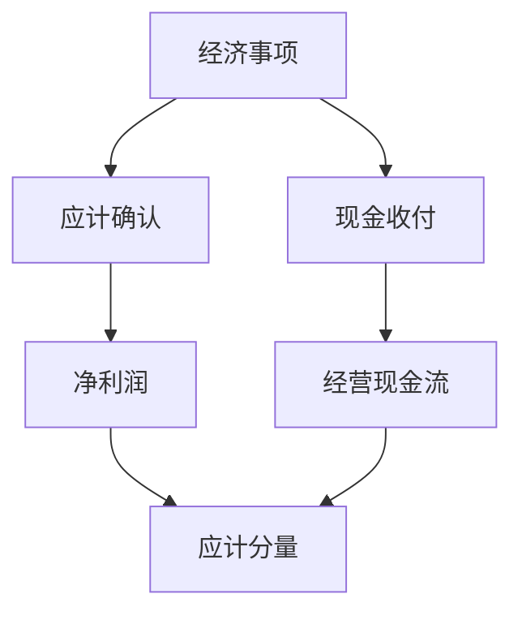

# 应计与现金流

应计把经济事项的确认时点与现金收付时点拆开；把净利润里的应计分量单独排序，后续回报往往更低。

<footer>—— 据 Sloan, The Accounting Review, 1996；Penman, Financial Statement Analysis 第 8 章整理</footer>

上一课[三张表怎么连](/quant/three-statements-link)钉死了两条勾稽链。身份闭合之后，利润与现金仍经常不同步。本课只补这一块差：应计是什么、怎样从已有字段拆出来、它对后面质量因子意味着什么。不重推勾稽，也不把可用日期提前讲完。

## 问题

若只用净利润排序，你把尚未收到的收入、尚未付出的费用、以及营运资本占用，都算进「盈利」。Sloan 把盈余拆成应计与现金两个分量，发现应计高的公司随后平均回报更低。缺口因此不是再读一张利润表，而是承认：**同一条勾稽链上，NI 与 OCF 的差本身就是可交易对象**。

Beaver 更早就指出年度盈余公告有信息含量；Sloan 的贡献是把信息拆开，指出市场对现金分量的定价更接近后续实现，对应计分量则系统性偏乐观。后课盈利质量、应计异象都从这次拆分起步。

### 应计不是造假的别名

匹配原则要求收入与费用在经济事项发生时确认，于是折旧、坏账准备、收入确认时点都进入应计。高应计可以是增长期的营运资本占用，也可以是激进确认。本课先把它当成**计量差**，取证式的盈余管理留给[盈利质量](/quant/earnings-quality)。把应计一律读成欺诈，后面的因子会把正常扩张的公司全部做空。

资产负债表法用营运资本与折旧等变动估计应计；现金流量表法直接用 $NI-OCF$。两种口径在并购、一次性项目上会分叉，回测必须锁死一种。

## 方法

简化定义：$Accruals \approx NI - OCF$。更细的资产负债表法把非现金营运资本变动加上折旧摊销等。缩放通常用期初总资产，以便截面排序；这是 Sloan 的惯例，不是唯一合法分母。后课 Fama–French 风格的质量或盈利因子，会再决定要不要行业中性化——那是组合步骤，不改变应计定义。

现金分量 $OCF$ 来自上一课链二。应计分量是链一与链二的差。因此本课在勾稽之后才有意义：若 NI 与 OCF 字段对不上同一报告期，差就没有经济内容。

## 机制

质量管道常做多低应计、做空高应计，或把应计当作多因子模型里的控制。机制有两层。一层是会计：应计倾向于反转，激进确认的利润随后要用现金或转回补回来。一层是定价：若投资者按盈余总量形成预期，对应计分量的预期误差会在后续窗口释放。本课不估计 PEAD，只要求因子计算固定口径、固定缩放、固定是否用经营现金流还是自由现金流。

后课 PIT 会问：你用的 NI 与 OCF 是公告当时的版本，还是多年后重述的终局版。应计定义对了、时间戳错了，Sloan 的差仍会泄漏未来信息。

回测最低实现：同一 PIT 切片上取 NI 与 OCF，期间对齐、缩放用期初总资产，截面分位前截尾。并购年、会计变更年单独标记，不要让一次购买法把应计因子的空头塞满收购方。现金流法与资产负债表法若并行，只能当稳健性，不能一年用这个一年用那个还称为同一信号。Sloan 的结果对口径敏感，敏感本身说明应计是计量对象，不是一个不变的异象常数。

## 边界

不映射 XBRL 标签，不做审计取证。极端应计常与并购、会计政策变更、一次性项目缠在一起，需等[盈利质量](/quant/earnings-quality)与[商誉与减值](/quant/goodwill-impairment)。本课也不引入可用日期；下一课才把「当时能看到的数字」写成约束。价值因子的账面权益仍用上一课的存量，不应用应计去改写账面。

后课默认：应计与现金已拆开；讨论盈利时先问分量，再问总量。

应计与现金拆开之后，后课默认不再用「净利润排序」冒充质量。极端值处理（截尾、行业内 z）属于组合步骤，要写在来源卡上，以免把 Sloan 的经济内容做成样本修剪的产物。一次性项目与并购年已标记的，质量课会再降权，本课不必提前删掉这些观测造成幸存者。

## 小结

- 勾稽闭合后，NI 与 OCF 的差就是应计窗口。
- 应计是匹配原则的产物，不等于造假。
- Sloan：高应计随后平均回报偏低，是质量因子的经典动机。
- 口径、缩放必须锁死，否则回测不可比。
- 时间戳尚未引入；下一课才讲 PIT。
- 出处：Sloan, *The Accounting Review*, 1996；Penman 第 8 章。
