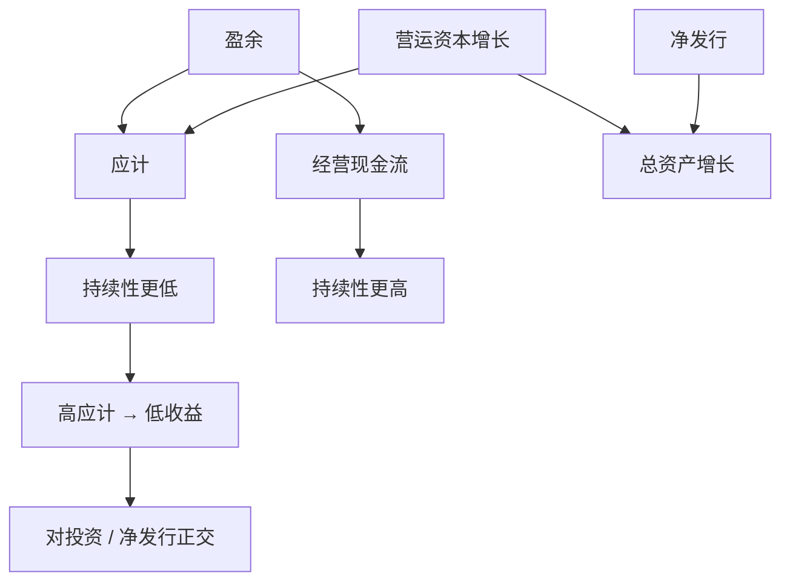

# 应计异常

盈余等于应计加现金流；应计部分的持续性低于现金流，若投资者盯住盈余总量，高应计公司随后的盈余与股票收益都会偏低。

<footer>—— Sloan, Do Stock Prices Fully Reflect Information in Accruals and Cash Flows about Future Earnings?, The Accounting Review, 1996</footer>

权责发生制把收入与费用从现金收付里挪到「更匹配」的期间，差额就是应计。Sloan 证明：应计高的公司未来 ROA 回落更狠，股票收益也更低；现金流高的公司相反。这是会计异常，不是[价值](/quant/value-factors)的倍数，也不是[PEAD](/quant/pead-sue) 的公告惊喜。后文的现金盈利、[QMJ](/quant/qmj) 的低应计块、以及[资产增长](/quant/asset-growth) 的营运资本扩张，都从这里分叉。本篇写 Sloan 的分解与可交易多空，以及它和投资、净发行的共线。

## 问题

若市场对盈余的两个成分一视同仁，则应计与现金流在预测未来盈余上的系数应接近，截面上也不应按应计排序出现收益差。Sloan 的检验是：把当期盈余拆成应计与现金，看明年盈余对两者的回归系数；再看按应计排序的组合的对冲收益。结果是应计的持续性更低，高应计组合收益更低。问题于是成为：投资者是否「盈余固定」——只看 EPS，不看质量。

应计有正常经营的部分（成长公司应收账款随销售增加），也有操纵的部分（提前确认收入）。异常应计（用 Jones 一类模型扣掉规模与增长解释的部分）把故事推向操纵；总应计把故事推向投资与增长。交易上两者相关。复制必须声明用的是资产负债表总应计、现金流量表应计，还是残差应计。

### 应计的会计定义

经营应计的常见构造是营运资本变化减折旧：

$$
\mathrm{Accruals}=\bigl(\Delta\mathrm{CA}-\Delta\mathrm{Cash}\bigr)-\bigl(\Delta\mathrm{CL}-\Delta\mathrm{STD}-\Delta\mathrm{TP}\bigr)-\mathrm{Dep}.
$$

再除以平均总资产。等价地，应计 $\approx$ 盈余 − 经营现金流。分母用资产而不是市值，是为了做会计持续性分析；做收益预测时也可以再看应计/市值。金融公司的营运资本含义不同，通常剔除。负的应计（大量现金回收、折旧高）进入多头，高存货、高应收进入空头。

现金流量表应计与资产负债表应计在有些公司上会对不上（并购、分类、非经营项）。Sloan 原文偏资产负债表。复制失败时先查表，而不是先改十分位断点。

## 方法

每年 6 月用已公布年报算应计/资产，NYSE 分位，等权或价值加权多空，持有一年。检验：对未来盈余的 Mishkin 检验或简单预测回归；对股票收益的 CAPM、[三因子](/quant/ff3)、四因子 α。等权效应更强，价值加权后常变弱——这是容量警报。与投资、净发行的马术比赛：在同一回归里放应计、$\Delta A/A$、净发行，看谁还显著。

季度应计能加快，噪声与季节性上升。行业中性能去掉银行与周期的会计差异。用修正 Jones 模型提残差应计，空头更像「操纵嫌疑」，换手与诉讼风险更高，样本外更脆。

### 与投资、增长是同一张资产负债表的不同切片

高应计往往伴随营运资本扩张，而营运资本扩张是总[资产增长](/quant/asset-growth) 的一块。Cooper 等把总资产增长写得更宽之后，应计异常有时被吸收一块。反之，应计控制后资产增长仍可能显著，因为并购、PP&E 不全部进入经营应计。正确的态度不是宣布其中一个「赢了」，而是：排序键要符合产品故事——若卖「盈利质量」，用应计或现金盈利；若卖「帝国建造」，用总资产或 capex。

## 机制

盈余固定：投资者用当期 EPS 外推，高应计的 EPS 不可持续，随后失望，价格下调。投资/q 理论：应计高表示扩张，扩张对应低贴现率或过度投资，随后收益低——这条与 CMA 同向。操纵：管理层用应计达标，随后转回。三条对冲工具不同：错误定价怕拥挤与披露改善；q 理论要对冲贴现率；操纵要对冲治理与监管。

发表后美股应计异常衰减的文献（Green、Hand、Soliman 等）指出：被交易之后 α 变薄，符合错误定价被套利。衰减也可以来自会计准则变化（应计更难膨胀）或样本里小盘权重下降。衰减并不自动否证 1996 年的样本内事实，但否证「永远按原文等权十分位能赚钱」。

### 现金盈利是同一枚硬币的背面

Ball 等人主张用现金营业利润替代应计制利润做盈利因子。那是把应计从盈利里抠掉，而不是单独做空应计。QMJ 把低应计放进盈利块，权重被稀释。[质量与盈利](/quant/quality-profitability) 已警告不要把这些名字当同义词。若五因子已含 RMW，再加应计多空，须报告对 RMW、CMA 的增量。

高应计不是「做假账」的同义词。快速成长的零售商应收与存货上升是经营。把空头当成做空欺诈，会在正常扩张年份被轧空。残差应计把增长扣掉，故事更脏，样本外更不稳定。

## 边界与工程取舍

小盘、低价、高换手主导等权溢价；借券与冲击成本先打空头。IFRS 与 US GAAP 对研发、租赁、收入确认的差异会改应计水平，跨国排序要在国家内做分位。A 股应计与盈余管理文献很长，但壳与 ST 会制造极端应计，必须缩尾并检查是否少数点驱动。

不要把应计多空叫做 CMA。不要把 EBITDA 减经营现金流的差随便叫做 Sloan 应计。不要在已经做空资产增长的组合里再等权叠一层应计，而不看持仓重叠。容量评估应用价值加权与可借券过滤，而不是 1996 年表格里的等权对冲。

出处：Sloan, *The Accounting Review*, 1996。后续的可靠性与总应计见 Richardson, Sloan, Soliman & Tuna。投资吸收见 Cooper, Gulen & Schill, 2008 与 Fama–French 五因子。衰减见 Green, Hand & Soliman 等，不要写进 Sloan 原文结论。

## 小结

- 盈余=应计+现金流；应计持续性更低，高应计预测低盈余与低收益。
- 定义要写明资产负债表、现金流量表或残差应计。
- 与资产增长、净发行、现金盈利共线，须做正交而不是并列三个 α。
- 等权小盘与发表后衰减决定可交易性。
- 出处：Sloan, The Accounting Review, 1996。
