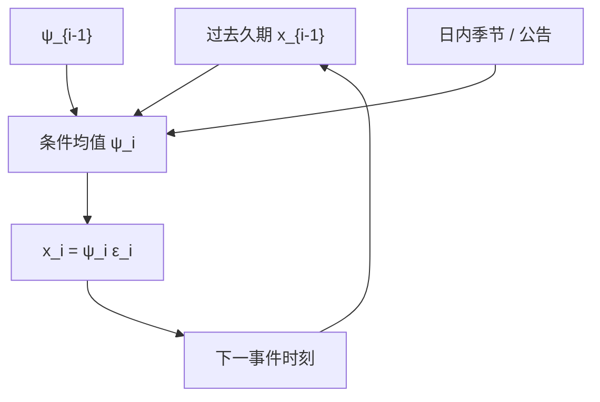

# ACD 自回归条件久期

相邻两笔事件的等待时间不是独立的指数抽签：刚刚很短的久期，往往预示着下一笔也会来得快。把这个条件期望写成自回归，久期就有了与 GARCH 对偶的结构。

<footer>—— Engle and Russell, Autoregressive Conditional Duration: A New Model for Irregularly Spaced Transaction Data, Econometrica, 1998</footer>

Hawkes 从强度 $\lambda(t)$ 出发，事件在强度高的时候更密集。[不等间隔采样](/quant/irregular-sampling) 已经提到，Engle 与 Russell 选择对偶的对象：**久期** $x_i=t_i-t_{i-1}$，即相邻成交（或相邻报价修订）的墙钟间隔。自回归条件久期（Autoregressive Conditional Duration, ACD）令 $x_i=\psi_i\varepsilon_i$，其中 $\psi_i=\mathbb{E}[x_i\mid\mathcal{F}_{i-1}]$ 随过去的久期与过去的 $\psi$ 演化，$\varepsilon_i$ 是正值新息。本篇写 ACD 的设定、与 Hawkes 的翻译、以及它在微观结构里能回答的「下一笔何时来」，而不是「下一笔什么价」。它补成交 Hawkes 没展开的久期计量，不重复核函数与分支比的全部内容。

## 问题

日历网格上的 GARCH 假设等间隔收益。成交点过程的间隔从毫秒到分钟，等间隔模型要么插入零收益，要么丢掉空洞。直接对 $x_i$ 建模，样本就是事件本身。朴素做法是假设 $x_i$ 独立指数，等价于常数泊松——这正是真实数据拒绝的：久期有强烈的自相关，开盘短、午间长，爆发成串。问题是找到一个像 GARCH 那样可估计、可诊断的条件均值，使标准化残差 $x_i/\psi_i$ 接近 i.i.d.。

第二个问题是对象：成交久期、报价久期、还是价格发生变化的久期。Engle–Russell 的原始应用包括价格久期（price duration）：只有当价格移动至少 $c$ 才记一步，用来连到交易强度与波动。混用三种久期会让系数不可比。A 股还要决定午休是删失、切断还是当成一个超长 $x_i$——第三种会毁掉整个 $\psi$ 的自回归。

### ACD(1,1) 与指数新息

标准 ACD(1,1) 为

$$
\psi_i=\omega+\alpha x_{i-1}+\beta\psi_{i-1},\qquad x_i=\psi_i\varepsilon_i,\quad \mathbb{E}[\varepsilon_i]=1.
$$

$\varepsilon$ 取指数、Weibull 或广义伽马。指数对应无记忆的标准化等待；Weibull 允许风险率随等待时间上升或下降。平稳性要求 $\alpha+\beta\lt 1$（在这一线性式里）。$\alpha+\beta$ 接近 1 表示久期的持续性强：忙的状态会持续，闲的状态也会持续。这与 Hawkes 分支比接近 1 是对偶现象的两种参数化，数值上不能直接划等号，因为一个积分的是核，一个自回归的是间隔。

$\psi_i$ 是条件期望间隔，强度的粗糙对偶是 $1/\psi_i$。只有在新息为指数、且强度在两次事件之间为常数时，这种对偶才精确。Hawkes 的强度在事件之间是连续衰减的，ACD 默认在两次事件之间把条件均值钉住，这是离散时间标记的代价。

## 方法

估计用极大似然，密度由 $\varepsilon$ 的选择与 $\psi_i$ 的递归给出。必须先去掉日内季节性：开盘、午间、收盘的确定性 U 形（或倒 U 形）久期，否则 $\alpha,\beta$ 会去拟合时钟。常用做法是先把 $x_i$ 除以时段样条或日内分箱均值，再对去季节后的序列估 ACD。残差诊断：标准化久期的自相关应消失；若 Weibull 形状参数显著偏离 1，指数新息不够。

标记 ACD 把成交量、方向放进 $\psi$ 或放进新息的尺度：大成交之后期望久期更短，对应自激。这是通向 Hawkes 的桥梁，但仍是事件时钟上的回归，不是连续强度。Engle 后来的 ACD-GARCH 把去季节久期与收益波动连起来：交易密的时候波动高。对象若是执行，ACD 给出「还要等多久可能有一笔对手方市价」，是 [成交概率](/quant/fill-probability) 里市价流的约化描述；它不给出对手方会不会打在你这一档。

### 价格久期与波动

价格久期把点过程稀化：只有 $|\Delta p|\ge c$ 才记录。$c$ 取一个 tick 或几个 tick。稀化后的 ACD 描述价格移动的等待，强度 $1/\psi$ 与瞬时波动同向。$c$ 太大，样本变短、丢失微观结构；$c$ 太小，又回到几乎每笔都记录，价格久期不再提供新信息。报告必须锁定 $c$，并说明是否在事件时间里对中间价还是成交价。中间价的闪烁会制造假的短久期，通常应要求 BBO 两侧都移动或中点移动至少半个 tick 且持续。

与 [成交量不平衡条](/quant/volume-imbalance-bars) 的差别：不平衡条按累积净量切样本，ACD 按时间间隔建模。前者改变下标，后者解释下标之间的墙钟。可以在 VIB 的条内再看平均久期，但不要把 ACD 的 $\psi$ 当成封条规则。

## 机制

机制上，短久期成串来自同一组微观结构力：算法切片把母单拆成密集成交、公告与开盘把所有人的强度抬高、Hawkes 式的反馈让一笔成交引来下一笔。ACD 不指出是哪一种，它只要求条件均值可预测。这是优点也是缺点：拟合好、诊断清楚，但对「内生还是外生」沉默。要拆开，需要把公告放进 $\psi$ 的外生回归项，或改用 Hawkes 并把公告放进 $\mu(t)$。

久期与买卖方向的联合，才接近信息模型。若短久期时方向更持续，更像知情或动量切片；若短久期时方向对冲，更像双边忙碌的做市。Engle–Russell 的框架可以扩成带方向的标记，但经典 ACD 论文本身不承担 PIN 的识别。毒性仍要不平衡与事后价差。

### 与 Hawkes 何时该换表示

事件极密、核的衰减发生在两次事件之间（毫秒级指数核、事件间隔也是毫秒），连续强度 Hawkes 更自然，因为 ACD 把两次事件之间的强度钉死。事件较稀、关心的是「下一笔成交要等几秒」、并且要与 GARCH 式的诊断文化对接时，ACD 更方便。二者不是竞争理论，是同一点过程的两种离散/连续记账。残差若在 ACD 之后仍有长记忆，可加分整 ACD 或改用慢核 Hawkes；先不要把 $\alpha+\beta=0.99$ 写成「市场临界」。

[多元 Hawkes](/quant/multivariate-hawkes) 处理的是类型之间的激励。多元 ACD、或 Engle 的自回归条件密度，可以对向量久期建模，但维数与识别都更绕。类型依赖优先用多元点过程。

## 边界

ACD 假定观测到每一次相关事件。馈送丢包会制造假的长久期，把 $\psi$ 拉高。用本地到达时间而不是撮合时间，会把网络抖动写进微观结构。涨跌停板上成交间隔的含义变成「还有没有排队成交」，不是连续强度。集合竞价只有一个匹配时刻，没有连续久期。

不要用 ACD 去填日历网格再跑等间隔因子：那是把点过程的条件均值插值成假的规则采样。不要在未去季节的原始秒间隔上报告「很强的持续性」——那多半是开盘效应。新息分布若有过离散，指数似然会误导标准误；应至少报告 Weibull 对照。

久期模型回答何时，不回答能否成交、以什么价成交。把它接到执行，还缺队列位置与深度。ACD 可以给市价到达的时钟，不能单独给短fall。

## 小结

- ACD 对事件间隔的条件均值做自回归，是不等间隔成交数据上与 GARCH 对偶的计量结构。
- 必须先去掉日内季节性；午休应切断而不是当成一个超长间隔。
- 标准化残差应接近 i.i.d.；Weibull 新息检验无记忆假设。
- 价格久期把点过程按最小价格变动稀化，用于连接交易强度与波动。
- 与 Hawkes：ACD 钉住事件间的条件均值，Hawkes 允许强度在间隔内衰减；密过程优先连续强度。
- 出处：Engle and Russell, *Econometrica*, 1998。
