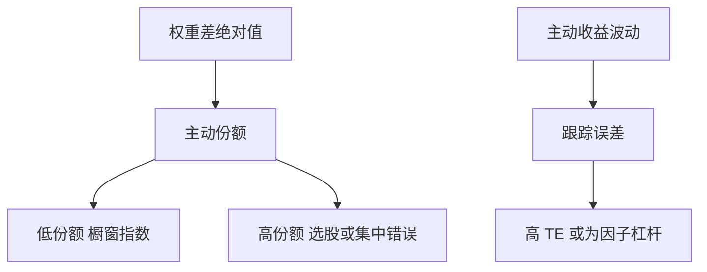

# 主动份额

跟踪误差度量的是收益偏离的波动；主动份额度量的是持仓与基准的重量差。可以高 TE 低主动份额（杠杆因子赌注），也可以低 TE 高主动份额（对冲掉的选股）。

<footer>—— Cremers and Petajisto, How Active Is Your Fund Manager? A New Measure That Predicts Performance, Review of Financial Studies, 2009</footer>

[上一课](/quant/benchmark-tracking-error)把契约钉在 TE 上。主动份额（active share）的缺口是**持仓层的偏离**：$\tfrac12\sum_i|w_{p,i}-w_{b,i}|$。Cremers–Petajisto 用它区分橱窗指数（closet indexer）与真正主动。本课写它与 TE、与 [Brinson](/quant/brinson) 的分工，以及它**不**保证 alpha——高主动份额也可以是分散很差的错误。

## 问题

TE 可来自几只期货或行业倾斜，持仓仍与指数高度重叠。主动份额高意味着名字层面不同，但可以用空头或对冲把 TE 压低（多空）。问题是产品识别：收主动费却主动份额接近零，是契约问题；主动份额高却持续负 IR，是技能问题。Petajisto 后续把基金分成因子赌注 vs 选股。不要把主动份额当新的定价因子去对 [CAPM](/quant/capm) 回归；它是治理度量。

与 130/30：空头增加主动份额，也增加借券。与股票多空中性：相对现金的主动份额无定义，应相对对冲基准或零。

### 基准一换，份额就变

用错基准会把风格暴露当成主动份额（小盘基金对标普 500）。必须与 TE 课同一套可投资基准。衍生品、空头、未分类现金要有处理规则，否则一半份额只是会计。

Cremers–Petajisto 的预测力在后续样本有争议。即便预测力减弱，橱窗指数识别仍然有用：那是费用是否该收主动价的证据，不必依赖 alpha 预测。

## 方法

计算：持仓与基准权重对齐到同一分类与时点。分解：行业内 vs 行业间（接近 Brinson 配置/选择）。对照：主动份额 vs 事后 TE vs 净 IR。阈值：极低则疑为橱窗；极高则查集中度与容量。ETF 化的因子产品主动份额可以高，那是规则暴露，不是选股。

## 机制

委托需要同时看「离基准多远」（份额）和「收益晃多厉害」（TE）。两者一起才能分清：在复制、在赌因子、还是在选股。费用应匹配真实主动；生命周期里，拥挤策略的主动份额可以仍高，IR 已经没了。

## 边界

持仓披露滞后使实时主动份额不可得。对冲基金不披露持仓时，度量退回 TE 与因子暴露。下一课改收益会计：即使持仓主动，现金流也会改写「赚了多少」。

## 小结

- 主动份额是持仓偏离，TE 是收益偏离，二者不可替代。
- 用途首先是识别橱窗指数与费用是否匹配。
- 高份额不蕴含正 IR，须与集中度和成本一起看。
- 出处：Cremers and Petajisto, *RFS*, 2009；Petajisto 对因子赌注 vs 选股的分类。
