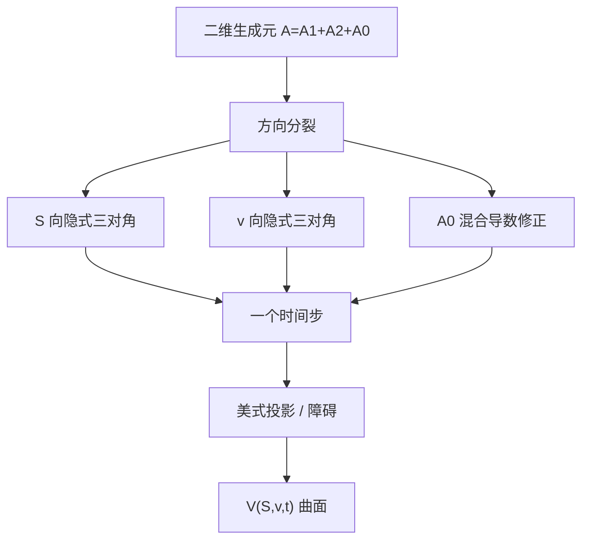

# ADI 高维 PDE

    
把多维抛物算子拆成逐方向的一维隐式，每步只解三对角系统；混合导数与相关布朗运动用显式或迭代修正，使二维 Heston 一类方程在网格上可算。

    <footer>—— Peaceman and Rachford, The Numerical Solution of Parabolic and Elliptic Differential Equations, Journal of the Society for Industrial and Applied Mathematics, 1955；in't Hout and Foulon, ADI Finite Difference Schemes for Option Pricing in the Heston Model, 2010</footer>

一维 Black–Scholes 用 [Crank–Nicolson](/quant/crank-nicolson) 三对角即可。[PDE 总览](/quant/option-pde) 指出二维隐式不再是单条 Thomas。随机波动的价格 $V(S,v,t)$ 满足带混合导数 $V_{Sv}$ 的二维抛物方程：[Heston](/quant/heston) 欧式香草有特征函数，不必解这张网格；美式、障碍、离散观察、与局部–随机混合，才需要 PDE。交替方向隐式（ADI）把 $A=A_1+A_2+A_0$ 拆开，$A_1$、$A_2$ 各含一个方向的对流扩散，$A_0$ 含混合导数与零阶项，每半步只对一个方向隐式。本篇写这种分裂，不重推 Heston 的仿射特征函数，也不把一维 CN 再讲一遍。

## 问题

二维隐式 CN 每步的未知量是 $J_S\times J_v$ 的矩阵拉直，带宽约为 $J_S$，直接带状解已比两次三对角贵一个数量级，三维则不可接受。显式二维受更严的 CFL，随机波动在 $v$ 小、$\sigma\sqrt{v}$ 的系数退化时更脆。需要在稳定性接近全隐式、成本接近一维隐式之间折中。

Heston 方程在 $v=0$ 的边界按 Feller 条件可能退化，混合导数由 $\rho\sigma S v$ 进入，相关 $\rho$ 接近 $\pm 1$ 时分裂格式容易不稳。问题是选出对混合导数处理得当的 ADI 变体，使香草在欧式极限上复现特征函数价格，再打开美式投影。Peaceman–Rachford 的经典两步对纯和式 $A_1+A_2$ 漂亮，对 $A_0\neq 0$ 不够；Craig–Sneyd、Modified Craig–Sneyd、Hundsdorfer–Verwer 是金融里更常见的后续。

### 算子分裂与混合导数

记 $U_t=AU+f$。Douglas–Rachford / Peaceman–Rachford 型的一步（示意）先 $(I-\theta\Delta t A_1)Y= \cdots$，再 $(I-\theta\Delta t A_2)V^{n+1}=\cdots$。$A_0$ 若被完全显式对待，相关项的稳定性限制会回来。Craig–Sneyd 用一次预测加一次对 $A_0$ 的修正；in't Hout–Foulon 比较了若干方案在 Heston 网格上的稳定性与精度，Modified Craig–Sneyd（MCS）对 $\rho\neq 0$ 较稳健。$\theta$ 常取 $1/2$ 或按方案指定的值，以恢复时间二阶。这些名字不是模型，是同一 PDE 上的时间步进器。

ADI 不增加经济假设。它解的仍是风险中性生成元。若欧式香草与 [Carr–Madan](/quant/carr-madan) 或 COS 对不上，先查边界、网格变换与参数是否同一测度，再怀疑分裂格式。用 ADI 去「验证」特征函数分支，方向应反过来：特征函数是香草基准，PDE 是美式扩展。

## 方法

网格：$\ln S$ 或 $S$ 均匀，$v$ 从 0 到 $v_{\max}$ 常非均匀，在 $v=0$ 附近加密。空间差分二阶；混合导数用四点或九点模板，注意在边界降阶。每步：若干次三对角（或带边界修正的拟三对角）求解，方向交替。成本每步 $O(J_S J_v)$。美式：每个完整时间步后对 $V$ 做 $\max(V,g)$，或把投影放进分裂的最后一次扫描——应对齐完整步，避免半步上投影破坏一致性。

边界：$S=0$ 降维成方差的一维方程；$v=0$ 按 Feller 用退化 PDE 或零流，选错会导致方差被吸收或假反射，美式执行区域也会歪。$v_{\max}$、$S_{\max}$ 截断用线性或渐近 Dirichlet。局部波动乘在 $S$ 方向扩散上，ADI 照旧，只是 $A_1$ 的系数随 $S,t$ 变。

### 与特征函数、蒙特卡洛的验收

欧式 Heston：同一参数下 ADI 价格应贴住 COS/FFT 到网格误差以内，且加密呈二阶（光滑支付）。这是实现的单元测试。美式没有闭式，用二维投影 CN（若算得起）或细网格 ADI 当参照，再用 [LSM](/quant/lsm-american) 看下界是否从下方靠近——LSM 不应高于收敛的 PDE。障碍要对齐 $S$ 网格线。希腊值：$\Delta$ 对 $S$ 差分，$\partial V/\partial v$ 是方差维上的差分，对冲上对应方差互换或期权组合，不要和 Vega（对 $\sigma$ 参数）混名。

## 机制

分裂的误差来自 $[A_1,A_2]\neq 0$：算子不可交换时，Peaceman–Rachford 的局部截断多出 $\Delta t$ 的交换子项，需要修正步去消。混合导数在交换子里特别讨厌，因为 $A_0$ 与 $A_1,A_2$ 都不交换。稳定性要用二维 von Neumann 或矩阵测度看 $\rho$、网格比、$\theta$。金融要求的正权比 $L^2$ 稳定更严：相关很大、网格各向异性时，ADI 权可能负，价格可以轻微破凸。实践上限制 $\rho$ 网格、或在混合导数上加一点人工耗散，并在香草上监视蝶式。

维数再升：三因子 ADI 变成三次方向扫描，混合导数更多，稳定性文献更窄。那时稀疏网格、回归蒙特卡洛通常更诚实。ADI 的设计点就是**二维、要全局曲面与美式**的那一块，不是任意维的万能隐式。

把 ADI 理解成「两个一维 CN 接在一起」只在无混合导数、算子可交换时近似成立。Heston 的 $\rho$ 一打开，就必须按带 $A_0$ 的方案实现，否则短到期偏斜会对网格敏感，看起来像模型问题。

### 局部–随机波动与 PIDE

Dupire 局部波动是一维，不必 ADI。局部乘随机（如 Heston 再乘 $\sigma_{\mathrm{loc}}(S,t)$）仍是二维，ADI 直接用，校准目标是欧式截面贴市场，动态留给随机因子。跳跃加 Heston 变成 PIDE：非局部积分不宜放进 ADI 的三对角核，通常对积分项用显式或 FFT 卷积，微分部分走 ADI，稳定性要按弱耦合来分析。那已经超出「纯 Heston 网格」的标准考题。

## 边界与工程取舍

Feller 违反时 $v=0$ 的离散化决定方差是否贴零，美式看跌的执行边界会跟着走。参数校准若每天跳，PDE 网格上的 $v_0$ 切片会整张移动，对冲比无意义——这是模型问题。三维以上不要坚持 ADI 充门面。欧式香草用 ADI 当生产引擎，通常慢于 COS/FFT，只适合作为独立验收。

不要把 Peaceman–Rachford 1955 写成 Heston 定价公式；不要在未通过欧式特征函数测试时报告美式 ADI 价格。in't Hout 与合作者的一系列论文是 Heston ADI 的工程出处，应指向具体方案名（CS / MCS / HV），而不是只写「用了 ADI」。

出处：Peaceman and Rachford, *J. SIAM*, 1955；Heston 网格上的方案比较见 in't Hout and Foulon, *International Journal of Numerical Analysis and Modeling*, 2010，以及后续 MCS/HV 稳定性文章。模型本身见 Heston, *RFS*, 1993。一维格式见 Crank–Nicolson, 1947。

## 小结

- ADI 把二维（以上）抛物算子按方向隐式分裂，每步三对角，用以计算 Heston 类美式与障碍。
- 混合导数 $A_0$ 必须按 CS/MCS/HV 一类方案修正；经典 PR 对 $\rho\neq 0$ 不够。
- 欧式极限应用特征函数验收；美式投影放在完整时间步上。
- $v=0$ 边界与 Feller 条件是网格正确性的一部分，不是装饰。
- 香草生产优先傅里叶；ADI 的理由是低维非欧式。三维以上转向模拟。
- 出处：Peaceman–Rachford, 1955；in't Hout and Foulon, 2010；模型见 [Heston](/quant/heston)；一维对照 [Crank–Nicolson](/quant/crank-nicolson) 与 [PDE](/quant/option-pde)。
