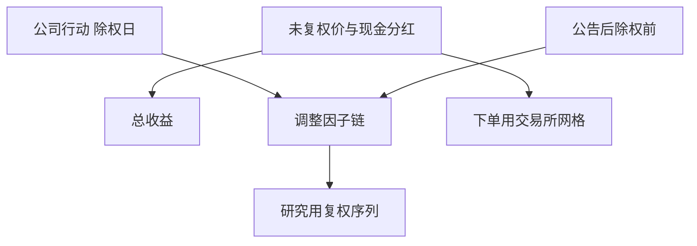

# 复权的实现

拆股、分红、配股改的是价格尺度，不是公司突然变贵或变便宜。复权因子必须与公司行动的可知日对齐，否则动量与波动都是假的。

<footer>—— CRSP 对分布与因子调整的文件说明；Campbell, Lo and MacKinlay, The Econometrics of Financial Markets 对收益构造的讨论</footer>

[上一课](/quant/index-constituents-history)固定了成员集合。本课的缺口是**价格与收益的尺度**：同一 permno 或股票代码在拆股前后不可比。CRSP 提供累积调整因子；A 股终端有前复权、后复权、除权价。实现错误会制造跳价「动量」或抹掉真实跳价。后课数据商会把不同供应商的调整链对照；本课先写内部应遵守的代数。

## 问题

未调整收盘价序列在 2-for-1 拆股日腰斩，对数收益若直接差分会出现假的 −50%。研究用的是总收益序列（含分红再投资）还是价格收益，必须声明。CRSP 的 `ret` 已含分红；自建若用复权价再算分红会双计。问题是：调整因子的生效时点（除权日 vs 公告日）、对停牌与退市日的处理、以及向前复权还是向后复权。向前复权让最新价等于市价、历史被改写，适合看图；向后复权让历史价不变、新价格被放大，适合把旧样本钉死。回测混用两种，仓位份额会错。

配股、权证、红股、转债转股、ETF 拆分，各有不同因子。用「分红再投资」一种方法去套配股，股东的选择权被忽略。公司行动应逐类实现，未知类型应标记并拒绝静默猜测。

### 可知日再次出现

行动公告后、除权前，市场已部分定价。用除权日才把因子接入面板，事件窗收益才干净；用公告日改写全部历史价格，会把尚未发生的拆股写进过去的波动。点-in-time：除权日前，研究用的调整链不应包含该次行动。这与会计 vintage 同构。

A 股涨跌停的基准是前收盘价（除权后另算）。复权研究序列与交易所涨跌停计算用的前收盘不是同一对象。回测涨跌停必须用交易所规则下的未复权或官方前收盘，不能用前复权图上的「看起来没碰到 10%」。

## 方法

维护行动表：`(security_id, ex_date, announce_ts, type, factor, cash)`。价格调整：除权日及之后的价格乘以从该日到样本末端（后复权）或从样本起点到该日（前复权）的累积因子——选一种，全局一致。收益：优先用供应商已计算的总收益；自建则 $1+R_t=(P_t+D_t)/P_{t-1}$ 在未调整价与现金分红上算，不要用已复权价再加 $D_t$。拆股因子乘进 $P$ 不乘进现金分红（分红是现金）。

质量控制：除权日对数收益的绝对值异常高且无新闻，常是漏因子或双计。与 CRSP `ret` 或交易所公布的复权对照，逐证券抽查拆股日。指数点位已按编制方案调整，不要再对指数水平做股票式前复权。

### 份额与权重

组合回测应跟踪份额：拆股后份额增加、价格下降，市值连续。用复权价当「可下单价格」会向交易所报一个不存在的价。下单层永远用未复权市价与最小变动单位；研究层用复权序列算收益与信号。两套价格并存是功能，不是冗余。

## 机制

错误复权把公司行动写成信息事件，动量、反转、波动目标全部污染。漏掉分红使「低价股」看起来有更强漂移。双计分红使高息股票出现假的正收益。与[借券](/quant/securities-lending)交界：空头在除息日要支付等价补偿，总收益视角下空头腿必须扣这一笔。

涨跌停、集合竞价、最小价差都定义在未复权网格上。[LOB](/quant/lob-structure) 的 tick 也是未复权的。信号可以在复权序列上算，执行必须映射回网格。

## 边界

外汇、加密拆分、基金拆分各有规则。本课以股票与 ETF 为主。供应商「前复权」默认是否含分红（后复权/前复权/前复权填权）名称混乱，必须读字段定义，不能靠中文产品名。

## 小结

- 研究收益与交易所下单价格分列；全局只选一种复权方向。
- 公司行动按类型实现，并按除权日点-in-time 接入。
- 涨跌停与 tick 用未复权官方前收盘，不用复权图。
- 出处：CRSP 分布与因子文件；Campbell, Lo and MacKinlay。
