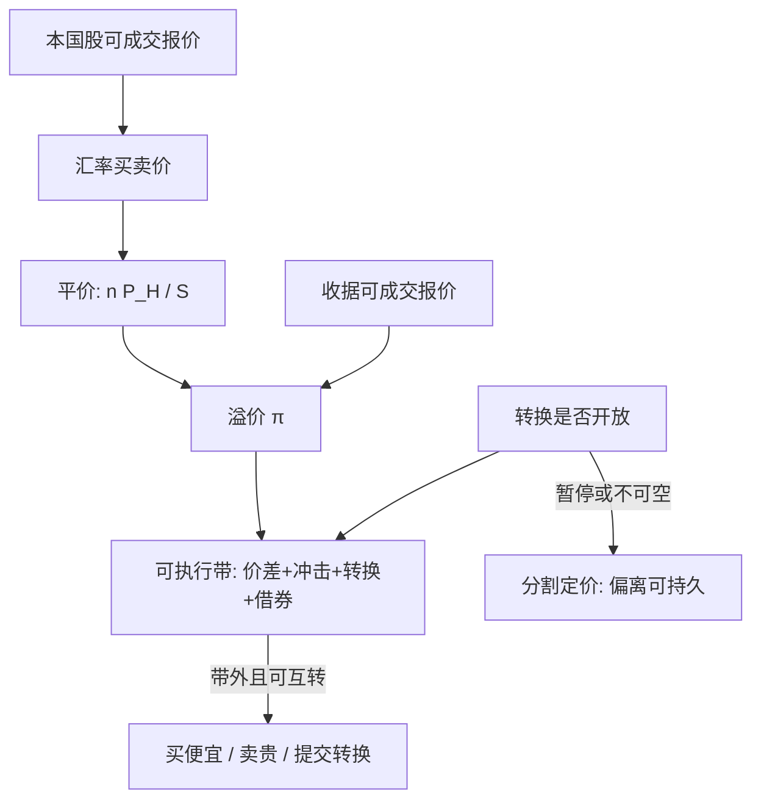

# ADR / 两地上市溢价

同一现金流在两个市场上可以持续报出不同价格；偏差的大小由持有成本、可转换性与谁被挡在门外决定，而不是由「一价定律应当立刻成立」决定。

<footer>—— Gagnon and Karolyi, Multi-market Trading and Arbitrage, Journal of Financial Economics, 2010；Froot and Dabora, Journal of Financial Economics, 1999</footer>

美国存托凭证（ADR）把一股或若干股本国普通股寄存在托管行，再在美国交易所或 OTC 挂出收据。理论上收据与本国股经汇率与转换比率应对齐；实际上溢价折价可以持续数日甚至数年。Froot 与 Dabora 用 Royal Dutch / Shell 这类孪生股票证明：交易地点本身会把当地指数的冲击写进「同一」现金流。Gagnon 与 Karolyi 在大规模跨境对上测量偏离，并把幅度连到卖空、借贷与资本管制这些持有成本。A 股与 H 股、A 股与 ADR 是同一逻辑的另外两套管道：现金流转的是一家公司，价格形成的是两群被制度切开的投资者。本篇写溢价作为**带摩擦的基差**，不是作为免费的均值回归。沪深港通是另一条通道，见[北向资金](/quant/stock-connect)。

## 问题

记本国股本币价格为 $P^H$，收据价格为 $P^A$，汇率 $S$ 为本币的外币价，转换比率 $n$ 为一份收据对应的普通股数。平价是

$$
P^A \stackrel{?}{=} n\, P^H / S
$$

（标价法按合约改）。观测到的溢价 $\pi=\log P^A-\log(n P^H/S)$ 含三块：可执行的错误定价、不可转换造成的分割、以及两边报价时钟与汇率时钟的错位。把收盘对收盘的 $\pi$ 当成套利信号，会把时区与最后一笔成交写成 alpha。

可转换性不是自动的。有赞助的三级 ADR 通常可与本国股按比率互转；一级、无赞助收据、以及受资本管制的市场，转换窗口窄、额度有、或根本不存在。不能互转时，两边是相关但不相同的要求权：投票、税收、股息预扣、以及谁能持有，都可以不同。此时 $\pi$ 更接近封闭式基金折价，而不是期现基差。

### 孪生股票、A/H 与 ADR 不是同一管道

Froot–Dabora 的对象是法律上几乎同一的现金流、在两地都可自由交易的孪生股票。偏离来自交易地点的需求：荷兰腿随欧洲基准动，英国腿随 FTSE 动。A/H 是同一公司的两种上市股份，历史上很长一段时间不可自由转换，内地与海外投资者被户口切开；溢价里有投机、有卖空约束、有资金进出成本，Mei、Scheinkman 与 Xiong 一类工作强调 A 股端的投机成分。ADR 则多了一层托管行与转换代理：即使法律上可转换，转换也有费用、周期与失败交割。三种管道的收敛机制不同，不能把皇家荷兰的日频回归系数拷到某只中概 ADR 上。

用彭博的「ADR 溢价」字段做日频排序，先核对转换比率、是否为部分上市、以及收据是否真的可兑换。不少字段在公司行为日会错几天，错的那几天往往是表面上最大的「机会」。

## 方法

一条可审计的对锁，必须同时有：同步时钟（把两边都对齐到重叠交易时段的可成交报价）、当时的转换比率与公司行为、当时的汇率买卖价、以及转换是否开放。可执行带是两边有效价差、冲击、转换费、预扣税差、借券与资金占用之和。仅当 $|\pi|$ 超出带，且转换或一对可借的空头腿都可用时，才允许：买便宜腿、卖贵腿，并提交转换或持有到可转换。若只能在一边做多、另一边做不了空，剩下的是单向的相对价值，收敛不被保证。

持有成本定价给出一个检验，而不是一个交易信号。Pontiff 的高成本套利框架说：残差波动高、卖空贵、转换慢的名字，均衡偏离可以更大。Gagnon–Karolyi 正是把跨国对的 $| \pi |$ 回归到这些成本上。研究设计应先解释「为什么偏离可以存在」，再问「带外的部分是否在可转换窗口内收敛」。把所有正溢价 ADR 做空、所有折价做多，忽略了成本截面，等于在做空最难借的名字。

### 汇率、税收与公司行为

$\pi$ 对汇率的暴露不是零。若收据在纽约交易、本国股在东京交易，美元日元的短窗波动会先打进 $P^A$，再通过转换预期打进 $P^H$。用日频收盘汇率去对齐，会把外汇的买卖价差写成股票溢价。税收方面，股息预扣、资本利得与是否可抵免，使「同一」股息对两组持有人不是同一税后现金流；除息日两边的跳可以不相等，这不是套利。拆股、配股、投票权差异若只调了一边的历史价格，回测会造出虚假的尖刺。

对 A 股相关名字，还要叠 [T+1](/quant/cn-tplus1)、涨跌停与融券约束。H 股可 T+0、ADR 可 T+0，A 股不能；涨停时 A 股腿买不到，溢价可以停在带外。沪深港通打开了部分 A/H 的共同投资者集合，降低了分割，但额度、标的名单与假期错位仍然切开信息集。ADR 管道与港通管道同时存在时，三地价格是一个有向图，不是一个点。

中概股从 ADR 回归香港或内地，转换比率与上市地位会变。用回归前的溢价分布去定回归后的阈值，是在用旧管道的弹性估计新管道。

## 机制

当转换开放且借贷便宜，做市商与对冲基金把 $\pi$ 压进带内：贵的一边被卖空，便宜的一边被买入，差额通过托管行交割抹平。机制与 [ETF 申赎](/quant/etf-create-redeem) 同类，都是一级市场的供给弹性在给二级价格封顶。弹性的上限是转换代理的处理速度、托管行的库存、以及本国市场的结算周期。弹性一旦下降——转换暂停、托管行拒收、本国停牌——二级市场变成两只相关股票，溢价可以走完整个错误定价的生命周期而不被抹平。

需求冲击按地点写入。本国指数再平衡、当地基金申赎、美国被动盘对收据的配置，都会让一侧暂时承担冲击。Froot–Dabora 的地点效应，就是冲击先留在交易发生的那一侧。若两边的边际投资者风险承受不同（内地散户 vs 海外机构），均衡的 $\pi$ 可以不为零：这是分割市场的定价，不是等待收敛的错误。把历史 A 股相对 H 股的平均溢价当成「公平溢价」去交易，是在赌分割结构不变。

### 卖空与借券决定哪一侧先动

贵的一侧若不可空，套利者只能买便宜侧、等待，承担 beta。便宜侧若不可买（额度、涨停、停牌），只能空贵侧，承担反向 beta。于是观测到的 $\pi$ 调整路径是不对称的：多数跨境对里，本国股流动性更好，调整更多发生在收据上；A/H 里往往是 H 股先动、A 股受涨跌停卡住。回测若假设两侧同时按中点成交，会把这种不对称写成瞬时 alpha。

## 边界与工程取舍

不要用收盘价差当可执行利润。不要在转换关闭或借券失败时仍按「统计套利」加仓。不要把 ADR、A/H、孪生股票、股票挂钩 GDR 混成同一因子。容量受较薄一侧与转换单位约束；大额会先把收据价差走阔，再排队进托管行。监管与发行人可以限制新收据的发行，供给弹性是或有的。

统计上，$\pi$ 高度持续，日频均值回归的 $t$ 值在重叠持有下会虚高，见[标签重叠](/quant/label-horizon-overlap)。应用非重叠的可转换窗口、或事件研究（转换开放、额度调整、停牌复牌），而不是把每日溢价当独立样本。过拟合风险同样适用：在几百对名字上搜阈值，必须进 [CPCV](/quant/cpcv) 与 [DSR](/quant/deflated-sharpe)，而不是只展示那一对曾经回归的皇家荷兰。

「折价买入 ADR」若不能空本国股，就是做多该公司加做多美元汇率减掉一层托管费。因子归因里应拆出市场、汇率与残差溢价，否则会把 beta 叫做跨境套利。

## 小结

- ADR 与本国股的溢价是带持有成本的基差；可转换性决定它是套利对象还是分割定价。
- Froot–Dabora 证明交易地点会写入价格；Gagnon–Karolyi 把偏离幅度连到跨境持有成本。
- A/H、孪生股票与存托凭证是三条管道，收敛机制与投资者集合不同，不能共用一套阈值。
- 可执行带必须含同步报价、汇率、转换费、借券与制度约束；收盘溢价不是利润。
- 出处：Gagnon and Karolyi, *JFE*, 2010；Froot and Dabora, *JFE*, 1999；Pontiff, *Journal of Finance*, 1996；Mei, Scheinkman and Xiong, 以及 A/H、沪深港通的公开制度文本。
