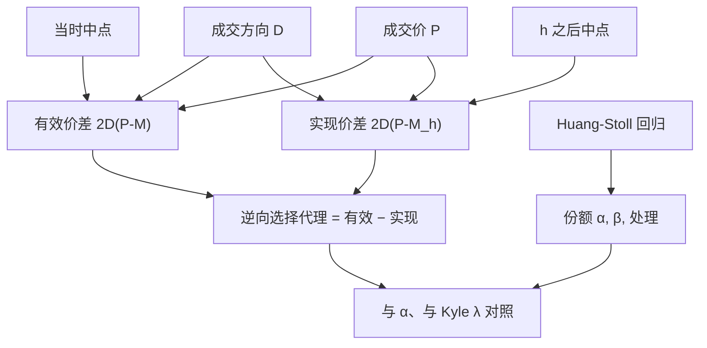

# 逆向选择成本度量

有效价差是成交当时付出的即时成本；实现价差是流动性提供者把存货重新定价之后还剩的收入。两者之差，是价格向主动方有利方向留下的那一截——经验上被当作逆向选择。

<footer>—— Huang & Stoll, The Components of the Bid-Ask Spread, Journal of Finance, 1997；有效与实现价差的会计见 Huang & Stoll, Journal of Financial Economics, 1996</footer>

[价差分解](/quant/spread-decomposition) 把报价宽度写成处理、存货与信息三项的概念和。要落到可加总的成交样本，Huang 与 Stoll 给出两条互相衔接的路。会计路：有效价差减实现价差，得到价格冲击，当作逆向选择的美元成本。结构路：用成交方向对价格变化的回归，把价差拆成逆向选择份额 $\alpha$、存货份额 $\beta$ 与处理份额 $1-\alpha-\beta$。本篇写这两套**度量**如何构造、窗口与方向分类如何改变数字，以及它们和 [Glosten–Milgrom](/quant/glosten-milgrom) 条件期望之差、和 Kyle 的 $\lambda$ 如何换算。不重复价差三分法的教科书叙事。

## 问题

流动性提供者怕的是：在不知情时与知情对手成交，随后中点朝对方有利方向跳走，报价价差里本该到手的收入被吃掉。要一个数字回答「这一笔、这一天、这只股票的逆向选择有多贵」。报价价差本身不够，因为它含处理与存货。成交方向本身不够，因为它不是成本。需要把「事后中点走了多远」写成与有效价差同量纲的量，才能比较市场、比较时段。

识别问题紧随其后。成交后中点移动，既可以是信息写入价格，也可以是存货诱导的报价调整，也可以是公开消息碰巧同向。Huang–Stoll 的结构模型用方向的自相关去分离存货（存货使方向负相关，因为做市商要平衡头寸）与信息（信息使价格永久移动）。会计分解更粗，不做这层分离，因此「有效减实现」是逆向选择的上界式代理，不是点识别。

### 有效、实现与冲击

记方向 $D_t$、成交价 $P_t$、成交时中点 $M_t$、随后窗口结束时中点 $M_{t+h}$。

$$
s^{\mathrm{e}}_t=2D_t(P_t-M_t),\qquad s^{\mathrm{r}}_t=2D_t(P_t-M_{t+h}),\qquad s^{\mathrm{as}}_t=s^{\mathrm{e}}_t-s^{\mathrm{r}}_t=2D_t(M_{t+h}-M_t).
$$

$s^{\mathrm{as}}$ 就是窗口 $h$ 上的价格冲击，常被直接叫做逆向选择成本。$h$ 取 5 分钟、30 分钟或随后 $k$ 笔，数字会变：太短，永久冲击还没走完；太长，无关信息混入。方向 $D$ 来自 [Lee–Ready](/quant/lee-ready) 或官方标志；分类错误同时压低 $s^{\mathrm{e}}$ 与 $s^{\mathrm{as}}$，因为随机 $D$ 使 $D\Delta M$ 向零。

实现价差可以为负：流动性提供者事后亏损。这正是毒性状态的会计表达。不要把负实现价差当成计算错误而取绝对值——符号是内容。

## 方法

会计度量：对每笔主动成交计算 $s^{\mathrm{e}},s^{\mathrm{r}},s^{\mathrm{as}}$，按成交额加权日度平均，再在截面或时序上比较。开收盘拍卖单独一列。$M_{t+h}$ 必须用成交后的报价，不能用含本笔的中点，否则冲击被低估。多市场用本所中点或综合中点须锁死。

结构度量（Huang–Stoll 1997 的三向分解，叙述其识别，不以某一次估计值为准）：成交价变化对滞后方向回归，系数里 $\alpha$ 对应价差中被信息吃掉的比例，$\beta$ 对应存货，$\alpha=\beta=0$ 时只剩处理导致的买卖弹跳。方向的一阶自相关进入存货识别：若买卖强烈负相关，模型把更多宽度派给存货。估计需要逐笔 $D$ 与价差水平；价差时变时应允许 $S_t$ 进入回归，而不是用全日平均价差。

### 窗口 h 是定义的一部分

同一股票，五分钟 $s^{\mathrm{as}}$ 与日终 $s^{\mathrm{as}}$ 可以差一倍。报告必须带 $h$。事件时间的 $k$ 笔窗口在开盘加密、午后变稀，与时钟 $h$ 不可比。做市存货的「转手」若平均只要几十秒，五分钟已经把存货回复算进实现价差，会计逆向选择会偏小；若知情信息要几十分钟才被公开确认，五分钟又偏小。没有无模型的正确 $h$。实务是报一组 $h$，看排序是否稳定。

## 机制

Glosten–Milgrom 里买卖报价是条件期望，价差本身就是逆向选择；没有存货，实现价差的期望应为零，有效价差全是信息。Kyle 里没有固定买卖价，逆向选择表现为 $\lambda y$。Huang–Stoll 允许三项共存：处理制造回跳，存货制造方向负相关与中点偏移，信息制造与方向同号的永久移动。会计 $s^{\mathrm{as}}$ 把后两项里「中点确实走了」的部分收成一截美元，因此含存货。要把存货拿掉，必须用结构模型或用做市商头寸数据。

经验规律与机制一致：公告前、小盘、分析师覆盖低，$s^{\mathrm{as}}$ 与 $\alpha$ 上升；小数化压处理项更明显，信息项下降较少。这与「价差变窄等于信息不对称消失」的叙事相反。比较两个市场谁更「公平」，应比 $s^{\mathrm{as}}$ 或 $\alpha$，而不是只比报价宽度。

### 与 lambda、PIN 的量纲

Kyle 回归 $\Delta m=\lambda y$ 里 $\lambda y$ 是价格变化，$2D\Delta m$ 与 $s^{\mathrm{as}}$ 同族，差别在 $y$ 是连续数量而这里每笔权重是 2。PIN 是概率，不是美元；高 PIN 日往往高 $s^{\mathrm{as}}$，但回归系数不是恒等变换。Goyenko 等人把各类流动性代理对照时，冲击类与价差类相关高、与成交量类相关低。写表格时不要把 PIN、$\lambda$、$s^{\mathrm{as}}$、$\alpha$ 排成「同一逆向选择」的四列而不声明量纲。

[Lee–Ready](/quant/lee-ready) 错误率在一 tick 价差上最高，而这类股票的报价宽度本来就小。逆向选择占比 $\alpha$ 会被分类噪声和窄价差同时扭曲。截面排序前应对 $D$ 的来源做分层，或改用官方主动标志。

## 边界与工程取舍

线性、固定份额、窗口内没有公开跳，是结构模型的舒适区。开盘、熔断、涨跌停让 $M_{t+h}$ 截断，$s^{\mathrm{as}}$ 无定义或接近零。费用与回扣改写经济价差：名义 $s^{\mathrm{e}}$ 不含 taker 费，比较 NASDAQ 与纽交所必须加回费用，Huang–Stoll 1996 的市场对照已经强调这一点。暗池中点成交的 $s^{\mathrm{e}}$ 接近零，冲击仍可能很大，会计会把它们读成「便宜但有信息」——这可能正好是选择偏差。

不要把 $s^{\mathrm{as}}$ 叫做 PIN。不要用一个 $h$ 的冲击去校准所有持有期的做市利润。不要在没有方向的 OHLC 上估 Huang–Stoll。A 股涨跌停日中点不能沿停板方向走完，$s^{\mathrm{as}}$ 被制度截断，应剔除或单独建模。

出处：Huang & Stoll, *The Components of the Bid-Ask Spread*, Journal of Finance, 1997；有效与实现价差见 Huang & Stoll, JFE 1996。会计分解的使用见后续市场质量文献。机制原形见 Glosten–Milgrom（1985）与 Kyle（1985）。

## 小结

- 逆向选择的会计代理是有效价差减实现价差，等于窗口内与方向同号的中点移动。
- Huang–Stoll 用方向回归把价差拆成信息、存货与处理份额；会计冲击仍含存货。
- 窗口 $h$ 属于定义；应报告一组窗口看排序是否稳定。
- 方向分类错误把有效价差与冲击同时向零拉。
- 与 PIN、Kyle $\lambda$ 相关但量纲不同，不能当同一列变量。
- 费用、拍卖、停板与暗池改变会计含义。
- 出处：Huang & Stoll, Journal of Finance, 1997；Journal of Financial Economics, 1996。
