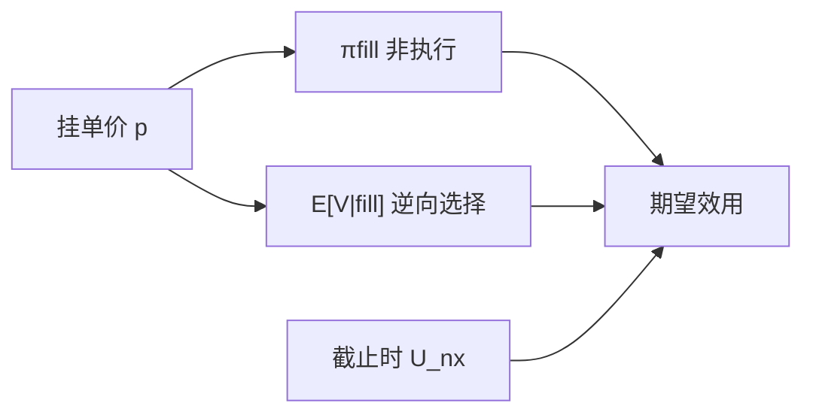

# 逆向选择对非执行风险

限价单有两种死法：成交在对你不利的时候（被捡），或到截止仍不成交（非执行）。最优挂单是在这两份风险之间分配，而不是单独最小化其中一份。

<footer>—— 据 Foucault 对 picking-off 与等待的讨论；对照 Copeland and Galai, Information Effects on the Bid-Ask Spread, Journal of Finance, 1983</footer>

[限价对市价](/quant/limit-vs-market-choice)给出何时离开队列去吃。缺口是：一旦选择限价，失败有两种经济学完全相反的方式。逆向选择（成交条件于坏消息）要求你挂得更保守、或更勤撤单；非执行（$\pi_{\mathrm{fill}}$ 太低）要求你挂得更有攻击性。两者对价格的含义相反。本课把权衡写清，为下一课最优放置提供目标函数，不重推 Foucault 均衡存在。

## 问题

被捡是条件于成交的损失：$E[V\mid$成交$]$ 比挂单价更差。非执行是条件于不成交的损失：你仍要在更差的价格完成，或根本完不成对冲。只防被捡，会把单子埋到远处，几乎永不成交，截止时被迫吃更宽的价差——非执行成本爆掉。只防非执行，会贴在 BBO 甚至越过，变成几乎市价，再加被捡。问题是同一决策变量（挂单价、展示、撤单频率）如何同时进入两份期望损失。

Easley–O'Hara 的事件不确定放大被捡：有事件时成交更可能到来。Parlour 的队深放大非执行：队尾 $\pi_{\mathrm{fill}}$ 低。状态要把两者同时包括。

### 成交是坏消息，不成交也是消息

限价卖出成交，暗示有人愿意在此刻买，可能是好消息（对卖方不利）。限价卖出一直不成交，可能是没有买家，也可能价值正在下跌、市价单去打买方。不成交更新事件后验，与「无交易是无事件」同族。把非执行当成外生概率噪声，会丢掉学习。

执行算法文献把非执行叫做 implementation risk，把被捡叫做 adverse selection 或 toxicity。本课保持微观结构用语，不引入新的经纪商标签。

## 方法

限价卖在价格 $p$ 的期望效用可写成

$$
\pi(p)\,E[p-V\mid \text{fill at }p] + (1-\pi(p))\,U_{\mathrm{nx}}(p),
$$

其中 $\pi$ 随 $p$ 更有攻击性而升（非执行降），条件期望 $E[V\mid\mathrm{fill}]$ 同时变差（逆向选择升）。一阶条件：放松 $p$ 带来的成交概率收益，等于边际被捡恶化。波动 $\sigma$ 主要进入条件期望；队深 $n$ 主要进入 $\pi$；截止 $T$ 进入 $U_{\mathrm{nx}}$。

经验分离：成交后中点向对手方向永久移动，是被捡/信息；限价撤单后自己改市价且中点未走，是非执行。Hasbrouck 永久影响对「限价成交」子样本应高于「随机时刻」，若限价成交被选中为信息事件。

### 两种风险的日内节奏

开盘事件不确定高，被捡权重大，挂单应更保守或更短寿命。收盘截止硬，非执行权重大，同一人改贴 BBO 或改市价。这与策略噪声的收盘聚集一致，不必假设下午知情者变多。公告窗口两者同时升：$\pi$ 可能升（活动密）但 $E[V\mid\mathrm{fill}]$ 更毒，净效应是价差宽、限价寿命短。

## 机制

流动性供给的「公平价差」必须同时买这两份保险。只按 Glosten-Milgrom 补偿逆向选择，会低估那些必须成交的挂单者所要求的攻击性溢价；只按库存补偿等待，会低估被捡。HFT 做市把撤单速度当作第三工具：降低限价寿命，同时压被捡与（若补得够快）非执行。速度竞赛单元会说明第三工具的社会成本。

对效率：被捡主导时，成交更有信息，VR 的短正自相关来自信息写入；非执行主导时，更多是队列摩擦，价格暂时成分来自补给。度量时要把限价成交与市价成交分开算永久影响。

## 边界

公式是部分均衡：$\pi(p)$ 依赖别人的策略。结构估计要回到 Goettler–Parlour–Rajan 一类计算均衡。隐藏单分别改变可见 $\pi$ 与真实被捡，下一课之后再拆。多市场时本地不成交不等于全局非执行，智能路由改写 $U_{\mathrm{nx}}$。

实现价差为负，常常是被捡项赢了；限价完成率低，常常是非执行项赢了。两个 KPI 一起看，才知道阈值往哪边偏。

## 小结

- 限价失败有被捡与非执行两种；对挂单价的比较静态相反。
- 最优是边际成交概率收益等于边际逆向选择恶化，再加截止惩罚。
- 开盘偏防被捡，收盘偏防非执行；公告窗口两者同时恶化。
- 出处：Copeland and Galai, *Journal of Finance*, 1983；Foucault, *Journal of Financial Markets*, 1999；动态权衡见 Roşu, 2009。
