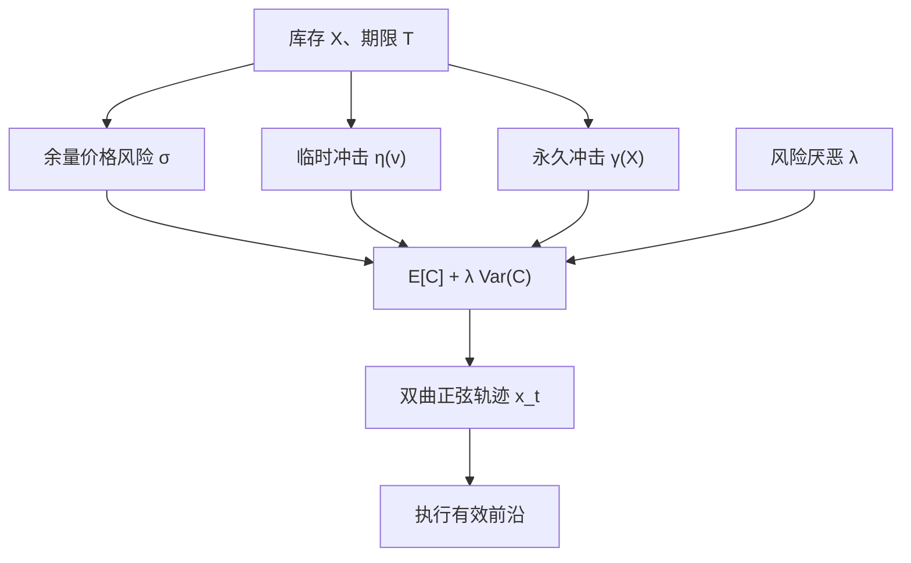

# Almgren–Chriss 最优执行

把一块仓位换成现金，临时冲击与价格风险权衡：交易越快，冲击越大；交易越慢，波动把尚未执行的余量伤得越深。最优轨迹落在成本–方差的有效前沿上。

<footer>—— Almgren and Chriss, Optimal Execution of Portfolio Transactions, Journal of Risk, 2000/2001</footer>

Perold 把纸面决策价与最终成交的差叫做实施缺口。[净边缘](/quant/net-edge) 把它列为可交易性的一截。Almgren 与 Chriss（2000/2001）把缺口写成可优化的对象：在固定期限 $T$ 内把库存 $X$ 降到零，临时冲击惩罚交易速率，永久冲击改写公允价格，算术布朗运动给出余量的价格风险。最小化期望成本加 $\lambda$ 乘成本方差，得到一条随风险厌恶变化的交易路径族——执行的有效前沿。本篇写线性冲击下的闭式轨迹、与 VWAP / 时间表的差别，以及把冲击改成平方根之后为什么不能沿用同一条双曲正弦。它是执行层的均值–方差，不是 alpha 模型，也不保证「按这条轨迹交易就会有正期望」。

## 问题

决策时刻持有 $X$ 股，必须在 $T$ 内卖完（买对称）。若立刻市价甩出，临时冲击最大，价格风险几乎为零。若匀速拖到 $T$，冲击较小，但价格可能先走。若假装没有冲击、只等好价格，余量暴露在 $\sigma$ 下，缺口的方差按剩余时间累积。问题是选择速率 $v_t=-\dot x_t$（$x_t$ 为剩余库存），使

$$
\mathbb{E}[C]+\lambda\,\mathrm{Var}(C)
$$

最小。$C$ 是相对到达价的实施成本。$\lambda=0$ 只关心期望成本，最优是尽快或按临时冲击的凸性摊平；$\lambda\to\infty$ 只关心方差，最优接近立刻执行。真实交易台在中间：有日终或信号衰减给出的 $T$，有可承受的执行风险预算。

信号衰减把 $T$ 从外生变成有成本的等待：统计套利的 alpha 半衰期以小时计，$T$ 不能按「把冲击摊到可以忽略」来选。慢因子的再平衡可以拉长 $T$，让临时冲击下降、永久冲击仍在。执行问题与[再平衡规则](/quant/rebalance-rules)通过 $T$ 耦合。

### 两类冲击必须先写进价格

Almgren–Chriss 的基准设定：公允价格 $S$ 是算术布朗运动，加上与已执行量成比例的永久冲击；成交价再相对当时公允价格加上与速率成比例的临时冲击。线性、无交叉、买卖对称。于是期望成本可以写成库存路径的泛函：永久项取决于交易的总量（对给定 $X$ 是常数）加路径交叉项，临时项取决于 $\int v^2$。方差来自余量过程对布朗运动的暴露。问题从「怎么切单」变成标准变分：在 $x_0=X,x_T=0$ 下求 $x_t$。

算术布朗运动会给出负价格，对短期限、小波动的执行仍是常用近似；几何布朗或对数量用对数价格会改方差项的形式，闭式解一般失去。工程上 AC 是短地平的工作模型，不是资产定价模型。

## 方法

连续线性情形的欧拉–拉格朗日给出剩余库存满足

$$
\ddot x=\kappa^2 x,
$$

其中 $\kappa$ 由临时冲击系数 $\eta$、波动 $\sigma$、风险厌恶 $\lambda$ 与永久系数 $\gamma$ 的组合决定（永久项进入期望，对轨迹的弯曲可以出现在有漂移或交叉时；经典无漂移设定里主导弯曲的是 $\eta,\sigma,\lambda$）。解是双曲正弦族：

$$
x_t=X\frac{\sinh(\kappa(T-t))}{\sinh(\kappa T)}.
$$

$\kappa T$ 小，路径接近直线（VWAP 型匀速）；$\kappa T$ 大，路径前倾——先快后慢，把风险尽快卸掉。这是均值–方差意义下的最优，不是「成交量加权最不显眼」。

离散时间版本把一天切成 $N$ 桶，二次目标，用线性代数求解，便于加约束：每桶数量上限、不得交易的拍卖时段、多资产交叉影响。多资产时 $\Sigma$ 进入方差，$\eta$ 可以是矩阵；对冲需求会出现：卖 A 的同时买对冲资产以降低余量风险，即使对冲腿没有独立的 alpha。这与组合优化的对冲是同一数学，只是地平是小时而不是年。

### 与 VWAP、POV、到达价的关系

VWAP 把交易与市场成交量对齐，目标是相对均价的短fall，不显式惩罚余量方差。POV 钉成交量占比，速率随市场活动变，$\kappa$ 被市场时钟替代。到达价（implementation shortfall）算法更接近 AC：参照到达中点，显式权衡冲击与风险。把 AC 轨迹当成「理论 VWAP」是错的：只有 $\lambda\to 0$ 且临时冲击对速率二次、无体积季节性时，匀速才近似最优。有 U 形成交量时，应在交易时钟或体积时钟上写 AC，而不是在墙上时钟上匀速。

平方根临时冲击把 $\int |v|^{\delta+1}$ 推进目标，$\delta\neq 1$ 时闭式双曲正弦失效，需数值求解。不要把线性解的 $x_t$ 公式里的参数「换成根号系数」继续用。校准应使用自己的母单短fall，按波动与 ADV 分层，样本外核对，见 [线性 / 平方根冲击](/quant/sqrt-impact)。

永久冲击对给定的 $X$ 与线性设定，期望成本里有一项 $\tfrac12\gamma X^2$ 与路径无关：你改变轨迹省不下这一项，只能省临时冲击与风险。若业务上关心的是「对未来持仓公允价的影响」，永久项仍决定你是否该交易；它不决定你多快交易。轨迹优化主要打临时项与方差。

## 机制

临时冲击机制是消耗可见流动性：你走得越快，越深地吃簿，成交价相对中点越差；你走完后若流动性恢复，这一截可以部分退回，见 [瞬时与永久冲击](/quant/temp-perm-impact)。永久机制是信息或存货被写入价格：别人更新报价，中点不回到起点。AC 用两条线性函数把它们分开，得到可加的会计，便于变分。真实市场里两者纠缠，线性是可处理的投影。

风险项的机制是未执行库存的 delta：你还是这只股票的持有人，直到卖出。$\lambda$ 把交易台的风险预算翻译成货币。$\lambda$ 可以来自日 VaR 限额、来自 alpha 衰减（等待的机会成本），或来自客户对短fall 方差的厌恶。不同来源给出不同的数值 $\lambda$，轨迹不同。用「行业标准 $\lambda$」而不写风险单位，路径不可审计。

### 衰减的 alpha 如何改轨迹

若持有余量每单位时间损失 $\alpha$ 的预期收益，等价于在期望成本里加入一项对 $x_t$ 的积分，轨迹更前倾：你为了留住 alpha 而愿意多付临时冲击。这把执行与投资决策连起来——衰减快的因子不应使用为冲击而拉长的 $T$。反过来，$T$ 由制度给定（收盘前必须完成指数调整）时，AC 只在该约束内有效，不能把 $T$ 当成自由变量去「优化夏普」。指数再平衡日所有人的 $T$ 相关，冲击函数本身上移，校准于平静日的 $\eta$ 会低估。

## 边界与工程取舍

线性、算术布朗、外生波动、无买卖价差截距、单一资产或常系数交叉，构成闭式解的边界。价差截距使极小速率仍有成本，最优会在「完全不交易某桶」与「交易」之间跳，接近禁交易带。涨跌停让 $v$ 的可行集时变为空，应把不可交易区间写成硬约束并允许 $T$ 延长或放弃，而不是让 $\kappa$ 发散。

不要把 AC 前沿上的某一点事后选成「短fall 最低的那条」再报告：那是对 $\lambda$ 与 $T$ 的样本内挑选。应预先按风险预算锁定 $\lambda$，按产品与信号锁定 $T$。不要用 AC 证明策略容量：容量还依赖永久冲击与拥挤，见净边缘的 $\mu_{\mathrm{net}}(A)$。多账户同向使用相似 $\kappa$ 会在开盘后一段同时前倾，制造内生冲击——模型把他人流量当外生布朗，这一点在拥挤时不成立。

A 股集合竞价、T+1、价格笼子改变可提交的 $v_t$。应在离散桶里对这些规则建模，而不是把连续双曲正弦离散化成若干市价单。核对用实现短fall 相对到达价，并分临时窗口与更长窗口，以免把永久项算进「算法没有做好」。

$\lambda$ 的单位必须可翻译：例如「多承担一单位执行方差，愿意多付多少基点的期望短fall」。没有单位的 $\lambda=10^{-6}$ 无法在交易台之间传递，也无法与组合层风险厌恶对照。

## 小结

- Almgren–Chriss（2000/2001）把实施缺口写成期望成本与成本方差的权衡，线性冲击下剩余库存沿双曲正弦下降。
- $\kappa T$ 小则近匀速，$\kappa T$ 大则前倾卸风险；VWAP 不是一般情形的最优。
- 永久线性项对给定总量往往不改变最优路径形状，轨迹主要打临时冲击与方差；平方根临时冲击需另解变分。
- $\lambda$ 与 $T$ 必须来自风险预算和信号衰减，不能事后挑选。
- 拥挤、涨跌停与价差截距使外生线性模型破裂，应用离散约束与自身短fall 校准。
- 出处：Almgren and Chriss, *Optimal Execution of Portfolio Transactions*, Journal of Risk, 2000/2001；Perold, *The Implementation Shortfall*, Journal of Portfolio Management, 1988；冲击函数的经验推广见 Almgren et al., *Risk*, 2005。
