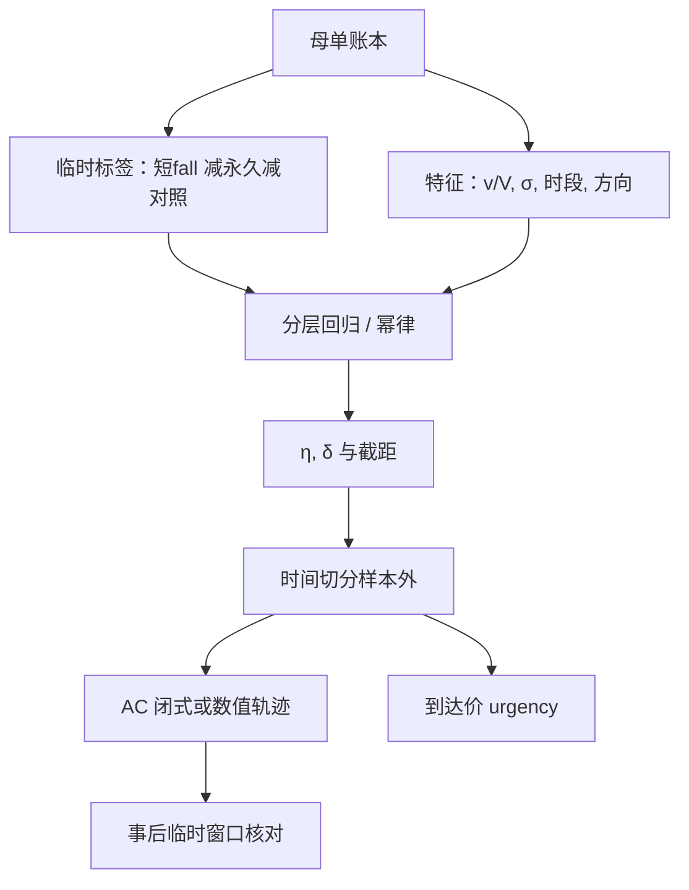

# Almgren 临时冲击校准

    
临时冲击系数不是文献里的一个小数，而是把母单短fall 里可恢复的那一截，对速率、波动与参与率做成可样本外检验的函数；校准对象是自己的执行，不是别人论文表格里的 $\eta$。

    <footer>—— Almgren, Thum, Hauptmann and Li, Direct Estimation of Equity Market Impact, Risk, 2005</footer>

[上一课](/quant/gatheral-schied)证明无漂移、线性冲击与标准期望–风险目标下最优执行是确定性轨迹，自适应不降低期望冲击。缺口是轨迹对临时冲击系数 $\eta$ 敏感：$\eta$ 大则更慢，$\eta$ 小则更敢前倾。Almgren 等人用机构股权母单直接估计冲击定律，发现规模项更接近平方根。本课只写**临时**这一截如何校准：因变量取什么、如何分层、如何避免把 alpha 与永久项吞进 $\eta$。不重推无漂移下的闭式轨迹。[线性与平方根冲击](/quant/sqrt-impact) 讨论函数形状；这里讨论同一形状下参数如何从执行账本里长出来。

## 问题

母单 $i$ 有到达中点 $M_0$，成交均价 $\bar P$，数量 $Q$，执行时间 $T$，同期波动 $\sigma$，同期或历史 ADV $V$。实施缺口含价差、临时冲击、永久冲击、时机、费用与未完成。临时冲击要回答的是：若把同一 $Q$ 拉得更慢，哪一截成本会下降。若把全部 $\bar P-M_0$ 对 $Q/V$ 回归，估到的是混合物，用它当 $\eta$ 会高估「拆单能省的钱」或低估——取决于永久与 alpha 的符号。问题是构造一个尽量接近「可恢复、依赖速率」的标签，再在分层样本上估

$$
I_{\mathrm{temp}} \approx \eta\,\sigma\,\mathrm{sign}(Q)\Bigl(\frac{|v|}{V}\Bigr)^{\delta},
$$

其中 $v\sim Q/T$ 或更细的分桶速率，$\delta=1$ 对应 AC 线性临时项，$\delta\approx 1/2$ 对应经验幂律。$\eta$ 必须允许随流动性桶、时段、买卖方向变化，否则单一全局 $\eta$ 只是平均了不可比的市场。

### 标签必须声明窗口

把母单结束后 $\tau$ 的中点 $M_\tau$ 拉回来：成交相对到达的偏离减去在 $\tau$ 仍留下的部分，近似临时；留下的部分近似永久。$\tau$ 太短，临时被低估（恢复未完成）；$\tau$ 太长，宏观噪声进入「永久」。应按该股票的 ADV 时间或成交笔数设 $\tau$，并设同期未交易对照，减去市场因子，见[瞬时与永久冲击](/quant/temp-perm-impact)。没有对照，牛市里的买入母单会把 beta 算进冲击，买卖不对称的 $\eta$ 会假显著。

到达价必须是执行台时钟的 $t_0$，不是投资经理昨夜的决策价。内部延误应单独归因。用决策价当 $M_0$，临时冲击会被隔夜缺口污染，校准出的 $\eta$ 在开盘母单上不可用。

## 方法

样本是母单，不是逐笔。逐笔回归把同一母单的内部相关性当成独立观测，标准误会缩小，也会把切片算法的内生速率当成外生。Almgren 等人按母单汇总：参与率、持续时间、波动、市值或 ADV 分位。回归可以是

$$
\frac{\widehat{I}_{\mathrm{temp}}}{\sigma}=\eta\,\Bigl(\frac{|Q|}{VT}\Bigr)^{\delta}+\beta^\top Z+\varepsilon,
$$

$Z$ 含买卖方向、开收盘时段、是否含竞价、价差分位。$\delta$ 可固定为 1 或 $1/2$，或在网格上用样本外 MAE 选，不要用全样本 $R^2$ 选。分层：至少按 ADV 与 $\sigma$ 交叉分层，小盘高波动的 $\eta$ 通常更大；把它们混在一起，大盘会主导，小盘执行会系统性超速。

交叉验证按时间切，不要随机切母单：同一周的拥挤相关。拥挤日（指数调整、财报扎堆）应作为单独状态或单独 $\eta$，否则平静日 $\eta$ 在再平衡日严重偏低。买卖分开估：卖出流动性在下跌日更薄，对称 $\eta$ 会让卖出腿过快。未完成母单：只对已执行部分估临时，未完成进机会成本，不要把放弃的量当成 $v=0$ 的「零冲击观测」。

### 从回归系数到交易轨迹

估到 $\hat\eta,\hat\delta$ 之后，AC 的 $\kappa$ 才能算。$\delta\neq 1$ 时不要沿用双曲正弦，应数值解变分或用分桶二次规划。到达价算法的 urgency 与 $\eta$ 必须同源：若 urgency 来自客户问卷而 $\eta$ 来自另一套短fall，轨迹不可审计。校准应滚动：用过去 $N$ 个月估，在随后 $M$ 个月的新母单上比预测临时成本与实现临时标签。偏差随时间走，说明流动性体制变了，而不是「再拟合一次 $\delta$」。

把 $\eta$ 写成 $\eta=\eta_0 (s/\sigma)^{\gamma}$ 一类，让价差进入临时项，避免极小 $v$ 时模型冲击低于半价差——那会怂恿算法去刷无穷小切片。价差截距使最优出现禁交易带：某些桶不交易。这与「$\eta$ 来自大单回归」不冲突：大单回归识别的是斜率，截距来自报价宽度，见[价差成本](/quant/spread-cost)。

## 机制

临时冲击的机制是消耗可见与隐性流动性后的短期恢复：吃簿、走阔、随后新限价与做市补回。$\eta$ 大表示同样参与率下恢复慢或深度薄。波动 $\sigma$ 出现在公式里，因为更大的价格尺度上，同样的相对消耗对应更大的绝对价格移动；它不是说波动「导致」冲击，而是量纲。参与率 $|v|/V$ 把你的速率相对于市场供给标准化：$V$ 要用同期可成交量，而不是年度 ADV 在停牌日的幻觉。

内生性：算法若已经按某个 $\eta_0$ 前倾，观测到的 $(v,I)$ 落在策略曲线上，回归识别的是「该算法的平均短fall」，不一定是供给曲线。缓解：在参与率或 $T$ 上有外生变化的母单（客户指定 VWAP vs 到达价、不同 urgency），或对算法参数做切换实验。没有外生变异时，应报告「条件于现行算法的预测成本」，不要声称得到了结构 $\eta$。

### 平方根与线性临时项不要混进同一条轨迹公式

AC 闭式来自成本 $\propto\int v^2$，即临时价格偏离对 $v$ 线性。经验 $\delta\approx 0.6$ 时，同一闭式的「把 $\eta$ 换成根号系数」没有变分依据。校准流水线应输出：在线性族下的 $\eta_{\mathrm{lin}}$（供 AC 闭式与风险预算沟通），在幂律族下的 $(\eta_{\mathrm{pow}},\delta)$（供容量与数值最优执行）。两套都做样本外，让交易台知道闭式用的是哪一套。Almgren 2005 的贡献是直接用母单估计，而不是从 Kyle $\lambda$ 外推；你的校准应继承「直接、分层、分开永久与临时」，而不是继承某一个发表的点估计。

$V$ 的定义一变，$\eta$ 的数值就变。必须写死：是 ADV 股数、同期市场成交、还是剔除自己成交后的他方成交。POV 算法若把自己计入 $V$，参与率分母偏大，$\eta$ 会系统性偏小。

## 边界与工程取舍

期货、ETF、个股、暗池成交混在同一回归里没有意义：供给时钟不同。竞价成交的「速率」不是连续 $v$，应剔除或单独估，见[开盘/收盘竞价执行](/quant/auction-execution)。涨跌停使 $v$ 可行集变空，这些母单是截断样本，简单删除会让 $\eta$ 偏向可完成的容易单。费用、印花税不是临时冲击，应从标签里减去。

不要用当日实现短fall 反推 $\eta$ 再回头「优化」当日剩余轨迹：那是把噪声当成供给。不要把文献 $\eta$ 乘一个「A 股折扣」当校准。核对图表：预测临时 vs 实现临时的校准曲线（不只是 $R^2$）、按参与率分位的残差、买卖非对称、以及把 $\eta$ 代入 AC 后样本外短fall 是否沿风险–成本前沿移动而不是全样本变得更好（后者往往是过拟合 $T$ 与 $\lambda$）。

临时冲击校准的产出是带单位的函数 $\hat I(v,\sigma,V,\text{时段})$ 与样本外误差带，不是一个无单位的 $\eta=0.1$。没有单位就无法与 $\lambda$ 的风险厌恶对谈。

## 小结

- 临时冲击校准用母单级可恢复短fall 对标准化速率回归，必须先切掉永久项、市场对照与内部延误。
- Almgren 等人（2005）的方法要点是直接估计、分层、分开永久与临时，而不是一个可搬用的 $\eta$。
- 样本按时间交叉验证；拥挤日与买卖方向应允许不同系数。
- $\delta\neq 1$ 时不能把 AC 双曲正弦当公式继续用；应并行维护线性族与幂律族。
- 内生算法使回归接近「现行策略的成本」而非结构供给，需要外生 $T$ 或 urgency 变异。
- 出处：Almgren, Thum, Hauptmann and Li, *Direct Estimation of Equity Market Impact*, Risk, 2005；Almgren and Chriss, *Optimal Execution of Portfolio Transactions*, Journal of Risk, 2000/2001；标签窗口见 Huberman and Stanzl 对冲击可恢复性的讨论以及执行事件研究实践。
