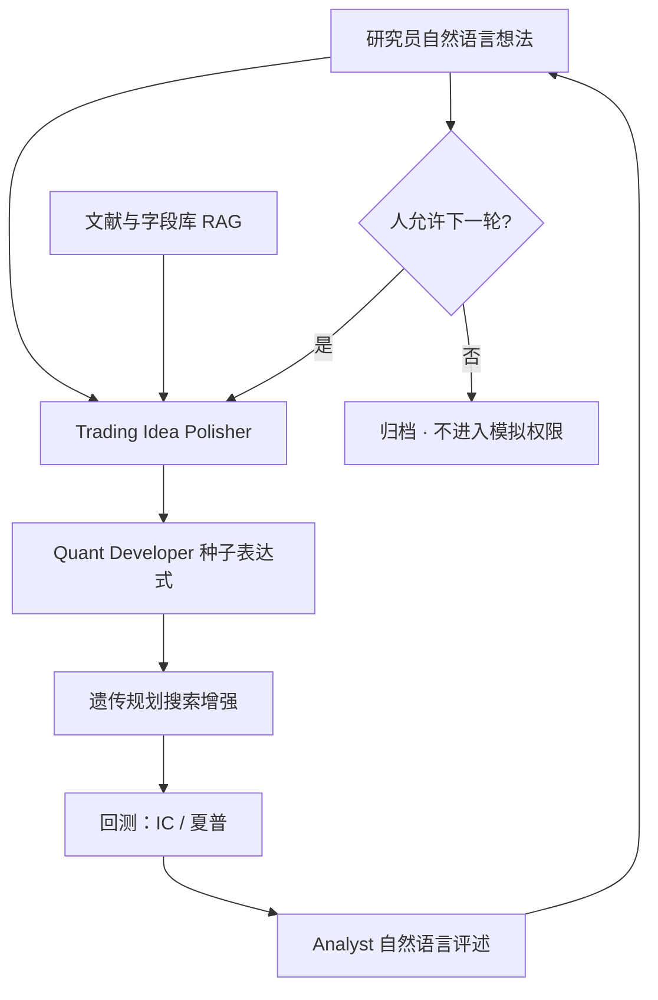

# Alpha-GPT 人类启发式挖掘

    
第三种挖掘范式用大模型当研究人员与搜索算法之间的中介：它理解交易想法、把想法编译成表达式，并在多轮交互里根据评述改写后续搜索。

    <footer>—— Wang, Yuan, Zhou, Ni, Shum and Guo, Alpha-GPT: Human-AI Interactive Alpha Mining for Quantitative Investment, arXiv:2308.00016</footer>

手工写因子依赖个人启发式，慢；遗传规划在算子与字段的笛卡尔积上搜，快但不懂你在说什么。Alpha-GPT（Wang 等人，2023 起，IDEA Research / HKUST）把大模型放进这条缝里：人用自然语言给想法，模型编译成公式化 alpha，再交给遗传规划一类算法做搜索增强，回测结果用自然语言送回给人评述。这是研究架构，不是下单代理。它不选择交易所、不改风控阈值、不把订单送进市场；它降低的是「想法 → 可回测表达式」的翻译成本。评价时仍要过 McLean–Pontiff 的发表后衰减与 Hou–Xue–Zhang 的可交易加权——系统若从 Kakushadze 101 与公开文献起步，先验已经偏向拥挤模板。

## 问题

Wang 等人把挖掘分成三种范式。第一种：研究员把直觉写成公式，回测、分析、再改，瓶颈是表达与人力。第二种：遗传规划等搜索在巨大组合空间里穷举，瓶颈是算力与不可解释。两者共同的缺口是：技术形态、波浪一类启发式很难写成既精确又短的表达式；搜索产出的大量公式又很难读；搜索配置本身的修改是琐碎劳动。需要一种中介，把自然语言想法编译成合法表达式，把回测元数据反编译成可评述的句子，并在多轮里记住你刚才说「不要再搜成交量确认」。

大模型能做翻译，但不能当无约束的代码生成器。金融字段有时点、有延迟、有单位；任意 Python 会引入[未来函数](/quant/no-future-function)。Alpha-GPT 的设计选择是：LLM 产出种子表达式，真正的大规模搜索仍由算法层做，计算加速层负责滚动窗口与向量化。人留在回路里，是因为作者明确认为交易直觉在当前模型能力之上。

### 编译与反编译才是产品

论文把核心算法叫 AlphaBot：领域知识编译（想法 → 结构化提示与种子公式）与反编译（公式与回测表 → 自然语言解释）。没有这一对，系统只是聊天窗口外挂回测。编译要检索文献与字段说明书，给想法消歧；反编译要能说明子表达式各自在做什么，而不是复述夏普数字。知识库用 Kakushadze（2016）一类公开公式与私有库的子表达式说明做嵌入检索；作者强调库是接地与一致性，不是直接复用现成 alpha。即便如此，检索会把搜索推向已有母题——这是拥挤的入口，不是脚注。

用 GPT-4 给「翻译质量」打分、再宣称胜过初级研究员，测的是表达式与想法的一致性，不是样本外 alpha。一致性高只说明编译可用；经济显著性仍要走加权、扣费与发表后窗口。

## 方法

工作流三阶段，对应三个代理角色。

**构思（Ideation）。** Trading Idea Polisher 读入自然语言想法，查文献与字段库，消歧术语，产出结构化提示。人可以只说「开盘向收盘的涨幅相对日内波动应反向」，不必先写出 Kakushadze 风格的分式。

**实现（Implementation）。** Quant Developer 用 LLM 生成种子表达式，写入 alpha 库；随后 Alpha Compute Framework 用遗传规划等搜索增强，在种子邻域里进化出更多候选。搜索增强是算法，不是再问一遍聊天模型。

**评述（Review）。** Analyst 调回测引擎，汇总收益、IC、夏普，用自然语言解释头部 alpha，等人给出下一轮修改。人可以要求换字段族、加行业中性、禁止某类模板。交互模式里人始终是发起与闸门；自治模式面对超大字段库时，用分层 RAG：先看已有成功 alpha，再选大类（价量 / 情绪等），再选二级类，最后才取具体字段说明书，以免把整库塞进上下文。

系统分层：WebUI（对话、会话、看板）、LLM 代理、算法挖掘（搜索增强、评估、去冗余、部署准备）、计算加速（流式滚动、向量化、GPU）。部署准备指实时计算正确性，不是实盘下单权限。Alpha-GPT 2.0（arXiv:2402.09746，草稿）把同一 Human-in-the-Loop 扩到建模与分析层，用多种代理串起「挖掘—建模—分析—下一轮方向」的研究环。公开细节少于 1.0，2.0 应标明草稿状态。

### 搜索增强与交互各贡献一截

文中 IC 比较：种子约 0.58%，十轮搜索增强后约 1.23%，一轮交互再加搜索增强约 2.23%（论文表 4，具体宇宙与定义以原文为准）。曲线显示样本内 IC 持续上升，样本外 IC 在初期跳升后趋于平稳，作者将其读作增强可泛化、宜在约 15 轮附近停止。对研究流水线，这意味着：LLM 负责把启发式放到正确的算子邻域，遗传规划负责在邻域里爬山，人负责在评述阶段关掉错误邻域。把三步收成一次「让模型直接写最终因子」，会丢掉可审计的分工。

WorldQuant International Quant Championship 2024 第二阶段，作者报告 Alpha-GPT 合格 alpha 数与总分可与全球前十量级相比（表 2，截至 2024-06-25）。竞赛分数不是可交易容量，也不替代 Hou–Xue–Zhang 加权复制。它只说明：在竞赛的公式语言与 IS/OOS 规则下，该工作流能产出合格表达式。

## 机制

大模型的预训练提供金融语言与常见技术形态的先验，所以「相对波动的开收涨幅」能被映射到带 $\mathrm{high}-\mathrm{low}$ 的分式。遗传规划提供局部组合优化，弥补模型一次生成的覆盖不足。人提供搜索方向的稀疏奖励：哪一类想法值得继续。三者合在一起，是把启发式搜索从研究员的笔记本搬到可重复的会话日志。它不提供因果识别，也不提供对[拥挤衰减](/quant/crowded-alpha-decay)的免疫。若知识库与提示充满已发表母题，系统会高效地再发现拥挤 alpha；评述阶段必须显式要求新颖性与低相关，而不能只要求更高 IC。

分层 RAG 的机制是把字段库当成必须导航的本体，而不是当成提示里的一张表。这与后文 [AlphaSchema](/quant/alphaschema-ontology) 把语义计划写成显式搜索空间是同一方向的不同切法：Alpha-GPT 仍让模型在交互里隐含地选空间，Schema 把空间先造出来再搜。

### 人在回路是安全边界，也是容量边界

交互模式承认模型不能替代资深直觉，这是安全：没有人闸门的表达式不得进入回测集群以外的环境。它也是容量：人评述的带宽决定真正被理解的因子数量，搜索增强产出的长尾仍然不可解释。工程上应把「进入人评述」的名额当成与回测预算一样的配额，用相关与复杂度先剪枝，否则 Human-in-the-Loop 会退化成人对着夏普表点头。

## 边界与工程取舍

公开实现细节有限：私有 alpha 库、竞赛数据字段、加速层都不在 arXiv 里可复现地给出。复现应对齐论文写明的算子表（时序 / 截面 / 分组 / 逐元）与 Llama 3 70B + BGE-M3 一类公开组件，不要把竞赛名次当成可下载的因子。表达式合法不等于无泄漏：种子仍须过时点对齐与延迟字段检查。不要把 Analyst 的自然语言解释当成经济机制——解释是反编译，机制要另做风险调整与成本 MC。

不要把 Alpha-GPT 理解成自动交易员。论文的对象是公式化 alpha 挖掘与研究效率；订单、经纪商、实盘权限不在系统图的出口上。评价新因子时，统计轴走 Harvey–Liu–Zhu / 紧缩夏普，经济轴走加权扣费，实盘走[漂移监测](/quant/live-drift-monitor)。LLM 把尝试次数 $N$ 放大，PBO 的分母必须把生成过的种子与遗传规划后代算进去，而不是只算「人点过的那几个」。

出处：Wang et al., *Alpha-GPT*, arXiv:2308.00016；Wang et al., *Alpha-GPT 2.0*, arXiv:2402.09746（草稿）。公式化 alpha 见 Kakushadze, 2016。评价折扣见 McLean–Pontiff, *JF*, 2016；Hou–Xue–Zhang, *RFS*, 2020。遗传规划挖掘见 Zhang 等人后续公式化因子搜索文献。

## 小结

- Alpha-GPT 用 LLM 做想法与公式之间的编译/反编译，遗传规划做搜索增强，人做发起与闸门；这是第三种挖掘范式。
- 三阶段工作流：构思、实现、评述；大字段库用分层 RAG，避免一次塞进全部说明书。
- 竞赛与翻译打分测的是工作流效率，不是可交易容量；公开信号仍要过发表后衰减与可交易加权。
- 知识库会把搜索推向拥挤母题；评述必须显式要新颖性与低相关。
- 系统出口是表达式与研究会话，不是订单。
- 出处：Wang et al., arXiv:2308.00016；2.0 见 arXiv:2402.09746（草稿）。评价见 McLean–Pontiff；Hou–Xue–Zhang。
