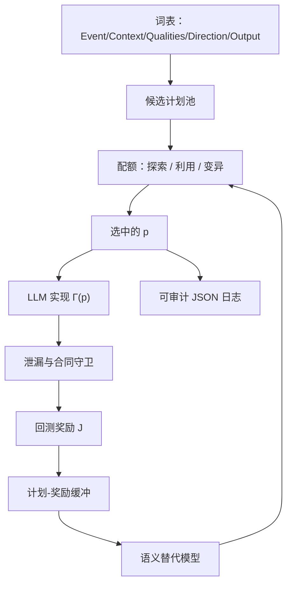

# AlphaSchema 领域本体

    
搜索的对象不应是代码或公式，而是先于实现的交易语义计划；计划由事件、情境、质量约束、方向与输出五元组构成。

    <footer>—— Yi, Yang, Jin, Li and Li, AlphaSchema: Exploring the Space of Trading Semantics for LLM-Based Alpha Mining, arXiv:2607.26642</footer>

Alpha-GPT 让模型在对话里隐含地选搜索空间；Hubble 在 DSL 树上搜；XAlpha 在假设与代码之间演化。AlphaSchema（Yi 等人，X-Tech / Monash / 清华交叉信息院等，arXiv:2607.26642）把空间本身造出来：每个候选先是一个语义计划 $p=(e,c,Q,d,o)$，再由 LLM 翻译成可执行因子。探索与实现解耦。奖励记在计划上，用替代模型（文中 LightGBM）在语义特征上打分，配额选择在全局探索、替代利用与局部变异之间分配有限的实现与回测预算。这是领域本体加贝叶斯式搜索，不是把交易语义当成操纵对手盘的剧本。公开实验在 A 股，并报告不同 LLM 实现同一计划时预测质量相近——作者读成「挖掘质量对模型选择大体稳健」。读幅度时仍要用 Hou–Xue–Zhang 的加权手续与 McLean–Pontiff 的发表后折扣：语义计划可以很像一篇论文的摘要，因而也很容易拥挤。

## 问题

许多 LLM 挖掘把「构造因子」和「决定下一步搜什么」都交给同一个代理。候选空间由提示、记忆轨迹和模型偏好隐性塑形，多样性不可测，覆盖不可控，轨迹难复现，成本绑在前沿模型的采样上。公式化与进化方法在实现空间里组合算子，驱动信号是数学适应度，不是可陈述的交易假设。需要一种表示：在写代码之前就能说清「捕捉什么事件、在什么情境、用什么确认、赌延续还是反转、输出什么形态」，并把搜索定义在该表示上。

本体在这里是工作定义，不是形而上学的市场分类学。作者不声称五元组穷尽机制，只声称它足够表达常见因子构造维度，使计划空间 $\mathcal{P}$ 可配置、可抽样、可学习。词汇表 $\mathcal{V}_E,\mathcal{V}_C,\mathcal{V}_Q,\mathcal{V}_D,\mathcal{V}_O$ 是超参：词表写成「突破、放量、波动压缩」，搜索就会往技术分析靠；不加「盈利意外」一类事件，基本面机制根本不在空间里。本体先于模型。

### 计划不是因子，实现是随机映射

形式化：$p\in\mathcal{P}$ 是语义计划，$\Gamma:\mathcal{P}\to\Delta(\mathcal{F})$ 是实现过程，把计划映到可执行因子的分布。目标是 $\max_p \mathbb{E}_{f\sim\Gamma(p)}[\mathcal{J}(f)]$。同一计划可用不同算子、窗口、函数形式实现，一次回测只是该分布的一个样本。因此奖励记在计划上、用多次实现或替代模型平滑，而不是把一次幸运代码的夏普当成该语义为真。这直接对抗「换一个随机种子又一个新因子」的幻觉。

若词表从已发表异常的摘要里长出来，本体就是拥挤地图。应把 McLean–Pontiff 清单上的预测变量标成已知点，搜索时要么当负例，要么要求计划在五元组上与它们的距离足够远。

## 方法

每轮：提出并选择计划（全局抽样、局部变异、配额分配）→ LLM 实现为代码 → 执行、泄漏、回测门 → 计划-奖励写入缓冲 → 更新语义打分器。打分器在计划的离散特征上回归 $\mathcal{J}$，对尚未实现的大候选池先打分，再花预算去实现。配额把有限次数分给：结构新颖（覆盖未知区域）、替代高分（利用）、强计划邻域的变异（局部改进）。关联反馈与计划而非与算子，是为了学习「哪些交易语义值得探」，而不是「哪棵树碰巧高」。

五维的直观分工：

- **Event**：被捕捉的市场现象，如突破、放量、波动压缩。
- **Context**：解释该事件的参照，如近期极值、VWAP 区域、波动体制、截面分位。
- **Qualities**：确认或过滤，如成交量确认、多周期一致、去极值。
- **Direction**：与未来收益的假设关系，延续、反转、区间震荡。
- **Output**：可交易形态，连续分数、事件衰减、截面排序。

实现后的因子仍须过数据合同与泄漏规则，再进回测。论文强调守卫式回测：计划、生成代码、校验状态与结果一并落盘。代码仓库在论文致谢中公开核心流程；以 arXiv 与仓库为准，附属公司新闻稿不是方法来源。

### 替代模型让 LLM 从搜索决策里退出来

若每一步「搜什么」都要模型采样，探索政策不可复现，也随供应商变。替代模型把决策变成：在已知 $(p,\text{reward})$ 上拟合，对候选 $p$ 打分，再用配额掺入随机探索。LLM 的角色收缩为实现器 $\Gamma$，而不是规划器。作者报告同一计划换不同 LLM 实现，预测质量可比，支持「瓶颈在计划不在文风」这一读法。工程上仍应固定实现器版本做主结果，换模型只当敏感性，避免把实现噪声当成新发现。

LightGBM 在离散语义特征上过拟合同样会发生：计划空间若比回测次数大得多，替代器会记住噪声奖励。配额里必须保留真正的结构探索，不能把预算全给当前高分区域。这与金融里「只交易正在赚钱的因子」是同一错误。

## 机制

解耦之后，多样性可在计划空间度量：事件-情境组合的覆盖、与已评估计划的汉明或集合距离。覆盖不足时提高探索配额；高奖励区域出现时提高利用与变异。这比在公式树上做编辑距离更接近「机制是否重复」。拥挤衰减的控制也应发生在这一层：与已部署因子对应的计划邻域降权，而不是等代码相关到 0.9 再丢。

奖励 $\mathcal{J}$ 若只用样本内 IC，本体搜索会高效找到拥挤且高 t 的技术语义。$\mathcal{J}$ 应含换手惩罚、覆盖、与库的相关、以及验证段表现，最好再含成本情景，见[费用 MC](/quant/cost-mc-sensitivity)。否则五元组只是给过拟合加了一层可解释的外衣。Hou–Xue–Zhang 的摩擦类异常，许多可以写成「低流动性事件 + 小盘情境 + 反转方向」；词表与奖励若不禁这类计划，复制失败会在语义层重演。

### 本体是可审计的中间语言

计划 JSON 比公式树更适合研究日志：研究员能读 $p$，能反对某一维（「不要再搜放量确认」），而不必读生成代码。这与 Alpha-GPT 的反编译同目标，但 AlphaSchema 把中间语言当成搜索原语，而不是事后解释。人闸门可以加在计划层：未批准的事件类型不得进入实现预算。这比在夏普表上做闸门更早、更便宜。

## 边界与工程取舍

词表是偏见。A 股实验不能直接当美股本体；涨跌停、T+1、集合竞价会改变「突破」的语义，必须成为 Context 的合法取值，否则计划在合同上不可交易。公开信息对完整词表规模、奖励精确公式与宇宙过滤以论文附录与仓库为准；新闻稿级「研究进展」不计入方法。不同 LLM 实现质量相近，不意味着 $\Gamma$ 方差为零，只意味着相对计划选择为二阶。

不要把语义计划自动当成可交易策略。实现仍可能泄漏、仍可能不可执行、仍可能只有等权微盘上的 t。搜索预算记入 $N$。不要在计划层声称发现了新经济学：五元组是工程本体，不是资产定价的充分统计量。系统出口是计划与因子实现，不是订单；配额选择优化的是回测预算，不是市场冲击。

出处：Yi et al., *AlphaSchema*, arXiv:2607.26642。对照 Wang et al., *Alpha-GPT*；Shi et al., *Hubble*；Liu et al., *XAlpha*。评价：McLean–Pontiff, *JF*, 2016；Hou–Xue–Zhang, *RFS*, 2020。替代模型见 Ke 等人 LightGBM 一类梯度提升；此处仅作语义空间上的回归器。

## 小结

- AlphaSchema 用五元组语义计划当搜索原语，把「搜什么」与「如何实现」分开。
- 奖励记在计划上，替代模型加配额分配实现预算；LLM 主要当实现器。
- 词表即本体，也即偏见；已知异常应标进空间以免高效再发现拥挤模板。
- 同一计划跨模型实现质量相近，支持瓶颈在语义选择；主结果仍应固定实现器。
- 计划可审计、可被人闸门拦截，仍须过加权、成本与样本外，才能谈经济显著。
- 出处：Yi et al., arXiv:2607.26642；对照 Alpha-GPT、Hubble、XAlpha；评价见 McLean–Pontiff 与 Hou–Xue–Zhang。
