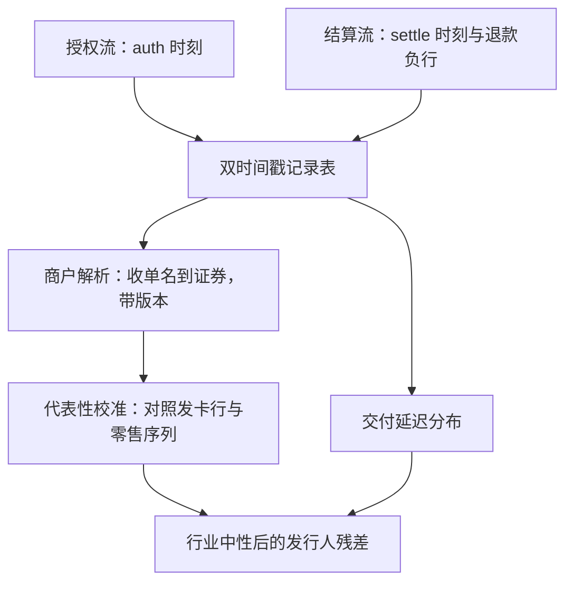
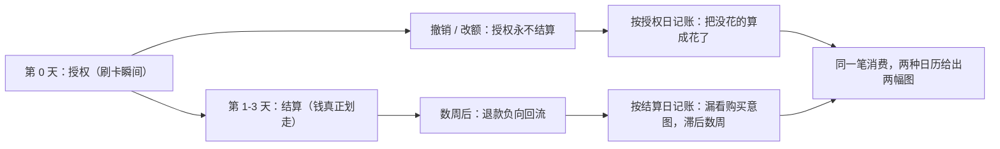

# 交易卡数据

卡数据的诚实从两个时钟开始：授权告诉你买了，结算告诉你钱动了；把两者混成一个日期，日历就会替你造出并不存在的 alpha。

<footer>—— 据 Ganong and Noel, American Economic Review, 2019；Baker, Farrokhnia, Meyer, Pagel and Yannelis, Review of Finance, 2023 整理</footer>

[上一课](/quant/alt-geo-deep)把空间传感器对齐到公司与面板，误差收敛到映射与加总规则。本课处理另一种个体级面板：卡与账户流水。主干课的[交易卡数据](/quant/card-spending)立了口径：Gross–Souleles 与 Ganong–Noel 说明流水能识别流动性约束下的消费；这是家庭金融与近实时宏观，不是默认的股票 alpha；商户映射、授权与结算、样本代表性都被点名。本课做工程深化：把这些坑变成可测的机制——双时钟、商户图谱、代表性校准与发行人残差。

## 问题

缺口在「坑被点名」与「坑被测量」之间。授权与结算是两个时钟：授权先发生，结算可能改金额、拆单或撤销，退款数周后负向回流；只按一个日期记账，政策支票到账周的「消费激增」里混着永远不结算的授权。商户是图谱不是字段：商户类别码与品牌实体不一致，一个零售集团几十个收单主体，映射不修订，同一家公司的销售额被拆到多家证券。面板在漂移：用户进出、发卡机构构成变化、激励活动改变刷卡行为，总量漂移与真实需求同形。聚合合规：数据只能在聚合层以上使用，个人级明细不可留存。这四件事不做成机制，nowcast 的误差无从归因。

nowcast 可译作「即时预测」：用高频数据估计还没公布的本期总量——比如用 4 月的刷卡流水猜 4 月官方零售额，而官方数字 5 月中才发布。它猜的是「现在」而不是未来，所以对数据交付延迟极其敏感，延迟账算错，信号就变成事后诸葛亮。

## 方法

其一，双时间戳表：每笔记录带授权时刻与结算时刻，金额两版，退款是负行而不是字段修正；任何日度聚合都声明用哪个时钟。其二，商户解析表：收单名到品牌实体再到证券的映射，带版本与可得日期，映射修订走生效日而不是回写——与[公司行动](/quant/corporate-action-engine)同一纪律。其三，代表性校准：把面板聚合消费对照发卡行财报与官方零售序列，报告比率及其漂移；比率不平稳的时段，nowcast 只做方向不做水平。其四，发行人残差：行业中性、季节调整后取公司残差，主干课的判据在这里变成每日作业；Ganong–Noel 的失业后支出骤降之所以可信，靠的是个体内对齐，不是总量对比。其五，交付延迟账：周频面板的延迟分布决定 nowcast 的可用日，信号时钟跟交付走。

行业中性就像赛跑只看选手比同组平均快多少：先把公司销售额减去所在行业的整体涨跌，剩下的才是这家公司自己的故事。不做这一步，行业普涨会把所有成员一起抬高，你以为买到了公司 alpha，实际拿到的是行业 beta。

## 机制

卡数据的边际价值为什么住在发行人残差：宏观消费意外早已被股债定价，主干课用刺激支票研究演示过这条地板；残差干净的前提是时钟与映射干净。授权时钟偏早所以更接近事件研究，结算时钟偏晚所以更接近现金流，两者的差本身是信息——预授权酒店与航空的分笔授权把这个差拉长到数周。不这么做的错法：把礼品卡销售当消费（销售时点与核销时点分离）；把发卡机构构成的漂移当成消费升级；把退款率的变化当成需求变化。

授权到结算通常差一至三个工作日，退款回流可滞后数周；Baker 等（2020）识别刺激支票的消费响应时，消费按个体与类别细排，正是为了把到账日的机械性到账与真实支出分开。双时钟不是洁癖，是识别条件。

两个时钟各自的失真路径——回答「混用一个日期到底错在哪」：

## 边界

本课不重讲家庭金融的因果问题——流动性约束与消费平滑是主干课与家庭金融文献的对象；用账户数据评估监管与产品设计（Agarwal, Chomsisengphet, Mahoney and Stroebel, 2015）是另一条应用线。卫星、文本、图谱各域不在此。个人级数据不可留存、不可交易使用，聚合门槛与删除义务的完整清单在[网络数据合规](/quant/web-data-compliance)；卡数据的供应商条款常比通用条款更严，逐条入注册表。

常见误区：拿到明细数据先「存下来以后再分析」。对卡数据这是合规红线——个人级明细不可留存，只允许聚合层以上使用。正确顺序是先声明聚合口径与保留期限，再做任何分析；供应商条款往往比通用数据条款更严，逐条登记而不是凭印象。

## 小结

- 双时钟是第一机制：授权与结算分开记账，退款是负行，聚合先声明用哪个时钟。
- 商户解析是一张带版本的图谱，映射修订走生效日，不回写历史。
- 代表性校准对照发卡行与官方序列；比率漂移时段只做方向不做水平。
- 边际价值在行业中性后的发行人残差，宏观层早被定价。
- 出处：Gross and Souleles, *QJE*, 2002；Ganong and Noel, *AER*, 2019；Baker, Farrokhnia, Meyer, Pagel and Yannelis, *Review of Finance*, 2023；Agarwal, Chomsisengphet, Mahoney and Stroebel, *QJE*, 2015；Chetty, Friedman, Hendren, Stepner and Opportunity Insights。
