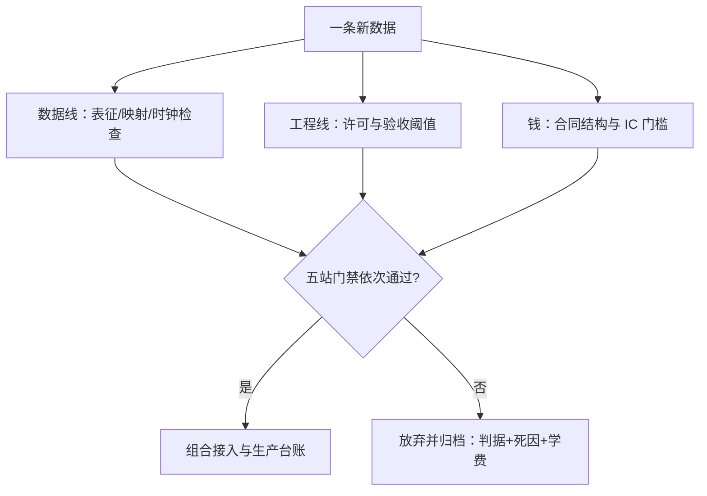
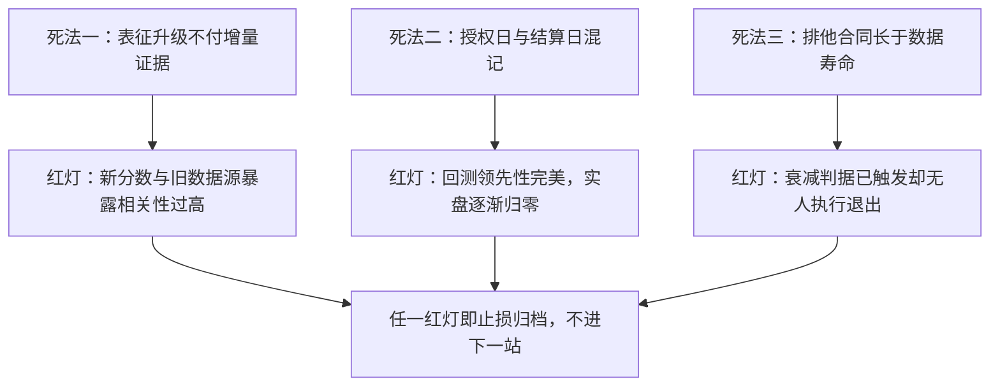

# 案例与收束

另类数据的失败很少死于数据本身，多数死于把「有一份新数据」当成了「有一个可交易的问题」；收束时把每一条走过的路标价，学费才会变成资产。

<footer>—— 据本课程各课的失败清单与五站流水线整理</footer>

[上一课](/quant/alt-data-to-strategy)把另类数据接到策略上：五站流水线的每站都有门禁，判据在看数据之前签字。本课是[另类数据工程](/quant/alt-cost-structure)课程的收束：把七条数据线与一条工程线走过之后剩下的东西——案例、失败模式与可复用的检查次序——收进一张决策单。后课默认已经读完本课程。

## 问题

另类数据的账很难算平，原因不是任何单点太难，而是失败分散在太多环节：数据可能没错但问题错了，问题可能没错但排他性买贵了，IC 可能不差但换手吃光了边际。缺口是把这门课程的各课收成一次「复盘演练」：给定一条新数据，先问什么、后问什么、在哪里放弃，以及放弃的学费如何记账。

## 方法

复盘用三栏对账。第一栏是**数据线**：文本（[文本因子的深化](/quant/alt-text-deep)）要付表征升级的增量证据，供应链（[供应链图谱](/quant/alt-supply-graph)）要验证冲击真的沿边传播，地理（[地理空间的深化](/quant/alt-geo-deep)）要检查地块到公司的映射误差，卡数据（[交易卡数据](/quant/alt-card-data)）要对齐授权与结算两个时钟。第二栏是**工程线**：爬虫的许可边界（[网络爬虫的合规与工程](/quant/alt-crawler-compliance)）在立项前签字，质量的验收阈值（[数据质量体系](/quant/alt-data-quality)）在试用协议里钉死。第三栏是**钱**：排他性、交付与衰减的合同结构（[成本结构](/quant/alt-cost-structure)）决定 IC 的门槛，五站流水线（[从数据到策略](/quant/alt-data-to-strategy)）决定何时退出。

放弃也要归档：判据、死因与已付成本三条都留痕，下一次同类数据进场时，折价的计算才有分母。

## 机制

三个案例型失败贯穿本课程。其一，**表征升级不付证据**：换大模型重跑文本分数，IC 提升但与新数据源的暴露几乎重合——增量证据的判据（[文本因子的深化](/quant/alt-text-deep)）没签就动手，学费是被折价的数据费。其二，**两个时钟混成一个日期**：卡数据用授权日聚合结算额，日历前移造出「提前知道」的假象（[交易卡数据](/quant/alt-card-data)），回测漂亮、实盘归零——验收阈值里没有时钟对齐这一条（[数据质量体系](/quant/alt-data-quality)）。其三，**排他性买成沉没成本**：独家合同按年付，但数据的可交易寿命只有两个季度（[成本结构](/quant/alt-cost-structure)），衰减判据（[从数据到策略](/quant/alt-data-to-strategy)）触发时舍不得退。三条路的共同点：错误在第一周就可见，只是没人被要求去看。

IC（信息系数）就是「预测与现实的命中率」：把因子分数和下期收益各排一次序，算两列排名的相关。0.05 的月度 IC 听起来可怜，但配合低换手与足够宽的截面，年化后可能就是一条可用的曲线；同样的 0.05 若出现在高换手信号上，一半被成本吃掉，就什么也不剩。

三种死法与它们在第一周的暴露信号——回答「每条路最早在哪里亮红灯」：

排他费是典型的沉没成本：钱已经付了，理性问题是「从今天起继续用它还值不值」，而不是「不用就白买了」。工程上的解法是把退出判据写进合同与流水线本身，触发即执行，让「舍不得」没有操作空间。

## 边界

本课程的口径止于数据侧的工程与研究纪律：信号进了组合之后的风险叠加、容量与执行在组合与执行课程里；「数据比市场聪明」的极端情形——信息本身来自违规——不在任何流水线的允许集里。另类数据的监管口径也在移动：[网络数据合规](/quant/web-data-compliance) 一课的合规清单要按当期规则重读，本课程不给跨期承诺。

初学者容易被「内幕级数据」的故事吸引。实际上来源违规的数据不是 alpha 加成，而是法律与声誉的负资产：收益无法入账、回测无法披露、供应商随时被查封。合规清单要当成这类策略的准入证来读，而不是事后补的成本项。

## 小结

- 复盘三栏对账：数据线逐域检查表征、映射与时钟，工程线把许可与阈值前置，钱线把合同结构折进 IC 门槛。
- 三条高频死法：表征升级不付增量证据、多时钟混一日期、排他性合同长于数据寿命——都在第一周可见。
- 放弃是产出：判据、死因、学费三件归档，同类数据的折价才有分母。
- 检查次序固定为「先许可、再质量阈值、后花钱」，顺序错了后面全对不了。
- 出处：本课程各课的失败清单；多重检验折价口径见 Bailey, Borwein, López de Prado and Zhu, 2014。
