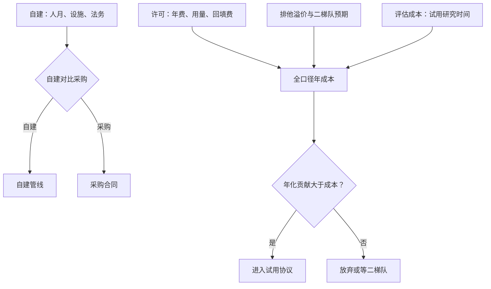
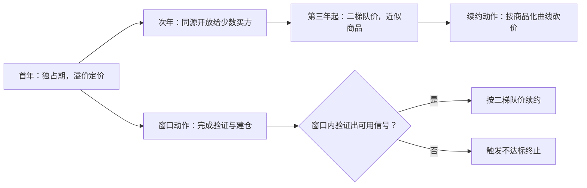

# 成本结构

另类数据的价目表从来不是每行多少元，而是一份关于排他性、交付与衰减的合同；成本结构算错，再好的 IC 也回不了本。

<footer>—— 据 Katona, Painter, Patatoukas and Zeng 关于另类数据生态的讨论；另类数据采购的一般实践整理</footer>

[上一课](/quant/alt-data-quality)立了质量门禁：不合格进不了特征管道。门禁通过只回答「能用」，本课回答「值不值」。产能与上限的口径在[容量与容量估计](/quant/live-capacity-estimate)已经立过；本课把另类数据特有的成本解剖开——它不是一笔订阅费，而是一张含排他溢价的合同加一条自建管线的影子成本。

## 问题

最常见的错不是买贵了，是**算少了**。许可费只是显性成本：年费按席位与资产规模分档，历史回填另收一次性费用。隐性成本通常更大：试用期里研究团队的时间、法务对条款的复核、存储与计算、删除管道的运维、以及上一课那套质量体系的人力。漏算这些， 「IC 是正的」与「这笔采购赚钱」之间就断了因果：一个把组合信息比率从 $0.9$ 提到 $0.93$ 的信号，年化贡献是 $\Delta IR \cdot \sigma \cdot A \cdot f$，其中 $\sigma$ 是策略波动、$A$ 是资产、$f$ 是费率；订阅当且仅当这个数 $\gt$ 全口径年成本。不列全口径，平衡永远向「买」倾斜。

代入一个数：$\Delta IR=0.03$、策略波动 $\sigma=8\%$、资产 $A=5$ 亿、费率 $f=15\%$，年化贡献就是 0.03×8%×5 亿×15% ≈ 18 万元。若全口径年成本（订阅加人力加运维）是 60 万，这单就买亏了——哪怕销售演示里的 IC 看起来再漂亮。平衡点永远算在钱上，不在指标上。

## 方法

成本分五类入账。许可类：固定年费、用量计费（按调用与下载）、历史回填费。排他类：独占期溢价，期满后同源数据以二梯队价格开放——溢价买的不是永久独占，是窗口内的验证与建仓时间。自建类：爬虫课的管线折算成人月、基础设施与法务复核，与采购价放进同一张表比。评估类：试用期研究时间按内部成本率计价，预登记的试用协议（下一课展开）控制这项不发散。合规类：留存、删除与审计的持续运维。三个摊销规则：跨策略摊销——同一面板服务多条策略时按调用分摊，成本不重复计入单条策略；跨期摊销——回填费摊到合同期；衰减入账——按商品化节奏给续约价做下调预期，供应商的成本随客户增多而摊薄，价格理应逐档下移。

「跨策略摊销」就像合租分房租：同一份数据若同时喂给三条策略，账单按用量拆成三份，每条策略只背自己那份。若让一条策略背全额，它的判据会被人为抬高；而三条都被拒绝时，这笔真实发生的成本反而凭空消失了。

## 机制

排他溢价为什么存在：信息优势的定义是别人没有；同一份数据卖得越多，窗口越短，所以供应商把早期高价卖给你一个人，后期低价卖给所有人——这条价格路径是结构性的，不是谈判风格。买方的理性应对是把排他期当作**建仓窗口**定价，而不是当作永久优势付年费。build 与 buy 的判别在三点：排他需求（自建是唯一的独占方式，但要独占就得养管线）、合规责任（自采的许可与删除义务自己扛，采购则写进合同）、维护预算（上一课的质量体系对自建是全职岗位）。不这么算的错法：按今年 IC 线性外推续费，忽略商品化降价，第二年还在为二梯队价格已经腰斩的数据付首年溢价。

排他窗口的价格路径与买方动作——回答「续约价为什么该逐年重谈」：

试用谈判里最值钱的条款不是折扣，是「不达标终止权」：预登记判据不达，合同在试用期结束自动终止、已付费用按比例退回。它把「信号行不行」的裁决权从供应商的续约节奏移回你的判据——这一条通常比五个点的价格折扣更影响全口径成本。

## 边界

本课不回答「信号行不行」——那是从数据到策略一课的试用协议与判据，本课只提供成本一侧的输入。供应商断供风险在爬虫与合规课已立（源切断是模型风险），这里只算它的对冲成本（替代源与金样回归的维护费）。人力成本的一般分摊、以及数据之外的交易成本（佣金、滑点、冲击），归执行课程，不混入数据成本。排他条款的反垄断边界以所在司法管辖为准，本课不展开。

「源切断」指供应商停业、被收购或断约后数据突然消失——这时不是模型变差一点，而是整条特征列没了。对冲手段之一「金样回归」：留一小份核对过的黄金样本，每次换源或升级后重跑，看口径是否还一致。这些维护费要提前算进年成本，不能等断供当天再想办法。

## 小结

- 成本五类：许可、排他、自建、评估、合规；只算许可费必错，且错向「买」。
- 盈亏平衡是 $\Delta IR \cdot \sigma \cdot A \cdot f$ 对全口径年成本，不是 IC 对订阅费。
- 排他溢价买的是窗口不是独占；价格路径随商品化下移，续约价要有下调预期。
- 自建对比采购在排他需求、合规责任、维护预算三点上判，不放同一张表就没法比。
- 出处：Katona, Painter, Patatoukas and Zeng 关于另类数据生态的讨论；另类数据采购与合同实践，据行业一般做法整理。
