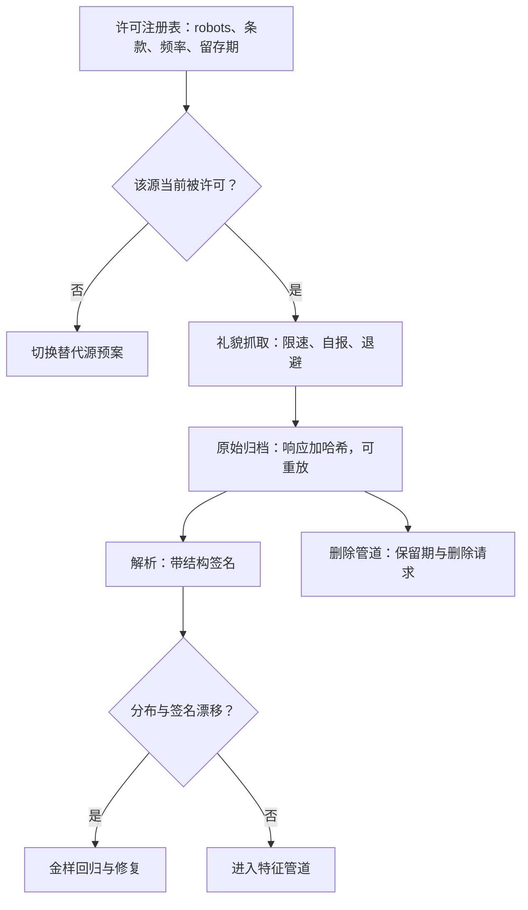
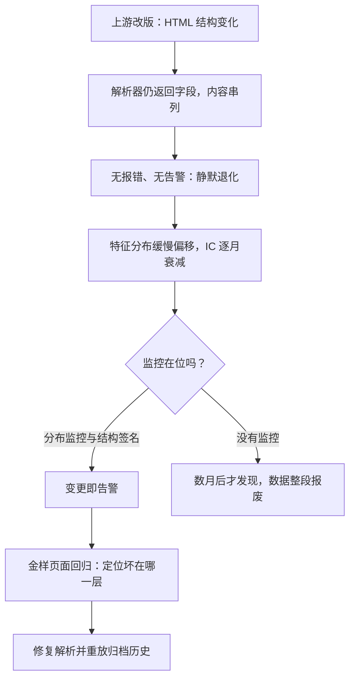

# 网络爬虫的合规与工程

爬虫的第一约束不是带宽，是许可；技术上可复制的抓取，法律上未必可留存，更未必可交易使用。

<footer>—— 据 hiQ Labs 与 LinkedIn 诉讼（美国联邦第九巡回法院）的公开报道；GDPR 与个人信息保护法的一般原则整理</footer>

[上一课](/quant/alt-card-data)把卡流水做成发行人残差，域深化四课到此收拢：文本、图谱、地理、卡，各域都有了带时间戳的面板。本课起转入工程单元，处理各域共同的进料口——自采数据。红线主干课已经画了：[网络数据合规](/quant/web-data-compliance)确立「公开可见不等于可采集、可存储、可交易使用」，管道第一道是合规清单。本课把清单落成爬虫的**工程件**：许可注册表、礼貌抓取、原始归档、解析漂移监控与删除管道，让「合法且不断源」成为可持续状态而不是一次性的项目验收。

## 问题

缺口在「要不要」与「怎么做才持续」之间。目标站的 robots 协议与服务条款各异且会单方面修改；反爬措施升级导致断源，而源切断是模型风险——主干课要求预先写替代，问题是怎么写。HTML 结构漂移让解析静默退化：字段还在，内容早已串列，IC 缓慢死亡而监控无告警。抓下来的原始页不归档，事后无法回答「当时页面上是什么」，回填无从检测，回测与实盘的差异无从归因。这四件事没有一件是「更快地抓」，全是许可与可重放性。

## 方法

五件工程件。许可注册表：每个源一行——robots 状态、条款摘录、法务复核日期、允许频率、留存期限，源变更走审批再生效。礼貌与身份：遵守协议的抓取延迟、真实自报的 UA、并发上限、失败指数退避——目的是把**被允许的**抓取做得可预测，不是绕过防护；绕过技术措施的方案不进本课，因为它违规且不可复制。原始归档：原始响应与抓取时刻的哈希一起入库，可按时刻重放，回测能回答「当时看到什么」——与[点时基本面](/quant/point-in-time)同一思想落到字节层。解析漂移监控：对解析结果做分布监控，对页面结构做签名，变更即告警；金样页面做回归测试，解析代码升级先过金样。删除管道：保留期到期与主体删除请求触发清理，义务来自合同与个人信息保护法，清理动作留痕可审计。

UA（User-Agent，用户代理）是抓取程序自报家门的字符串：浏览器会自报「我是 Chrome」，爬虫也应当如实自报身份与联系方式。伪装成浏览器也许能过防护，但那已属于规避技术措施——本课的立场是「把被允许的抓取做得可预测」，不是潜入。

## 机制

合规件为什么是工程件而不是备忘录：许可会变，注册表让「哪天、哪个源、凭哪条条款」可审计，纠纷时这是唯一的证据；替代源必须预先写成代码路径并过金样回归，断源日的切换才是配置变更而不是救火；原始归档是回填检测的前提——没有当时快照，就测不出供应商或自己的回填（[回填偏差](/quant/alt-data-backfill-bias)的四层前视全部因此漏检）。不这么做的错法：合规靠口头约定，断源靠现场想办法，解析退化靠用户投诉发现——三条都会把工程事故变成模型事故。

robots 协议是行业惯例，服务条款是合同约束，二者绑定方式不同：前者约束自动访问的礼貌，后者约束使用与留存。hiQ 与 LinkedIn 的多年诉讼围绕「抓取公开资料是否构成计算机欺诈」，往返裁定说明不确定性集中在合同与个人数据层面，而不是技术可行性——这正是注册表把两者分列的原因。

解析漂移为什么能静默杀死信号、监控如何拦截——回答「字段还在为什么 IC 还是死了」：

指数退避就是「失败后翻倍等待」：第一次失败等 2 秒，再失败等 4 秒、8 秒、16 秒，而不是每 2 秒硬撞一次。硬撞会把对方的偶发故障撞成对你的永久封禁；退避既给对方喘息，也让自己的重试集中在对方恢复之后。

## 边界

本课只立流程不立判例：辖区差异大——美国计算机欺诈法律的边界、欧盟数据库特别权利、国内个人信息保护法——具体条文以所在司法管辖为准，不在本课伪造。个人数据一律在聚合层以上停留，这与后文各课一致。质量阈值的定义与门禁是下一课的对象；采购与定价归成本结构课；抓取的频率设计只到「被允许的范围内可预测」为止，不做规避技术。

常见误区：「页面公开可见，抓下来就没事」。公开只解决「看到」，不解决「存储期限」「二次分发」与「个人信息」三件事——同一份公开页面里若含个人信息，删除请求一样适用于你。这也是个人数据一律只在聚合层以上停留的原因。

## 小结

- 许可注册表是爬虫的第一张表：robots、条款、频率、留存期，源变更走审批。
- 原始归档带哈希可重放，是回填检测与事后审计的字节层前提。
- 解析漂移靠分布监控加结构签名加金样回归拦截，静默退化不是宿命。
- 替代源预案预先写成代码路径；源切断是模型风险，不是运维新闻。
- 出处：hiQ Labs v. LinkedIn（第九巡回法院）公开报道；GDPR、个人信息保护法的一般原则；本课程网络数据合规与回填偏差各课。
