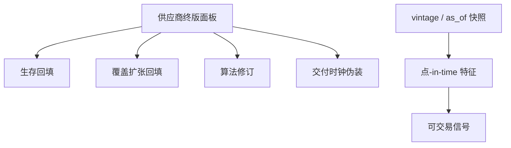

# 回填偏差

另类数据供应商在你买入历史的那天，已经知道哪些公司活到了现在、哪些门店还开着、哪一版算法把云层处理得更好。把这本日历当 $t$ 日可知，是另类数据版的前视。

<footer>—— 对照 Croushore and Stark 对宏观实时数据集的动机；另类数据中的生存与修订问题见 Katona 等对另类数据进入资本市场的讨论</footer>

[期权链作为现货信号](/quant/options-as-spot-signal)把一条相对干净、有交易所时钟的另类源用到了现货。本课打开回填：卫星、消费、网页、文本供应商交付「2005 年至今」面板时，往往含有当时并不存在的修订、覆盖与存活。Croushore–Stark 为宏观建立实时数据库，正是因为终值与初值不同。另类数据同样有 vintage。后课面板构造与卫星特征都默认：没有 vintage，就没有可交易的点-in-time。

## 问题

回填偏差至少四层。生存：历史只包含今日仍在覆盖名单上的公司或设施，退市、关店、破产被拿掉。覆盖扩张：供应商后来才追踪的名字，被填上「历史」特征，早期截面其实更窄。算法修订：云检测、NLP 模型重跑，过去的特征值被改写。延迟伪装：交付文件的时间戳是研究购买日，不是当时可获得日。四层可以同时存在。用终版面板训练、用终版面板回测，IC 会漂亮，实盘用当时版本会掉一块——掉的是回填，不是拥挤。

缺口是要求供应商或内部管道提供 `as_of`：每一观测在何时变为对客户可用。没有这一列，另类数据不能进生产信号，只能当事后解释。

### 回填不是幸存者偏差的别名

幸存者偏差通常指股票宇宙。回填还改**特征值本身**。一家一直存活的公司，其 2014 年的卫星营收代理可能在 2020 年被新模型改掉。点-in-time 股票宇宙挡不住这种修订。必须对特征做版本，像宏观实时数据集那样。

试用数据尤其危险：供应商给你的样本往往是覆盖最好、修订最多的名字。容量与拥挤课已经警告选择偏差；回填是同一偏差在数据采购上的版本。

## 方法

合同与工程都要求 vintage 文件：每日交付快照存档，不许在旧快照上覆盖。回测 API 只允许 `as_of ≤ 决策时刻`。对照实验：终版面板 vs vintage 面板的 IC 差，就是回填贡献。差很大，说明 alpha 来自修订，不是来自当时信息。覆盖矩阵：每个日期哪些名字非缺失；覆盖随时间变宽时，早期横截面不可与后期直接比，应在共同覆盖上检验。

与公司行为对齐：设施列表必须随分拆、并购更新，且更新不得前移到宣布前。地理映射用当时的门店名单，不是今日官网。

### 文本与网页的特殊回填

网页被改、新闻被删、社交账号被封。抓取若只存今日能抓到的 URL，历史情绪是存活文本。必须存当时抓取的原文快照。合规课会限制你能存什么；在允许的范围内，快照是点-in-time 的唯一方法。供应商「历史情绪分数」若不能提供当时分数，视为无 vintage。

## 机制

回填把未来信息写入过去特征，等效于前视。生存回填让模型在「将会存活」的条件分布上训练，实盘没有这个条件。算法修订把不可交易的测量改进写成过去的 alpha。市场若在数据发布当时已经部分定价，终版还会把后来才知道的测量误差修掉，进一步美化。Katona 等人讨论另类数据的分配效应时，隐含前提是数据在当时被一部分人持有；回填研究把「当时」弄丢了，分配效应也无法定义。

不要用终版卫星特征去「验证」当时的实现价差或订单流。两边时钟都错，相关没有含义。

### 试用样本往往是回填最重的子样本

供应商给你「效果最好」的历史，覆盖与修订都经过选择。应用该样本估 IC，再把覆盖推广到全宇宙，是把回填与选择偏差乘在一起。合同应要求随机或全覆盖 vintage。

## 边界

交易所成交回放一般不回填价格（更正另说），这是另类数据与市场数据的差别。宏观实时数据库是榜样，不是所有另类供应商都愿意提供。不能提供则降级为宏观解释变量，不进下单。下一课在有 vintage 的前提下把不规则观测建成面板。

终版卫星计数与当时订单流的相关，两边时钟都可能错。这种相关不能当「另类数据已被定价」的证据。

## 小结

- 回填含生存、覆盖、算法修订与交付时钟四层，都会造成前视。
- 没有 `as_of` 的另类历史不能当点-in-time 信号。
- 终版与 vintage 的 IC 差度量回填贡献。
- 特征修订 ≠ 股票宇宙幸存者，两套都要管。
- 试用样本往往是回填最严重的子样本。
- 出处：Croushore and Stark, *Journal of Econometrics*, 2001；另类数据与资本市场见 Katona, Painter, Patatoukas and Zeng 及相关讨论；点-in-time 原则见本课程序研究偏差主干。
