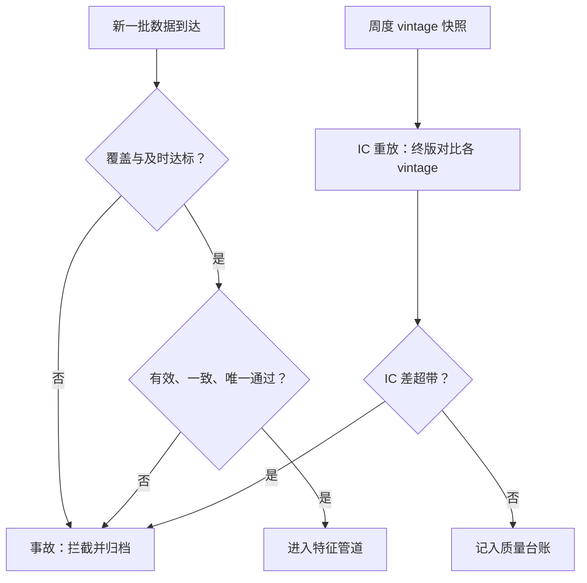

# 数据质量体系

数据质量不是一份描述文档，是一组带阈值的验收测试；没有阈值的质量维度只是形容词。

<footer>—— 据 Croushore and Stark, Journal of Econometrics, 2001；数据质量维度框架的一般实践整理</footer>

[上一课](/quant/alt-crawler-compliance)把自采管道立成带许可注册表与原始归档的工程件；归档回答「当时是什么」，本课回答「现在这份好不好」。主干课立了偏差谱系：[回填偏差](/quant/alt-data-backfill-bias)的四层前视、[面板构造](/quant/alt-panel-construction)的映射、日历与缺失三张表。本课把偏差防治落成**体系**：维度、阈值、门禁、事故——让「数据坏了」从 IC 缓慢死亡变成一次可拦截的事故。

## 问题

另类数据的失败模式与行情数据不同：它很少报错。覆盖悄悄缩（面板用户流失，某类商户整体消失）；口径悄悄换（供应商改算法、改样本，序列连续而含义已断）；交付悄悄迟（延迟分布的尾从两天拖到九天，信号可用日整体后移）；单位悄悄错（元与千元、毛与净）。四件事都无异常日志，唯一的外显是 IC 逐年衰减——等你从收益上发现，回测与实盘的差异已经不可归因：是信号失效，还是进料变质？缺口因此不是「更多质量检查」，而是**挂在决策上的阈值与拦截机制**。

## 方法

六个维度，各配阈值。覆盖：宇宙与时间的单元格矩阵，核心段覆盖不得低于基线的 $95\%$，骤降即事故。及时：交付延迟的分布，对 $p95$ 与 $p99$ 设上限，上限由信号的持有期反推——日频信号的延迟预算与月频不同。有效：模式、类型与值域规则，硬失败直接拦截，不进特征管道。一致：跨源对账，自采样本与供应商对同一实体的值比对，容差带预先声明。准确：对官方基准的 nowcast 误差控制在声明的区间。唯一：主键与去重。三个机制把维度变成体系：门禁挂在管道上——不合格数据不进特征，这是[特征商店三原则](/quant/feature-store-research)的执行层；周度 vintage 快照与 IC 重放——每周对同一历史窗口重算一次，终版与各 vintage 的 IC 差就是回填贡献的可测值，回填课的判据由此变成例行作业；事故与复盘——跌破阈值即事故，归档走[研究复盘](/quant/research-postmortem)模板，死因必须落在判据上。

## 机制

阈值为什么必须挂在决策上：质量维度只有在「这个信号多快地用它」面前才有数值答案，脱离持有期谈延迟上限、脱离宇宙谈覆盖率，都只能得到形容词。NA 不是零，覆盖阈值决定当日截面谁进场，这是面板课立过的规矩；门禁把它从规矩变成开关。不这么做的错法：质量做成月度报表——报表出来时，带病数据已经上线三周，IC 的三周衰减永久记在信号头上；或者只监控特征分布不监控原始进料——供应商改了样本，特征分布的变化被误读为市场状态变化。

对账样本要分层抽：按实体规模、地区与时间分层各抽若干，容差带按层声明。总量对账通过而某层对不上，是最常见的「总体看着没事」陷阱——供应商收缩的恰恰是那一个小层。

## 边界

本课测的是「数据像不像它应该有的样子」，不测「信息还在不在」——后者是信号衰减，归本课程后面「从数据到策略」一课的退场机制管辖。行情与基本面数据的质量由数据工程主干处理，另类数据只是同一思想在脏进料上的特化。供应商的合同义务与赔付条款是采购问题，归成本结构课；跨源对账的容差带设定依赖用途，本课不给通用数值，只给「预先声明」这条纪律。

## 小结

- 六维度各配阈值：覆盖、及时、有效、一致、准确、唯一，脱离用途的阈值只是形容词。
- 门禁挂在管道上，不合格进不了特征；月度报表不是质量体系。
- 周度 vintage 快照加 IC 重放，把回填偏差从论文判据变成 cron 作业。
- 跌破阈值即事故，复盘死因落在判据上，负结果可检索。
- 出处：Croushore and Stark, *Journal of Econometrics*, 2001；本课程回填偏差、面板构造、特征商店各课的数据质量条款。
