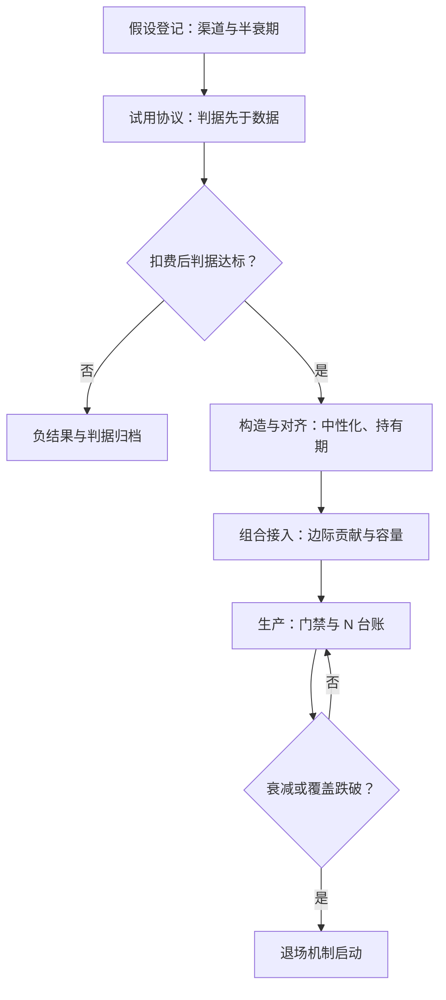
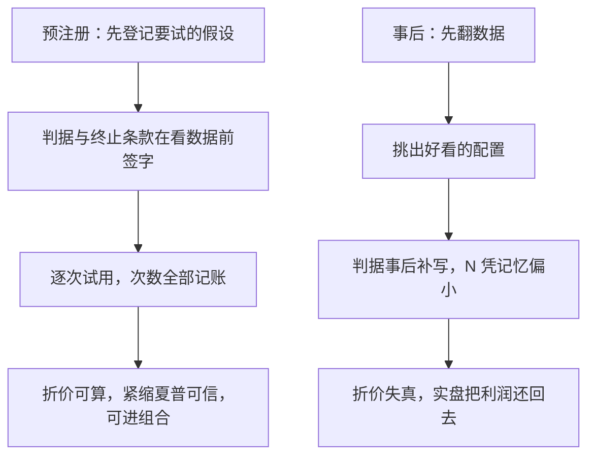

# 从数据到策略

数据与策略之间隔着一段协议：先写清怎样算成功、怎样算失败，再看数据；顺序反过来，回测会替你把任何假设都圆上。

<footer>—— 据 Bailey, Borwein, López de Prado and Zhu, The Deflated Sharpe Ratio, 2014 整理</footer>

[上一课](/quant/alt-cost-structure)把成本列成全口径：许可、排他、自建、评估、合规，盈亏平衡挂在年化贡献对成本上。本课是工程单元的合拢：把过了质量门禁、算得清成本的数据，变成一条进组合的信号，并配好失败时的退场。单点判据都已立过——[回测过拟合](/quant/backtest-overfitting)的折价、[紧缩夏普](/quant/bailey-dsr)的 $N$ 调整、[标签与持仓期](/quant/label-horizon-overlap)的重叠纪律；缺的是把它们串成顺序并记账的**协议**。

## 问题

各判据分散在不同课，实践里「试用一份 vendor 数据」没有统一协议。结果是三件系统性浪费：试得快、上得快、忘得也快——试过多少个表征与数据集没人记，$N$ 事后无从追认，折价算不了；负结果不归档，同一份数据明年换个包装再试一遍，等于对同一个零假设反复开火；判据在看完数据之后才定，「试用成功」被默认为「找到了一个能看的配置」——这是无惩罚的多重检验，不是研究。缺口因此不是新检验，是**顺序与账本**。

「多重检验」就是同一道题反复作答：从 100 个试过的配置里挑最好的那个，它的好成绩很可能只是运气——就像掷 100 次硬币总会出现一段连正面。不记录总共掷了几次，就没法判断这段连正面是本事还是概率。$N$ 记的正是「一共掷了几次」。

## 方法

五站流水线，每站有门禁与产出物。第一站假设登记：为什么这份数据有别人尚未交易的信息？写清传导渠道、预期半衰期、以及它可能只是已知因子的再包装的方式——上一课的残差增量判据在这里预注册。第二站试用协议：样本期、基准（增量相对词典、相对已有因子组合）、中性化规格、判据与终止条款，全部在看数据之前签字，终止条款接上一课的「不达标终止权」。第三站构造与对齐：行业与市场中性化，持有期对齐交付时钟与信息半衰期，执行基准用[到达价](/quant/arrival-price)，扣费口径在协议里写死。第四站组合接入：增量暴露与[因子边际贡献](/quant/fz-marginal-contribution)，容量按[容量估计](/quant/live-capacity-estimate)的口径上限管理。第五站生产与台账：特征进[特征商店](/quant/feature-store-research)的门禁，试用次数计入 $N$ 台账，负结果连同判据归档进复盘库，可检索。

预注册就像考试前公布评分标准：先写死「达到什么算及格、什么算放弃」，再开卷答题。若允许看完答案再定标准，人人都能「及格」——数据试用同理，判据后置的试用成功率恒为高，但毫无信息量。

## 机制

顺序为什么不可换：折价的分子是试过的次数，$N$ 只能从预注册的账本里来，从事后记忆里来的 $N$ 永远偏小；判据先于模型是本课程一贯口径，在利率与信用案例里收过束（[利率与信用案例与收束](/quant/rc-case-map)）。退场机制与进场的判据同源：预注册时写下的半衰期与覆盖下限，就是衰减治理的触发线，信号衰减到判据以下按协议退出，而不是按情绪坚持。不这么做的错法：试用成功即上线、无退场条款——数据的商品化与对手方的涌入会让信息优势单调衰减，没有退场机制的信号最终以滑点的形式把利润还回去。

试用结束时应当能答出三个数：试了几个表征与配置（$N$）、扣费后的紧缩夏普、相对词典或供应商基线的增量 IC。三个数答不出任何一个，就不该转正式采购——这条三问判据把过拟合折价、费用现实与增量要求压进一张便签。

同一份数据、两种顺序的结局对比——回答「为什么判据必须先于数据」：

## 边界

各判据的数学在各自课里已经给出，本课不重推；因子研究的方法论整体归因子深化课程，组合层的优化归组合构建课程，本课只到「信号进组合的门」为止。供应商层面的合同条款归成本结构课；退场之后的知识沉淀与台账治理归策略生命周期治理的口径。预注册不是形式主义：它的产出物（协议文本、$N$ 台账、负结果库）是后续任何复现与审计的原始证据。

负结果库是防止「重复付费」的资产：同一份数据明年换个供应商或换个名字再来时，检索台账 30 秒就能回答「试过，$N=17$，死因是换手吃光边际」。没有这本账，组织会对同一个零假设反复开火，学费一遍遍地交。

## 小结

- 五站流水线：假设登记、试用协议、构造对齐、组合接入、生产台账，每站有门禁与产出物。
- 判据在看数据之前签字；$N$ 只认预注册账本，不认事后记忆。
- 负结果连判据归档、可检索，否则同一数据被反复试错且折价无从计算。
- 进场判据与退场触发同源，衰减到线即按协议退出。
- 出处：Bailey, Borwein, López de Prado and Zhu, 2014（紧缩夏普）；Harvey and Liu 关于多重检验的讨论；本课程研究复盘与成本结构各课。
