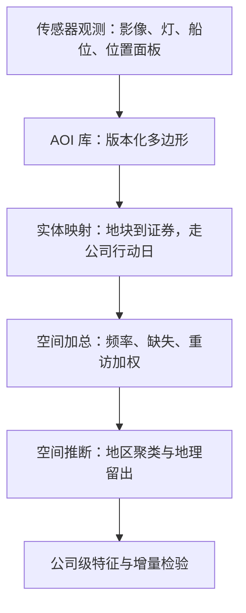

# 地理空间的深化

传感器看到的是地块，组合需要的是公司；地理数据深化的主要误差发生在那一次映射里，而不是卫星里。

<footer>—— 据 Donaldson and Storeygard, Journal of Economic Perspectives, 2016；Addoum, Ng and Ortiz-Bobea, Review of Financial Studies, 2020 整理</footer>

[上一课](/quant/alt-supply-graph)把文本与披露拼成供应链图谱，冲击传导有了带时间戳的边。本课把同样的对齐问题搬到空间上。主干课的[卫星与地理](/quant/satellite-geo)立了夜灯与经济活动的关系、传感器换代与云层的坑；[卫星到特征](/quant/satellite-to-feature)立了节点存档、云掩膜与传感器交叉校准的管道纪律。本课的深化在**特征之后**：地块数字怎么变成公司面板，空间结构怎么改变检验，以及手机面板这类新传感怎么合规地进来。

## 问题

缺口在「传感器到特征」与「特征到公司」之间。三个坑。映射错：兴趣区圈错地块，或门店、厂房、仓库归属错公司——用总部坐标当经营位置是最常见的错法，总部在纽约的零售商，其营收不发生在纽约。加总任意：同一批地块换一种分格加总，结论可以翻转，这是可修改面积单元问题的老病（Openshaw, 1984）。推断失效：地理相邻的观测误差相关，普通标准误把 $t$ 值抬高数倍，虚假显著在空间数据里是常态而不是例外。不解决这三件事，把县夜灯乘一个权重就当公司营收 nowcast，得到的不是信号而是加了噪声的行业暴露。

## 方法

对齐管线四步。其一，兴趣区库版本化：门店、厂房、物流设施的多边形各自成表，关联到证券，关联切换走[公司行动](/quant/corporate-action-engine)的有效日——并购与关店改映射，不改历史。其二，加总规则显式声明：聚合频率、缺失阈值、重访不均的加权方式，重访周期不规则的传感器按观测时间加权而不是按日历等权。其三，检验按空间做：按地区聚类或方块自助，验证集按地理留出——训练北美、验证欧洲，防止空间泄漏让回测好看。其四，增量相对基准：对官方统计与分部披露的增量定义信息（[分部披露的地区口径](/quant/segment-geo)另有其坑）。新传感两条：高分辨率设施观测与手机位置面板，后者必须在聚合层以上停留，最小化与删除义务沿用[网络数据合规](/quant/web-data-compliance)的口径。

## 机制

映射为什么是主要误差源：传感器误差主干课讲过（云、饱和、换代），这里难的是公司层。停车场车辆数到收入的弹性随业态变化——折扣店与奢侈品店的转化率不同，同一个车流数含义不同；地理暴露到定价的通道则是另一条线：气候新闻可以对冲（Engle, Giglio, Kelly, Lee and Stroebel, 2020），海平面上升已进入沿海房价（Bernstein, Gustafson and Lewis, 2019），干旱暴露压 agricultural 收益（Hong, Li and Xu, 2019），公司地址与设施位置决定谁暴露多少——Addoum, Ng and Ortiz-Bobea（2020）正是把温度冲击对齐到设施位置才做出识别。不按管线走的错法：用住宅区夜灯外推工业用电，把城市化当成了产出。

DMSP-OLS 夜灯只有 6 比特量化，取值 0 到 63，明亮城市核早早饱和，增长读不出来；VIIRS 自 2012 年起以辐射校准接替（Donaldson–Storeygard, 2016 对此有专节）。做十年以上的夜灯面板，先写世代拼接规则，再谈 IC。

## 边界

夜灯宏观测量与云掩膜管道是主干课与特征课的对象，不重讲；农业天气溢价的交易化另有其课（[农业天气溢价](/quant/ag-weather-premium)）。手机面板不落个人级数据，轨迹再识别风险使聚合门槛不可放松。空间相关校正改变的是标准误不是系数：校正之后仍在的效应才值得进因子库。地理数据的覆盖率随公司业态分化，覆盖阈值决定谁进当日截面，这一横截面纪律归面板构造主干课管辖。

## 小结

- 深化发生在特征之后：兴趣区版本化、实体映射、加总规则、空间推断四步缺一不可。
- 总部坐标不是经营位置；映射误差是公司级地理信号的主要误差源。
- 空间相关使常规标准误失效，按地区聚类与地理留出是回测的最低配置。
- 世代拼接（如 DMSP 到 VIIRS）先于任何十年期夜灯面板。
- 出处：Donaldson and Storeygard, *JEP*, 2016；Addoum, Ng and Ortiz-Bobea, *RFS*, 2020；Engle, Giglio, Kelly, Lee and Stroebel, *RFS*, 2020；Bernstein, Gustafson and Lewis, *JFE*, 2019；Hong, Li and Xu, *JFE*, 2019；Openshaw, 1984。
