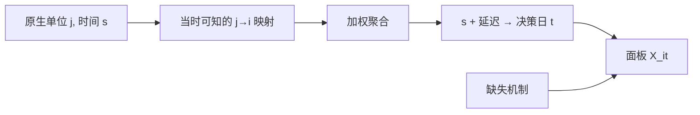

# 面板构造

另类观测落在设施、邮编、SKU、船舶上，证券落在 CUSIP 上。面板不是把表格 join 起来，而是声明空间单位、时间单位、映射规则与缺失机制之后，才得到一张可回归的 $(i,t)$。

<footer>—— 据 Donaldson and Storeygard 对卫星数据空间对齐的讨论；对照资产定价里证券-日期面板的标准构造</footer>

[回填偏差](/quant/alt-data-backfill-bias)要求 vintage。本课的缺口是：即使每个快照都是当时可得的，观测仍不规则——有的日子有云、有的门店关了、有的公司对应几千个点。要把它们收成与收益对齐的面板，必须写出聚合、映射、缺失与频率转换。后课卫星到特征是本课在影像上的特化；网页合规限制哪些原始观测能进面板。不要把面板当成「数据科学预处理」，它决定你估计的是哪一个经济对象。

## 问题

标准资产定价面板是证券 $i$、日期 $t$ 的收益与特征。另类源的原生键是设施 $j$、网格 $g$、或文本 ID。映射 $j\to i$ 多对一，还有一对多（合资、加盟、供应商）。时间上，卫星重访不是交易日，消费数据可能是周，文本是事件时间。硬把最后一次观测前向填充到每个交易日，会制造虚假的日频独立性，也会在缺失非随机时（雨季无影像）造成偏差。

缺口是三张表：映射表（谁属于哪只证券、权重用营收还是面积）、日历表（观测时刻 → 可交易时刻，含时区与延迟）、缺失表（缺测是无活动还是传感器失败）。没有这三张表，回归里的固定效应不知道在固定什么。

### 频率转换会改写信息集

周频消费加总到月，再预测月收益，延迟结构与加总方法（和、均值、期末）会改变。用当周数据预测当周收益，若数据周五才交付，前视。面板的 $t$ 必须是**决策日**，特征值是该日 `as_of` 下已完成的聚合。这与宏观 nowcast 相同。

权重用今日营收份额去聚合历史门店，是映射上的前视。权重应使用当时已知的披露，例如上年 10-K 的门店数，而不是最新财报往回套。

## 方法

选定分析单位：通常仍是证券-日，以便接收益。聚合：对 $j\in i$ 的观测做加权和或中位数，报告有效 $j$ 的个数——覆盖稀疏时特征方差来自抽样而不是来自经济。对齐：观测时间加处理延迟，映射到下一个可交易时刻。缺失：区分结构性零（停车场空）与 NA（云层）；NA 不要填零。共同样本：要求覆盖达到阈值才让 $i$ 进入当日截面，避免早期只有两家门店的「公司」主导排序。

平衡面板几乎不存在。应用非平衡方法，并报告每个 $t$ 的 $N_t$。横截面 rank 在 $N_t$ 很小时不稳定，见特征课。公司行为：映射表在分拆、并购日切换，由公司行动引擎提供有效日，不由另类供应商擅自改历史键。

### 从面板到可检验假设

构造完成后声明：左边是哪一种收益（持有期 $H$ 与上一课程体制一致），右边是哪一种聚合。停车场车辆数预测的是同店还是营收意外，对象不同。把所有另类列丢进 GBDT，等于拒绝声明对象。面板是假设的载体。

## 机制

错误映射把别家的活动算进本公司，制造虚假截面相关，看起来像共同因子。错误填充把天气缺失写成低活动，系统性在旺季低估。错误日历把发布后的修订写进发布前的 $t$。这三件事都会被回测当成 alpha。正确面板把另类数据降到与点-in-time 基本面相同的纪律，alpha 若还在，才进入容量讨论。

债券没有日度面板那么密。另类若要对齐公司债，左边可能是月度利差变化，映射是发行人而非 CUSIP 条款。不要硬造债券日频面板。

### 覆盖阈值是截面的组成部分

当日有效 $j$ 太少时，特征方差来自抽样。不设阈值，排序会被两家门店的公司主导。阈值使 $N_t$ 变化，这应写入缺失表，而不是事后抱怨因子换手。

## 边界

个人级数据即使能提高 $R^2$，也不应作为面板单位，见合规课。下一课把卫星栅格走到特征，仍使用本课的映射与缺失纪律。不要指望供应商的「公司日表」已经做对——那张表往往是终版回填。

用最新营收份额回算历史门店权重，是映射上的前视。权重只能用当时已披露的结构。

## 小结

- 面板需要映射、日历、缺失三张表，键是决策日的证券。
- 前向填充与用最新权重回算历史，都是前视。
- NA 不是零；覆盖阈值决定谁进入当日截面。
- 频率转换必须声明聚合与交付延迟。
- 映射切换走公司行动有效日。
- 出处：Donaldson and Storeygard, *Journal of Economic Perspectives*, 2016；Henderson, Storeygard and Weil, *AER*, 2012；点-in-time 与宏观 vintage 传统。
