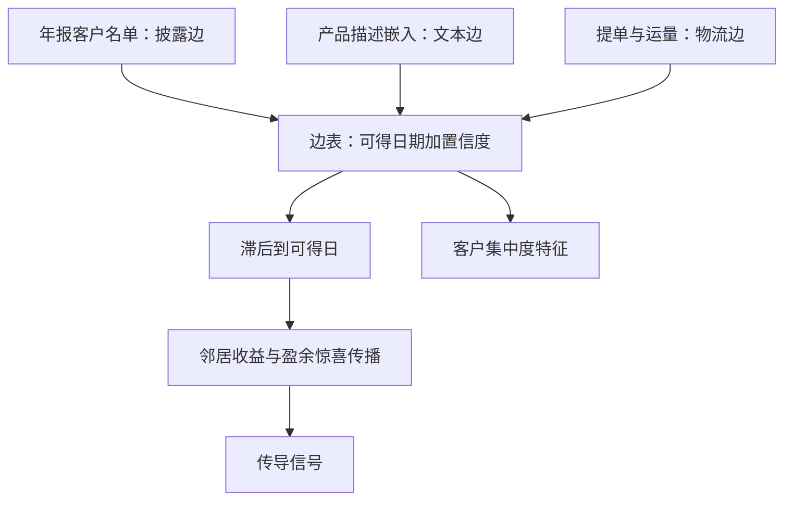

# 供应链图谱

行业分类把公司按相似分桶，供应链把它们按依赖连边；冲击沿边传播，不沿桶传播。

<footer>—— 据 Cohen and Frazzini, Journal of Finance, 2008；Hoberg and Phillips, Journal of Political Economy, 2016 整理</footer>

[上一课](/quant/alt-text-deep)把文本立成带验收的表征阶梯：残差增量不过门，就不升级。那台机器的产出不必只是一个分数——把文档之间的相似度变成公司之间的**边**，文本就从情绪工具变成图谱材料，这是本课。[供应链另类数据](/quant/supply-chain-alt)已经立了经济联系与收益可预测性：Cohen–Frazzini 的贸易边、货运指数先分解再交易、边必须滞后到可获得。本课做工程：边从哪来、怎么存、怎么在滞后纪律下变成信号。

## 问题

主干课留下的缺口是边的**供给与质量**。披露边稀疏而滞后：占收入门槛以上的客户才要求披露，且一年只随年报更新一次。文本边多假阳性：产品相似不等于存在交易，竞争者之间相似度最高。物流边贵而慢：提单与船舶数据按条计价，覆盖不均。三个工程问题随之而来：一条边**何时可得**（关系披露在事后，用同期边回测就是前视）；一条边**多稳定**（客户关系会切换，边本身有半衰期）；**节点对齐**——大客户常是私营或海外公司，不在你的股票宇宙里，边的一端挂在无处交易的名字上。

## 方法

三源边，各带置信与时间戳。披露边：解析年报客户名单，边的可得时间取披露日，不是财政年度末；美国 S-K 条例要求披露占收入 $10\%$ 及以上的客户依赖，所以单家公司的披露边通常只有零到几条，稀疏是制度属性，不是解析缺陷。文本边：用上一课的 $L_3$ 嵌入对产品描述取余弦相似度，每家公司只保留最近邻的若干条——Hoberg–Phillips（2016）的做法，行业边界随产品演进内生移动。物流边：提单与运量聚合到公司对，频率低但方向硬。边表统一 schema：起点、终点、类型、可得日期、置信度，刷新与失效走公司行动日历。信号端两条：邻居的滞后收益与邻居的盈余惊喜向本公司传播，Cohen–Frazzini 的原始发现正是滞后一个月的邻居收益仍可预测；客户集中度本身作为风险特征进入横截面。

## 机制

边比桶好的机制在传导结构：冲击沿投入产出网络放大与衰减（Acemoglu et al., 2012；Carvalho et al., 2021），行业桶只在分类修订时才动，而文本边随产品线季度级演进——这正是 Hoberg–Phillips 强调的内生差异化。不这么做的错法有两条对称的：用**同期**关系回测，把事后才披露的客户当成了当时已知，等于在回测里开了天眼；用行业桶近似供应链，把竞争者与交易对手混为一谈——竞争者收益同向是因为共同因子，贸易伙伴收益领先是因为传导，二者的交易含义相反。

边的一端不在股票宇宙，边没有失效：传导到可交易的最近上市公司，正是这条边的用法之一——供应商多为私营时，其上市客户的共同供应商暴露仍可计算。直接把不可交易节点剔出图谱，等于把传导链掐断在最有信息的一段。

## 边界

本课不处理地理聚集——把边投影到地图上是下一课的对象；货运指数的需求、供给与拥塞分解主干课已给，不重讲。文本边在产品同质的行业（大宗商品、基础金融）里退化，近邻与自身几乎同分布；私营对手方的集中度披露缺失会使边系统性偏向大公司样本。传导信号换手高于基本面因子，费用与容量按执行课的口径评估，不在本课展开。

## 小结

- 图谱的材料是三类边：披露、文本、物流，统一存可得日期与置信度，稀疏是制度属性。
- 一切传导信号先滞后到可得日；同期边回测即前视。
- 文本边来自上一课的表征阶梯，行业边界随产品内生移动，比分类桶更贴近传导。
- 集中度本身是风险特征；不可交易端点保留，向可交易端传导。
- 出处：Cohen and Frazzini, *JF*, 2008；Menzly and Ozbas, 2010；Hoberg and Phillips, *JPE*, 2016；Acemoglu, Carvalho, Ozdaglar and Tahbaz-Salehi, *Econometrica*, 2012；Carvalho, Nirei, Saito and Tahbaz-Salehi, *QJE*, 2021。
