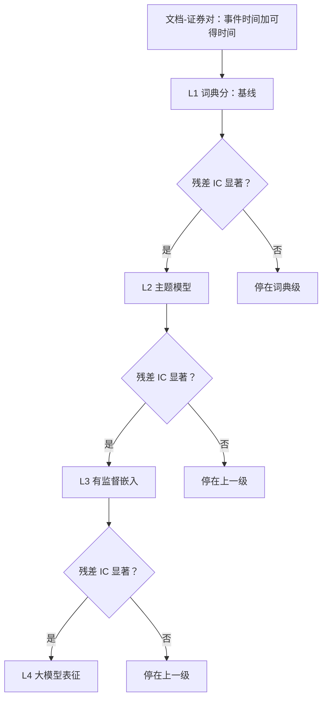

# 文本因子的深化

文本因子深化的单位不是把模型换大，而是每换一级表征都要付一次增量证据：新的分数必须解释旧的分数解释不了的那部分收益。

<footer>—— 据 Loughran and McDonald, Journal of Finance, 2011；Ke, Kelly and Xiu, 2019 整理</footer>

[上一课](/quant/dp-map)把深度定价收在管线上：数据窗口、表示、损失、模拟器与种子都是模型的一部分，基线先于架构、测度先于用途、验证先于部署，并让下一门课程带着这套管线口径走进另类数据。本课是「另类数据工程」的第一课。主干课给出的是「一份语料、一个词典、一个 IC」的单点做法；深化是把文本从单一分数升级为**表征阶梯**，并为每次升级建立相对上一级的验收。后课默认你手上的文本已经切成带双时间戳的文档-证券对。

## 问题

缺口在两端。测量端：词典把整份文档压成一个数，年报里 MD&A 措辞的逐年变化、脚注里风险条目的增删、问答里的回避与含混，全被压没了——这些恰恰是市场慢消化的部分。评价端：换一个更大的语言模型重跑，IC 变好了，但没人能回答「好出来的部分」是新的信息，还是同一条情绪信息的再包装；更没人回答为了这个数字试了多少个模型与提示词——[回测过拟合](/quant/backtest-overfitting)的折价账没有人记。缺口因此不是「更强的文本模型」，而是**表征升级的验收协议**。

## 方法

表征分四级，逐级付费：词典是 $L_1$ 基线；主题模型（Blei, Ng and Jordan, 2003）把文档放进话题空间是 $L_2$；有监督嵌入把文本当高维协变量、用正则约束（Ke, Kelly and Xiu, 2019；Gentzkow, Kelly and Taddy, 2019）是 $L_3$；大模型表征与打分是 $L_4$。升级判据只有一条：把新表征对旧表征与盈余惊喜回归取残差，残差对未来收益的预测若不显著，就停在上一级。三条纪律逐字沿用主干：事件时间与可得时间分开，[点时基本面](/quant/point-in-time)的规则按列执行；标签窗口对齐[标签与持仓期](/quant/label-horizon-overlap)的重叠规则；持有期对齐信号的半衰期，文本因子衰减快，错配的持有期会把 alpha 磨成手续费。

## 机制

深化有上限，原因是文档级情绪的大头是已定价的基本面新闻，主干课已经演示过这条地板。真正的增量住在难消化的文本里：年报可读性的恶化与盈余持续性的关系（Li, 2008）、脚注与风险披露的边际变化，这类内容的处理成本低、被读到的比例小。语言模型降低的是**特征工程成本**，不是测量误差：提示词会把词典偏置原样带回来，打分与词典分高相关；幻觉会制造语料里不存在的句子；试过的每个提示与模型都要计入 $N$，按紧缩夏普的口径打折（[DSR](/quant/bailey-dsr)）。不这么验收会错在哪：你会把「LLM 复读了词典」当成「发现了新信号」，为再包装付溢价。

Loughran–McDonald（2011）的出发点是一个可数的错配：通用情感词典的负面清单里，近四分之三的词在财务叙述里并不负面——"liability""capital" 这类词按通用清单打分会把中性描述算成坏消息。表征再深，这道错分仍是基线。

## 边界

本课不处理文本之间的**关系**——把文档相似度变成公司之间的边是下一课的对象；爬虫的合规与工程归工程单元；地理与卡数据各有其课。也不宣称语言模型必有 alpha：它的产出同样要过残差增量这道门。供应商语料的再分发与留存限制（[网络数据合规](/quant/web-data-compliance)）会约束特征的可移植性，续约即模型风险，这在采购时就要入账。

## 小结

- 深化的形式是表征阶梯：词典、主题、有监督嵌入、大模型，每级只凭残差增量升级。
- 增量的对手方是上一级表征加盈余惊喜，不是零基准。
- 语言模型省的是特征工程，不省测量误差；试过的每个配置都计入 $N$ 并打折。
- 文本因子的半衰期短，标签与持有期必须对齐，否则只留下换手。
- 出处：Tetlock, *JF*, 2007；Loughran and McDonald, *JF*, 2011；Blei, Ng and Jordan, *JMLR*, 2003；Li, *JAE*, 2008；Gentzkow, Kelly and Taddy, *JEL*, 2019；Ke, Kelly and Xiu, 2019。
