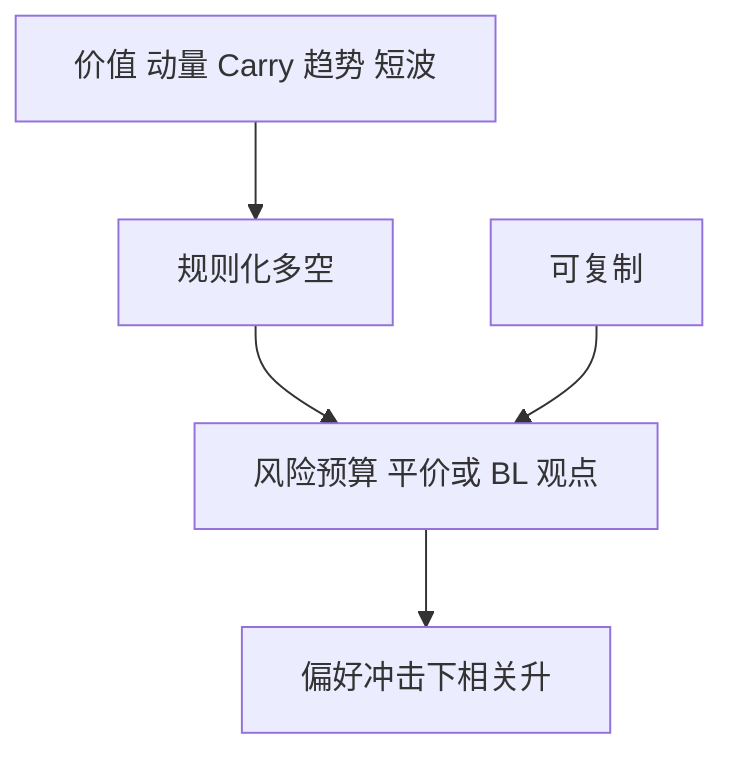

# 另类风险溢价 ARP

把价值、动量、套息、趋势写成跨资产、规则化、可做多空的风险溢价，产品名可以叫 ARP；经济学上它们仍是承担某种状态的补偿，或是尚未被费用吃掉的异象。

<footer>—— Asness, Moskowitz and Pedersen, Value and Momentum Everywhere, Journal of Finance, 2013；Carry 见 Koijen 等, JFE, 2018</footer>

[上一课](/quant/short-vol-tail)把短波动标成一类可打包的溢价。另类风险溢价（ARP）的缺口是**整张地图**：价值、动量、[跨资产 Carry](/quant/carry-everywhere)、[趋势](/quant/tsmom)、低风险、以及短波动，如何与股票多空、宏观、RV 分工。主干 [价值与动量无处不在](/quant/value-momentum-everywhere)、[风险平价](/quant/risk-parity) 已写构造。本课只定策略族：ARP 是规则化的风险预算，不是「对冲基金 alpha」的新名字。

## 问题

机构把「另类」卖成低相关的第三条收益。实现上，ARP 组合在风险偏好冲击里相关升高：动量崩、价值修复、短波动缺口可以叠在同一季。问题是分类：哪些腿有风险补偿叙事（Carry 在崩溃状态差），哪些更像行为或结构（指数纳入、拥挤），哪些只是杠杆过的市场 beta。不要用 [CAPM](/quant/capm) 的截面回归把所有 ARP 再「检验」一遍——主干已经做过因子实证；本课问的是**产品层如何分桶与约束**。

与股票多空：学术 HML/动量是 ARP 的股票实现；产品还要期货、FX、商品腿，约束在保证金与展期，不在借券。与宏观：系统宏观往往就是趋势+套息，应承认重叠，勿双边计提容量。

### 规则化不等于可容量无限

把信号写成透明规则，方便复制，也方便拥挤。ARP 的衰减来自费用、冲击与同质杠杆，见后课策略生命周期。风险平价是配权引擎，不是又一个溢价；它放大 ARP 也放大同步去杠杆。

Litterman 的风险预算语言（热点与对冲）比「再找一个新因子」更适合 ARP 组合：先看谁贡献主动风险，再决定要不要那一腿的溢价。

## 方法

清单：价值、动量、Carry、趋势、低 beta、短波动。每条腿：资产类、再平衡、成本、危机情景。组合：风险平价或等风险贡献，对冲掉不需要的市场 beta。报告：腿的相关矩阵用体制切片，不用全样本一个数。与 [Black–Litterman](/quant/black-litterman) 的衔接：主观观点应加在溢价均值上，而不是改信号定义。

## 机制

跨资产共同溢价意味着共同状态变量：增长、通胀、流动性、风险偏好。规则化收获的是状态补偿的可交易投影。产品层把投影切成可销售的份额，同时制造拥挤。短波动是其中凸性最差的一条，不能用价值的回撤经验去标定它的保证金。

## 边界

ARP 不是法律上的「另类投资」定义。本课不把私募、实物放进同一张期货溢价表。评价必须扣费、扣展期、扣危机月。

## 小结

- ARP 是规则化的跨资产溢价桶，不是新的 alpha 物种。
- 与宏观、股票多空有重叠，容量不要双边计算。
- 短波动与价值不可用同一套回撤经验。
- 出处：Asness, Moskowitz and Pedersen, *JF*, 2013；Koijen, Moskowitz, Pedersen and Vrugt, *JFE*, 2018；风险预算对照 Litterman, Hot Spots and Hedges。
