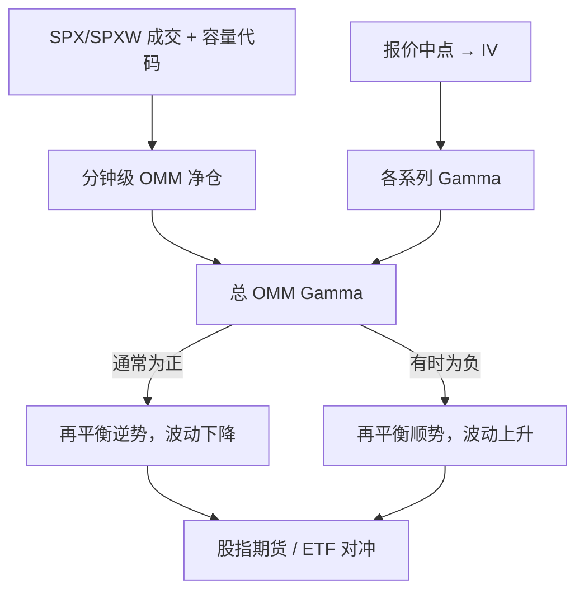

# 0DTE 与波动

零日期权的 Gamma 极大，做市商再平衡有可能打到指数；用成交容量还原做市商净仓后，典型效应是压低波动，负 Gamma 时段才把日已实现波动最多抬高约三个百分点（年化）。

<footer>—— Amaya, Garcia-Ares, Pearson and Vasquez, 0DTE Index Options and Market Volatility, 2025</footer>

到期日为零的指数期权（0DTE）把 Ni、Pearson 与 Poteshman 的对冲外溢压缩到一个交易日之内。平值期权的 $\Gamma\sim 1/(S\sigma\sqrt{\tau})$ 在 $\tau$ 按小时计时已经很大，标的穿过执行价会迫使做市商在股指期货上大幅调仓。市场叙事常把 0DTE 写成「日内 gamma squeeze 的燃料」。Amaya、Garcia-Ares、Pearson 与 Vasquez（2025）用 Cboe 提供的 SPX/SPXW 成交容量，按分钟重建期权做市商（OMM）净仓与总 Gamma，再估计波动对滞后 Gamma 的关系，并用「Gamma 不影响波动」的反事实模拟给出效应的上界。结论与恐慌叙事不同：样本里 OMM Gamma **通常为正**，中位效应是略微降低日波动；负 Gamma 出现时，年化日已实现波动最多升高约 3.3 个百分点，三十分钟窗口最多约 6.4 个百分点——仍落在日常波动变化的普通区间内。本篇写识别与希腊值机制，衔接[期权需求压力](/quant/ni-option-demand-pressure)和[到期钉住](/quant/pin-risk)，不是一份如何利用 0DTE 放大指数冲击的说明书。

## 问题

若做市商对 0DTE 净空且 Gamma 为负，指数上涨时他们必须买入期货、下跌时卖出，再平衡与价格同向，条件波动上升。若净仓使 Gamma 为正，再平衡逆势，条件波动下降。问题有三层。第一，仓位符号不是成交量：0DTE 占指数期权成交的份额可以很高，但做市商可能在客户之间撮合，净仓远小于总量。第二，Gamma 的符号随路径与客户结构时变，用「0DTE 成交占比」一个标量预测波动，会把正、负 Gamma 日平均掉。第三，即使回归系数显著，经济幅度是否大到改变指数风险，要用反事实分布来量，而不是用叙事里的极值日当均值。

Ni 等人（2021）已在个股上建立「净 Gamma 与已实现波动负相关」。0DTE 把同一系数搬到指数，并利用短到期把 Gamma 放大。Adams、Fontaine 与 Ornthanalai（2024）用周二、周四到期扩容作为外生变化，发现有 0DTE 可交易的日子指数波动更低，机制仍是中介对冲。Amaya 等人要回答的不是均值符号——均值已经偏抑制——而是**最坏的正贡献有多大**。

### 从成交容量累加净仓，而不是从未平仓倒推

公开的未平仓不按做市商拆。Amaya 等人对每一笔 SPX/SPXW 成交记录买方与卖方的容量（客户、做市商等），从系列上市起按分钟累加，得到每个系列的 OMM 净仓 $q^{\mathrm{OMM}}_{k,t}$。再用该分钟买卖价中点反推隐含波动，代入带分红的 Black–Scholes–Merton 得到 $\Gamma_{k,t}$，加总

$$
\Gamma^{\mathrm{OMM}}_t=\sum_k q^{\mathrm{OMM}}_{k,t}\,\Gamma_{k,t}.
$$

这一构造把「谁在存货」与「存货对现货有多弯」分开。只看 0DTE 成交张数，会把客户之间的对倒算进做市商压力。只看当天新开仓，会丢掉多日累积、今天才变成 0DTE 的仓位——Adams 等人强调，抑制波动的对冲需求，很大一块来自此前较长到期滚下来的头寸，而不是当天新买的 0DTE。

0DTE 的 Gamma 在执行价附近像针。指数在一分钟内穿过一簇 $K$，OMM 的 Delta 目标可以跳一个数量级。分钟采样已经是折中：更细会碰到报价噪声，更粗会把针平均掉。报告应声明时钟，不能把日终 Gamma 当成盘中极值。

## 方法

波动模型把一分钟收益的条件方差写成 GARCH 项、日间水平、日内季节性，再加上滞后的 $\Gamma^{\mathrm{OMM}}$。关键系数是负的：Gamma 越高，下一分钟波动越低。线性模型用分钟收益平方对滞后 Gamma 回归，符号一致。然后关闭 Gamma 通道做模拟，比较真实已实现方差与反事实已实现方差，差值即「OMM Gamma 的贡献」。日频率上，中位贡献是略降波动（约 0.08 个百分点，年化）；最大升幅约 3.3 个百分点。三十分钟窗口的最大升幅约 6.4 个百分点。与「所有原因造成的波动日变化」相比，3.3 个百分点大约是日变化标准差（约 4.5 个百分点）量级内、约五分之一交易日都会出现的普通跳变，因此作者不把样本内最大值解释成系统性失稳。

对照实验很重要。Brogaard、Han 与 Won（2024）用 0DTE 成交占比与 ETF 波动的相关，抓的是活动强度而非存货符号。活动可以与波动同时升，只因为信息日两者都活跃。Amaya 的贡献是把强度换成有符号的 Gamma，并给出反事实幅度。复制时应同时报告：Gamma 的正负频率、条件均值效应、以及分位数上的最大升幅，避免只摘「最大 3.3 个百分点」当标题。

### 正 Gamma 抑制、负 Gamma 放大，是同一条再平衡规则

做市商目标是 Delta 中性。仓位 Gamma 为正时，$\Delta_{t+\mathrm{d}t}\approx\Delta_t+\Gamma\,\mathrm{d}S$，标的升则须卖标的，标的降则须买，订单流与冲击方向相反，已实现波动被垫一层均值回复。Gamma 为负时符号全反，短窗动量被加强。0DTE 不改变规则，只改变 $|\Gamma|$ 的量级。因此「0DTE 增加波动」在逻辑上不成立，除非再加一条：OMM 在 0DTE 上系统性地处于负 Gamma。数据里这一条通常不成立——客户更常买短日期权做方向或当天对冲，做市商作为对手方往往正 Gamma。负 Gamma 会在客户集中卖出波动、或路径把做市商推到执行价错误一侧时出现，那是状态，不是制度常数。

## 机制

短到期把 Black–Scholes Gamma 的分母 $\sqrt{\tau}$ 拉到极小，ATM 附近的对冲需求对现货 loc 极敏感。对冲工具是股指期货与 ETF，不是一篮子现货，所以外溢首先打在期货上，再经基差传到现货，见[指数套利](/quant/index-arb)。这与个股期权的对冲不同：个股要借券、受涨跌停，指数期货的冲击更接近连续。Golez 与 Jackwerth（2012）已在到期窗口看到指数期权对冲对期货的影响；0DTE 把到期窗口变成每个交易日。

反事实模拟假设关闭 Gamma 通道后，收益过程的其余部分不变。若负 Gamma 日同时是宏观信息日，最大升幅里仍可能混有共同冲击。作者把结果称为「最大影响」的估计，而不是因果上的唯一分解。使用时应保留这一限定。

### 与需求压力、钉住、离散对冲的关系

[需求压力](/quant/ni-option-demand-pressure)决定做市商一开始为什么处于某张 Gamma 表上；0DTE 论文把表上的数对到指数波动。钉住是 $\tau\to 0$ 且收盘靠近 $K$ 的极限；0DTE 全天都像「到期日的下午」。离散对冲误差在 Gamma 大时主导 P&L，见[对冲频率](/quant/delta-hedge-freq)。三者共用一条会计：存货 → Gamma → 再平衡 → 标的。差别只是时钟。把 0DTE 当成新资产类别另起一套「操纵波动」的故事，会丢掉这条会计。

## 边界与工程取舍

样本是 2020 年 7 月至 2023 年 6 月的 SPX/SPXW，不含以后的结构变化，也不含个股 0DTE。Lipson、Tomio 与 Zhang 指出个股 0DTE 与标的波动的关系可以不同，因为借券与做市集中度不同。容量代码仍可能误分类；做市商把风险转到 OTC 或内部账本后，公开 Gamma 偏小。模型用 Black 公式从中点报价取 Gamma，微笑动态与跳跃会使盘中 Gamma 有偏差。

境内没有与 SPX 0DTE 对等的「每个交易日到期」的股指期权序列。上市期权的到期日、行权、做市与持仓限额以沪深交易所、中金所现行规则为准；不得把美股 0DTE 的成交节奏搬到 A 股期权上假设可复制。程序化下单仍受[程序化交易管理规定](/quant/cn-program-trading-rules)与[高频认定](/quant/cn-hft-threshold)约束。本篇的工程用途是：若交易台持有极短到期期权，风险限额应按盘中 Gamma 路径设，而不是按日终希腊值；以及不要用「0DTE 成交占比」单独作为指数失稳指标。

最大 3.3 个百分点是样本内反事实上界，不是保证。换一段负 Gamma 更频繁的样本，上界会移动。风控应监控 $\Gamma^{\mathrm{OMM}}$ 的符号与集中执行价，而不是把某一篇论文的数字写成阈值后就不再更新。

## 小结

- 0DTE 放大的是做市商 Gamma 再平衡，不是成交张数本身。
- Amaya 等人用容量代码重建 OMM Gamma：典型为正、抑制波动；负 Gamma 时年化日波动最多升约 3.3 个百分点。
- 该上界落在日常波动变化的普通范围内，不足以单独支持「0DTE 使指数失稳」的均值叙事。
- 抑制效应有一部分来自较长到期滚成 0DTE 的存货，而不只是当天新开仓。
- 境内不可按美股 0DTE 节奏假设可交易；上市期权与程序化规则是约束。
- 出处：Amaya, Garcia-Ares, Pearson & Vasquez, 2025；Ni, Pearson, Poteshman & White, *RFS*, 2021；Adams, Fontaine & Ornthanalai, 2024。
