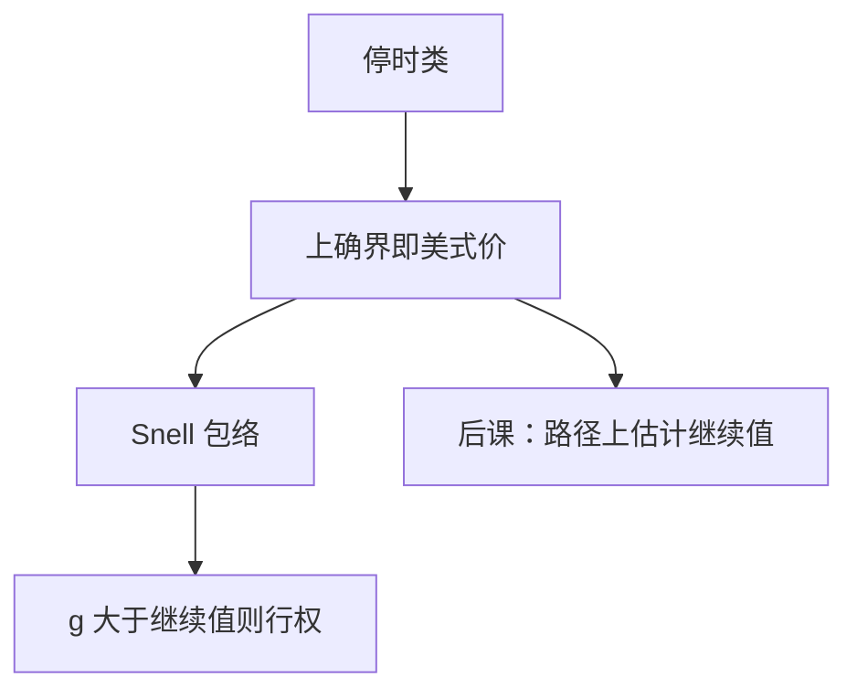

# 美式提前行权与最优停

美式价格是停时类上的上确界：$V_0=\sup_\tau\mathbb E_Q[\mathrm e^{-r\tau}g(S_\tau)]$。提前行权当且仅当立即支付超过继续持有的条件期望。

<footer>—— 据 Bensoussan, Acta Applicandae Mathematicae, 1984；Karatzas, 1988；Shreve, Stochastic Calculus for Finance II, 第 8 章整理</footer>

上一课[跳过程直觉](/quant/jump-process-intuition)留下不连续路径的接口。本课回到连续扩散，处理权利本身的时间：美式可在 $[0,T]$ 任一停时行权。缺口不是再写一遍欧式期望，而是把[停时与可选抽样](/quant/stopping-optional-sampling)里的 $\tau$ 拿来做优化。本课只给最优停与 Snell 包络接口，不把自由边界数值做完；后课蒙特卡洛会用这条上确界当模拟对象。

## 问题

欧式把 $\tau$ 钉死为 $T$。美式允许持有人选 $\tau\le T$，价格是对所有停时取上确界。缺口是：这个上确界满足 $V_t=\max\bigl(g(S_t),\,\mathrm e^{-r\Delta}\mathbb E[V_{t+\Delta}\mid\mathcal F_t]\bigr)$（离散骨架），连续极限是变分不等式 $V\ge g$，PDE 在继续区域内成立，在行权区域内取等 $V=g$。没有最优停，美式被误写成欧式再加一个「可能提前」的口头修正。

无股息看涨：在常数 $r\gt 0$ 下永不提前行权，美式等于欧式。看跌、有股息看涨，提前可能最优。这是接口，不是要在本课证完。

### 最优停不是「看到最高点再行权」

那不是停时。最优 $\tau^*$ 是首次进入行权区域的时刻，区域由当时的 $S$ 与剩余期限决定，不依赖未来路径。与停时课的反例同一条：不能用尚未实现的最大值。

Snell 包络是 supermartingale 的最小上界过程，在最优停时变成鞅。可选抽样保证：乱停只会更差或持平。

## 方法

$V_t=\mathrm{ess\,sup}_{\tau\in[t,T]}\mathbb E_Q[\mathrm e^{-r(\tau-t)}g(S_\tau)\mid\mathcal F_t]$。继续值 $C_t=\mathbb E_Q[\mathrm e^{-r\mathrm d t}V_{t+\mathrm d t}\mid\mathcal F_t]$，行权当 $g(S_t)\ge C_t$。BSM 扩散下存在临界价 $S^*(t)$：看跌在 $S\le S^*(t)$ 行权。这是后课差分、树、Longstaff–Schwartz 回归的共同对象：都在近似 $C_t$。

跳会让区域出现「无触摸」带（跳跃越过边界），本课不展开，只声明接口仍是对停时取上确界，搜索空间没变。

## 机制

继续值是「再等一瞬间」的复制价格，欧式课已经会算条件期望。美式多一个逐点 $\max(g,\cdot)$，破坏了纯 PDE 等式，改成互补：$(V-g)\cdot(\text{PDE 残差})=0$。对冲在边界上 $\Delta$ 可能折拐（平滑粘贴在扩散情形常成立），Gamma 在边界附近变大。这是与欧式 delta 的差别，不是新的测度。离散时间把上确界收成从 $T$ 向后的动态规划，树方法做的就是这件事；连续极限只是把网格加密。

无套利：美式价必须 $\ge$ 欧式价，且 $\ge g\mathrm e^{-r\cdot 0}=g$（立即行权）。低于内在价值的报价可被立即行权套利。这不依赖 GBM。

## 边界

本课不实现最小二乘蒙特卡洛，不画自由边界的渐近。不把百慕大、可转债的条款写全。后课默认：美式 $= $停时上确界；欧式是 $\tau\equiv T$ 的特例；无股息看涨不提前。下一课[蒙特卡洛路径](/quant/mc-paths)用模拟估计期望；美式需要在同一路径对象上再估继续值。

## 小结

- 美式价格是贴现支付在停时类上的上确界。
- 行权当立即支付不低于继续值；最优 $\tau$ 是首入行权区。
- 无股息看涨通常不提前；看跌与股息看涨会。
- 跳不改变上确界定义，只改变区域形状。
- 出处：Bensoussan 1984；Karatzas 1988；Shreve SDE II 第 8 章。
