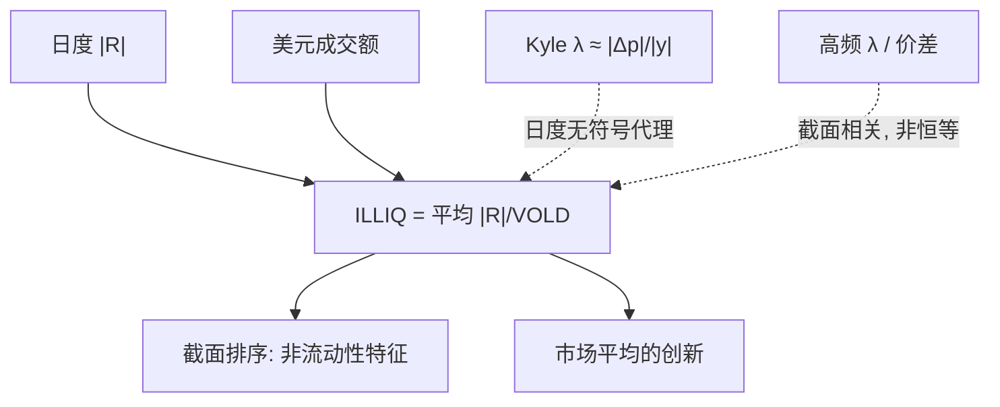

# Amihud 非流动性

用当日绝对收益除以美元成交额，再在月内平均：给定成交金额，价格动得越大，股票越不流动——这是 Kyle 式冲击在日度数据上能算出来的最粗实现。

<footer>—— Amihud, Illiquidity and Stock Returns, Journal of Financial Markets, 2002</footer>

[上一课](/quant/corwin-schultz)用单日与两日高低价距从日线里解有效价差；隔夜跳与涨跌停必须调整，否则两日窗口不是两倍的日内扩散。价差是宽度，还不是「每单位资金的价格影响」。缺口是 Amihud 的 ILLIQ：用日度绝对收益与成交金额之比代理冲击，好在长样本、多国家、不必逐笔报价。本课写度量本身，不重推高低距方程。资产定价结论是这个度量的用途之一，不是定义。后课 Kyle $\lambda$ 默认：ILLIQ 与高频 $\lambda$ 相关，不是恒等。

## 问题

买卖价差、深度、$P(Q)$、高频 $\lambda$ 都更接近冲击的机制，但在 1960 年代的日度文件里不存在，在许多市场上至今没有可靠的历史 L2。若流动性要进入几十年的截面，必须用开高低收与成交额能算的量。Kyle 的直觉是 $\lvert\Delta p\rvert\approx\lambda\lvert y\rvert$，于是 $\lvert\Delta p\rvert/\lvert y\rvert$ 估 $\lambda$。把一天压成 $|R|$ 与美元成交额，就是这一比的日度版。问题是：日收益里混有隔夜信息、成交额里混有无冲击的换手，ILLIQ 还有多少成分真是深度的倒数。

第二个问题是水平不可比。市场容量膨胀、股价通胀、拆股与货币单位，都会让 ILLIQ 的原始水平随年代漂移。Amihud 因此在时序上更强调非流动性的创新或相对排序，而不是 1980 年与 2020 年的绝对数字对比。度量问题先于定价问题：排序乱了，溢价检验无从谈起。

### 日度 |R|/成交额作为冲击代理

$R_{i,d}$ 常用收盘到收盘收益，$\mathrm{VOLD}$ 是成交量乘收盘价（或均价）。无成交日通常跳过，不进平均；$D_{i,t}$ 是月内有效日数，过少则当月 ILLIQ 缺失。零成交日本身也是非流动性信息，有人另做零收益日比例（Lesmond 一类），不要与 ILLIQ 混成一个公式。取绝对值是因为 Kyle 的 $\lambda$ 为正，方向在日度上已被信息盖过，符号成交量难以从 OHLC 恢复。

ILLIQ 与有效价差、与高频 $\lambda$ 在截面上正相关，这是它作为代理的经验资格；相关不是恒等。价差压缩的电子化年代，ILLIQ 仍能区分「同样成交额下谁的价格晃得更厉害」，说明它抓的是冲击而不是仅仅是报价宽度。Goyenko、Holden 与 Trzcinka 把多种低频代理与高频基准对照，ILLIQ 通常名列前茅——这是选用它的理由，也说明它仍是代理。

分母用股数而不是金额，会把高价股算得更不流动，纯粹因为单位。Amihud 用美元成交额，是为了让 $\lvert R\rvert/\mathrm{VOLD}$ 接近「每单位资金的价格影响」。换货币或未做通胀处理时，跨年水平仍不可比。

## 方法

月度个股 ILLIQ：对过去 $D$ 个交易日（常取一个月，定价研究常用过去十二个月的日度平均以提高精度）计算上式，要求最低有效日数。极值：低价股、极小成交额会让单日比率爆炸，应在日度层面缩尾，或剔除价格低于某阈值的样本。拆股与分红：收益用调整后序列，成交额用未调整股数乘未调整价，或两端都用调整后但保持一致，避免分子分母各调一次。

市场非流动性：对个股 ILLIQ 做等权或价值加权平均，再取一阶差分或 AR 残差当作「创新」，供时序定价使用。等权会被小盘主导，价值加权更接近资金体验。与 Pástor–Stambaugh 的 $\gamma$ 创新不是同一序列：后者来自收益对符号成交额的回归，更接近临时冲击的共同因子。两种市场流动性应标清来源。

### 低频可算与微观结构 λ 的距离

日度 $|R|$ 包含隔夜跳空，而隔夜往往没有对应的连续成交额（或只有稀薄盘后）。ILLIQ 因此把信息公告与冲击混在同一分子里。稳健做法是用开盘到收盘收益配当日成交额，丢掉隔夜；这会改变历史样本长度与国际可比性，但更接近 Kyle 的交易时段。高频 $\lambda$ 用带符号流量，ILLIQ 用无符号金额：一天里买和卖对冲后净流量可以很小，但 VOLD 很大，ILLIQ 偏低——活跃的双向市场被当成流动，这有时正确（深度确实大），有时只是来回弹跳。

与 PIN 的距离更远。PIN 要买卖计数和似然，估的是知情到达份额；ILLIQ 不识别信息事件。二者截面相关，因为信息不对称的股票往往更浅。把 ILLIQ 叫做「日度 PIN」是类别错误。VPIN 是日内毒性，ILLIQ 是日度冲击平均，时钟差两个数量级。

## 机制

机制声明很短：若价格变动主要来自订单流冲击，则给定成交金额，变动越大 $\lambda$ 越大。日度加总把许多微观冲击与信息跳加在一起，于是 ILLIQ 是 $\lambda$、日内信息强度与隔夜公告的混合物。在公告稀少、交易连续的月份，它更像深度；在财报月、宏观日，它更像信息方差。这解释了为什么控制波动率之后 ILLIQ 的定价能力会变弱——分子本来就是 $|R|$。

Kyle 的比较静态仍提供语言：噪声交易增加（成交额上升而 $|R|$ 不按比例上升）时 ILLIQ 下降；价值不确定上升时 ILLIQ 上升。经验上成交额的长期趋势使 ILLIQ 下降，并不自动等于逆向选择消失，见 PIN 文献里 $\varepsilon$ 膨胀导致 PIN 机械下降的平行现象。跨年代比较非流动性，应看相对排序或对市场 ILLIQ 的残差。

### 截面排序、通胀漂移与 A 股口径

截面上 ILLIQ 与规模、低价、波动高度共线。价值加权或先独立于市值再排序，是避免把 SMB 再发现一次的最低要求。[流动性因子](/quant/liquidity-factor) 文已讨论与反转、动量腿的纠缠；度量文要强调的是：缩尾与价格过滤会显著改变头部组合的成分，任何溢价表必须报告这些过滤。通胀与市场扩容使原始 ILLIQ 非平稳，Amihud 用市场非流动性的新去做时序检验，正是承认水平不可直接当状态变量。

A 股：涨跌停把 $|R|$ 截断在 10%（或相应限额），停板日成交额可以很小或很大，ILLIQ 失真。T+1 改变隔夜风险在分子里的含义。成交额口径含虚增时分母膨胀，ILLIQ 偏低。应剔除涨跌停日或对截断做 Tobit 式理解，而不能把美股系数当标尺。

单日 $\mathrm{VOLD}\to 0$ 而 $|R|\gt 0$ 时比率无界。实现上应对分母设下限或把该日设为缺失。不要用一个极大的 ILLIQ 去代表「无限非流动」——那一天往往是数据或停牌复牌，不是 Kyle 均衡。

## 边界

ILLIQ 不是价差估计，不是高频 lambda，不是 PIN。它在没有报价数据时提供冲击的单调代理，并在有高频基准时表现出可接受的截面相关。用它做执行成本的绝对水平（「这一笔会亏多少个 bp」）会错：没有数量的非线性，也没有买卖方向。执行应回到 $P(Q)$ 或短期 $\lambda$。

不要与 Pástor–Stambaugh 因子混名。不要在分钟收益上套同一公式还叫 Amihud——高频版需要另写符号流与微观结构噪声处理，那是另一篇度量。不要把市场 ILLIQ 创新直接当交易信号：它是定价研究里的风险代理，实现时点与可交易性要另做。

Amihud（2002）的定价结果对样本期与是否价值加权敏感。后续文献并不一致。本篇把度量写清楚，溢价是否仍存在，见流动性因子一文与原论文，而不是把 ILLIQ 的构造当成溢价已经证实。

## 小结

- Amihud ILLIQ 是日度 $|R|/\mathrm{VOLD}$ 的平均，代理 Kyle 式冲击，为长样本截面而设计。
- 它与高频 $\lambda$、价差正相关，但混有隔夜信息与无符号成交额，不是微观结构斜率本身。
- 水平随通胀与容量漂移，时序应用创新或相对值；截面须处理规模、低价与缩尾。
- 与 PIN、VPIN、OFI 时钟与对象均不同；与流动性风险因子不是同一序列。
- 涨跌停、零成交、分母近零与 A 股口径是构造边界。
- 出处：Amihud, *Journal of Financial Markets*, 2002；低频代理评价见 Goyenko, Holden and Trzcinka；冲击理论见 Kyle, *Econometrica*, 1985。
