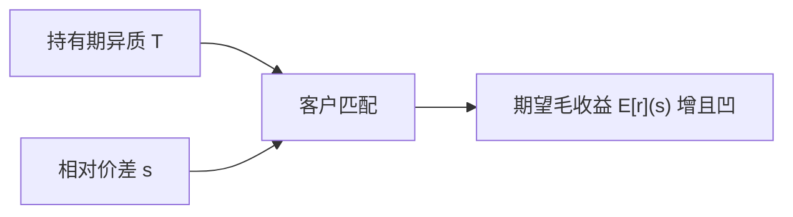

# Amihud–Mendelson 价差与预期收益

买卖价差是反复交易的成本。持有期短的客户不愿碰价差宽的资产，于是宽价差资产必须提供更高的期望毛收益，才能在均衡里被持有。

<footer>—— Amihud and Mendelson, Asset Pricing and the Bid-Ask Spread, Journal of Financial Economics, 1986</footer>

[Grossman–Miller](/quant/grossman-miller)解释即时价格相对充分分担价格的暂时折让，对象是冲击路径，还不是截面预期收益。缺口是：若价差是持有资产时每次换手都要付的成本，它应进入**要求回报**。Amihud 与 Mendelson（1986）给出客户分层（clientele）：短持有期投资者专攻窄价差资产，长持有期投资者才愿意持有宽价差资产，且要求的超额毛收益随价差上升、但凹。本课不是 [Amihud 2002 非流动性比率](/quant/amihud-illiquidity) 的日度 $|R|/DVOL$。

## 问题

资产定价若只认贝塔，价差只是微观摩擦，不应出现在期望收益里。可是投资者买入付 ask、卖出收 bid，往返成本约一个价差。持有期 $T$ 越短，价差摊到每年的成本 $s/T$ 越大。不同人 $T$ 不同，谁持有高 $s$ 的资产就变成均衡问题。要解决的是：在给定价差（本课把它当外生市场特征）下，预期收益如何随 $s$ 调整，以及哪些人构成边际持有者。

这与库存、信息决定**价差从哪来**是反方向的问题。Ho–Stoll / Kyle 生成 $s$；本课把 $s$ 当作已存在的成本，问它如何被定价。后文 Stoll 再把 $s$ 拆开，避免把信息成分与处理成本一锅烩进溢价。

### 客户分层而不是单一折现率

若所有人持有期相同，高 $s$ 资产的期望收益只需抬高 $s/T$，关系接近线性。若 $T$ 异质，短线投资者退出高 $s$ 资产，其价格由更长 $T$ 的人决定，每年摊到的成本更小，于是期望收益对 $s$ 的反应是凹的：价差从很小到中等时溢价上升快，再往上被长线客户接住，边际溢价变缓。

Amihud（2002）的 ILLIQ 是冲击代理，进入另一条「非流动性定价」实证。1986 年对象是报价价差本身。两篇作者重叠，问题不是同一个度量。

## 方法

投资者 $i$ 有外生持有期（或外生到达的流动性需求），最大化净价差之后的收益。资产 $j$ 有相对价差 $s_j$。均衡时，资产按 $s$ 排序，投资者按 $T$ 排序，出现匹配：最短 $T$ 持有最窄 $s$，最长 $T$ 持有最宽 $s$。期望毛收益 $E[r_j]$ 是 $s_j$ 的增凹函数。实证含义：在截面上控制风险后，报价价差应预测收益，且不必线性。

检验上，Amihud–Mendelson 用 NYSE 报价价差对收益回归。后续文献用换手率、持有期代理来测客户分层：高换手股票的价差敏感度应更大。这与流动性风险因子（Pástor–Stambaugh）不同：这里是特征成本，不是协方差风险。

### 毛收益与净收益

投资者关心的是净价差收益。均衡比较的是毛收益，因为价差已经写在交易价格里。观察到的平均收益若用中点计算，会把价差成本的一部分藏进买卖弹跳；应用实际可实现的买卖价更接近模型。Roll 价差与报价价差在这里是输入的两种测法，不是本课要分解的三成分。

## 机制

价差把市场切开。短线资金集中在大盘、窄价差名字上，把那里的价格抬高、期望收益压低；宽价差名字留给长线资金，价格更低、期望毛收益更高。这是一种内生分割，不必有投资禁令。公司若能缩小价差（上市、做市、披露），可以改变自己的客户群与资本成本——这是微观结构接到公司金融的接口，本课只点到为止。

与 Grossman–Miller 对照：GM 的暂时折让是风险分担不足的即时价格；AM 的溢价是反复支付交易成本的长期要求回报。一个资产可以同时有大的冲击回复（GM）与高的平均收益（AM），但回归里两个对象的频率不同：一个是日内到数日，一个是月到年。

## 边界

价差外生是最大边界。若价差由逆向选择决定，高 $s$ 同时标志信息环境差，溢价可能是信息风险而不是交易成本。Stoll 三成分与 PIN 就是为了不让这一混淆滑过。持有期若对收益内生（赚得多就持有更久），分层的外生 $T$ 被破坏。1986 年样本的报价价差与今日电子盘的有效价差不可直接换单位。

不要把「小盘溢价」自动写成 Amihud–Mendelson。小盘同时有高价差、高 ILLIQ、高特质波动。识别需要在同等风险下看价差，而不是看市值。

## 小结

- Amihud–Mendelson（1986）把买卖价差写成反复交易成本，期望毛收益随价差上升且因客户分层而凹。
- 短持有期投资者专攻窄价差资产；宽价差资产的边际持有者是长线客户。
- 对象是报价价差的资产定价，不是 2002 年 ILLIQ 度量。
- 价差若内生于信息，溢价的解释要留给成分分解。
- 出处：Amihud and Mendelson, *Journal of Financial Economics*, 1986；对照 Amihud, *Journal of Financial Markets*, 2002。
