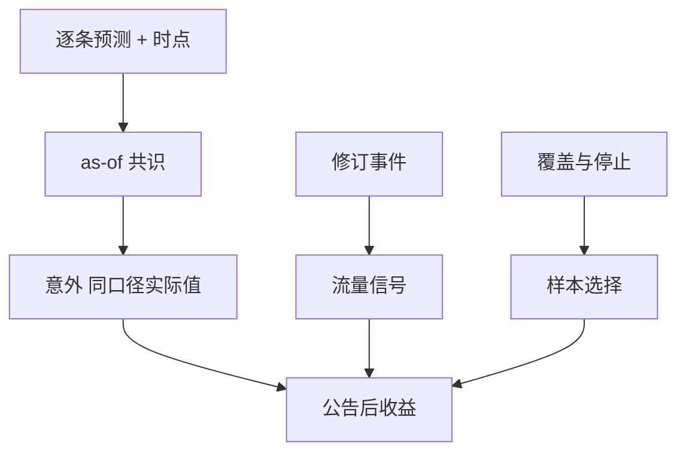

# 一致预期与分析师

一致预期是当时市场上可观察的盈利路径，不是 Compustat 的最终真实。未预期盈利的分母若用错「实际」或用错可知日，SUE 就变成前视会计。

<footer>—— Diether, Malloy and Scherbina, Differences of Opinion and the Cross Section of Stock Returns, Journal of Finance, 2002；对照 IBES 用户指南对统计期与实际值的说明；Stickel, Womack 等对分析师修订的经典结果</footer>

[上一课](/quant/fundamentals-restatements)把公司自己的数字做成 vintage。[对齐课](/quant/crsp-compustat)把主键接好。本课的缺口是**分析师信息集**：IBES 一类共识、修订、离散度与「实际值」字段。Diether、Malloy 与 Scherbina（2002）表明预测离散度与收益相关，且数据构造（是否含停止覆盖等）会改变结论。后课指数成分换对象；本课不把共识写成「聪明的 Compustat」。

## 问题

SUE 常写成 $(E-\hat E)/\sigma$。$\hat E$ 必须是公告前最后可知的共识，$\sigma$ 必须用当时可知的预测或历史意外。$E$ 若取 Compustat 最终盈利，而 $\hat E$ 取 IBES，口径差（一次性项目、摊薄）会进入「意外」。IBES 自己的 actual 与共识同口径，通常更合适——但仍有发布时点。问题是每条预测的 `announce_ts` 与统计期：月度共识快照是哪一天的截面，能否在开盘前使用。

覆盖缺失不是随机：小盘、亏损、即将退市更少分析师。用共识特征做截面，等于在有覆盖的子宇宙上交易。离散度在覆盖为 1 时无定义。Diether 等强调对 IBES 文件版本与调整的处理；复制必须声明文件（Summary vs Detail）与复权调整。

### 修订路径比静态共识更接近信息流

水平共识是存量；上调下调是流量。Stickel、Womack 一类结果表明修订带有收益效应，但也有缓慢扩散与可交易性限制。回测修订必须用修订公告时点，不能用月末快照里已经改完的数字去填月中交易。这与会计 vintage 同一纪律。

A 股一致预期来自 Wind、朝阳永续等。字段与调整（是否含预测机构当天）各异。原则：公告时点、口径一致、覆盖偏差。不要直接套 IBES 的美国财政日历。

## 方法

点-in-time：Detail 文件保留每条预测的有效区间，Summary 快照只在快照日使用。实际值用与共识同口径的字段，公告日用盈利公告时间戳（注意盘前盘后）。复权：预测与实际必须在同一股本基础上；拆股调整错误会造成假意外。离散度：至少两名分析师，声明是标准差还是变异系数，以及是否剔除过期预测。

与 CRSP 收益对齐时，事件窗从公告时点起，不是从财季末。盘后公告对当日收益的归属要明确：计入次日开盘。这与[集合竞价](/quant/cn-limit-auction)在 A 股的开盘跳价是同一类时钟问题。

### 停止覆盖与选择

分析师停止覆盖往往在坏消息附近。把停止当缺失、用旧共识填，会让困境公司看起来「仍有温和预期」。应把覆盖状态当特征或把停止当事件，而不是前向填充预测。

## 机制

共识是公开信息的压缩。有效市场下，水平共识已在价格里，可交易的是意外与修订。离散度代理意见分歧，在卖空约束下与高估相关（Miller；Diether 等）。这把本课接到[借券](/quant/securities-lending)：高离散且难借的名字，空头腿可能实现不了。纸面的离散度溢价必须扣借券与覆盖偏差。

供应商的「一致预期」是加权与清洗后的产品。换供应商等于换过滤器，因子不可在未声明的情况下横比。后课数据商对照会把这写成一般原则。

## 边界

不提供利用非公开分析师沟通或抢embargo 的方法。投资银行内部模型不在 IBES 宇宙。量化若把 NLP 纪要当「分析师」，那是另一数据源，时钟与许可另算。

## 小结

- 共识必须点-in-time；实际值与预测同口径，勿用 Compustat 最终盈利冒充。
- 修订是流量；停止覆盖是选择，不能前向填充。
- 离散度效应与卖空约束纠缠，须报告可实现版本。
- 出处：Diether, Malloy and Scherbina, *JF*, 2002；IBES 文档；Stickel / Womack 修订文献。
