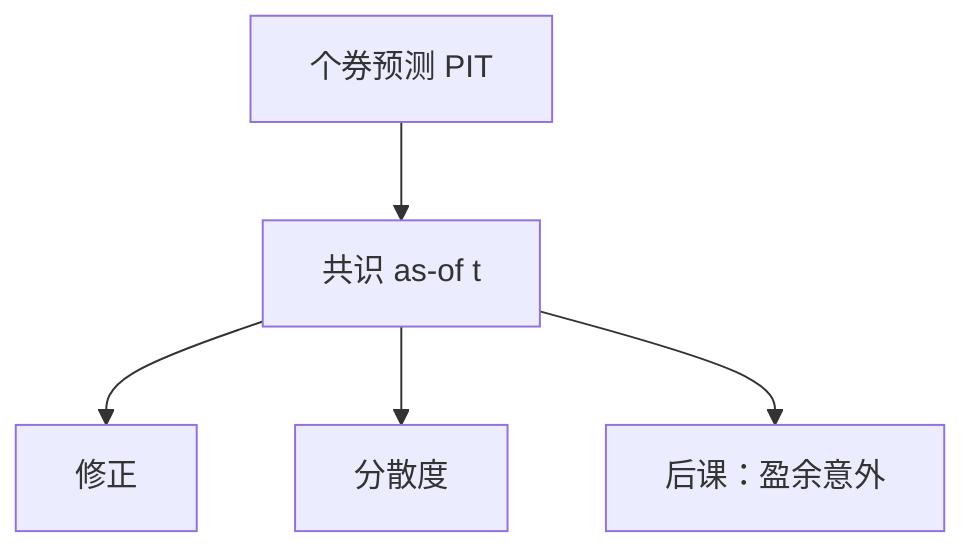

# 分析师预期与修正

一致预期是当时可观测的预测分布的某种汇总，不是事后才知道的真实盈余；用终局真实值当「当时市场预期」，惊喜全是前视。

<footer>—— 据 IBES 共识构造惯例；Diether, Malloy and Scherbina, Journal of Finance, 2002；Ljungqvist, Malloy and Marston 对分析师样本的讨论整理</footer>

上一课[税率与递延税](/quant/tax-deferred)收束了报表侧的税务口径。从这里起，信息集从「公司已披露的表」扩到「第三方当时的预测」。本课是「从报表到因子」这一课序的第一课：后课盈余意外、公告窗口都默认你会取 **PIT 的分析师预期**，而不是把真实 EPS 倒填成预期。不重写应计与质量。

## 问题

没有预期，盈余只是水平；有了预期，才能谈意外。IBES 一类库给出各预测机构在不同日期的 EPS、利润、收入预测。一致预期通常是中位数或均值，必须在形成日 $t$ 只用 $t$ 之前已发布、未撤回的预测。用财报公布后才知道的真实值去当「预期」，后面的惊喜因子收益会含未来信息。缺口是把分析师库当成与财报一样的 PIT 对象：每条预测有发布日、每条共识有 as-of 日。

分析师覆盖本身有偏：小公司、即将退市的公司覆盖少或突然消失。这与幸存者课是同一宇宙问题在卖方研究上的投影。

### 共识不是市场隐含预期

价格已经汇总了比卖方研报更广的信息。一致预期可以系统性乐观，也可以在亏损公司上滞后。本课把共识当**可交易的公开预测**，不当有效市场的充分统计量。修正（上调/下调）往往比水平更有信息：水平含有长期偏见，差分能消掉一部分。后课惊喜会再用共识当减数；减数错了，惊喜全错。

Ljungqvist 等指出分析师数据库存在回填与消失。PIT 分析师库要冻结当时已存在的预测人，不能用今天还能下到的完整历史当当时共识。

## 方法

在 $t$ 日，收集所有发布日 $\le t$、目标财期匹配、尚未过期的预测，汇总为共识（中位数对异常值更稳）。分散度（标准差或分位距）是另一信号，Diether 等把它与回报联系起来，但本课只要求它与共识同一 as-of。修正 = 当前共识 − 上一日（或上一个月）共识，两端都要 PIT。财期要对齐：用 FY1 还是 FY2、用季度还是年度，必须与后课惊喜的真实值口径一致，含是否摊薄、是否扣非、是否含一次性项目。

入库日不是发布日；FY1 滚动与财报日对齐。回填进来的分析师预测要剔除。覆盖过少时改时间序列预期，而不是让一两家券商的点预测决定共识。

## 机制

卖方预测进入价格的速度慢于公告本身，但快于完全没有预期的基本面排序。修正因子交易的是「预期的变化」，仍要服从可用日期：研报发布于盘后则归下一交易日。覆盖消失时，不要用最后一个共识一直持有到退市——应视为信息集收缩，与退市课的宇宙更新一起做。乐观偏差使水平信号弱、修正信号相对干净，这是方法上偏好差分的原因，不是保证 alpha。

后课公告窗口会把共识当成事件研究的条件信息。本课先保证共识在事件日之前已经冻结。

共识 as-of 要用预测发布日，不用统计日或入库日。FY1 在财报公告后会滚成「已过期」，必须换到新的 FY1，否则惊喜减数停在旧财年。覆盖人数过少时中位数不稳定，可要求最少 N 家或改用时间序列预期。回填分析师（后来才进入数据库、却带上早年预测）要剔除：这是分析师版幸存者，会让历史共识显得更准。

## 边界

不写卖方利益冲突的监管汇编，不把 NLP 研报当成本课方法。真实盈余如何定义、意外如何缩放，下一课[盈余意外](/quant/earnings-surprise)。后课默认：凡用到预期，皆为 as-of 共识；口径与财期已锁定。

后课惊喜的减数就是本课冻结的共识。修正因子的两端都要 as-of：用后来才发布的上调去解释过去的回报，是前视。覆盖消失按宇宙更新处理，最后一个共识不得无限期沿用到退市。FY1 滚动规则写进来源卡，与财报可用日期对齐。

后课惊喜直接使用本课冻结的 as-of 共识；修正与分散度必须与共识落在同一 PIT 切片。

一致预期的口径必须与后课真实 EPS 同一行锁定：摊薄、扣非、是否含一次性。口径漂移会造成系统性「意外」，其实只是减数与被减数不在同一张利润表上。

## 小结

- 报表给水平；分析师给当时可观测的预期。
- 用终局真实值当预期，是前视。
- 共识、修正、分散度必须同一 PIT 切片。
- 口径（摊薄、扣非、财期）要与后课惊喜一致。
- 覆盖消失属于宇宙更新，不是数字缺失那么简单。
- 出处：IBES 惯例；Diether, Malloy and Scherbina (2002)；Ljungqvist 等对分析师样本。
