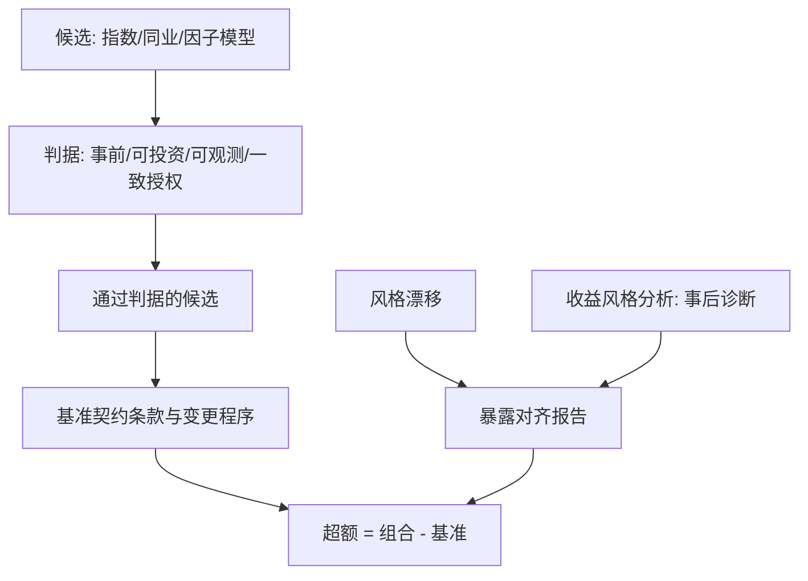

# 基准选择的争议

用一组可投资的资产类指数可以还原基金收益的大半，剩下那截才叫选择；争议从来不在拟合，而在风格由谁、在何时指定。

<footer>—— Sharpe, Asset Allocation: Management Style and Performance Measurement, Journal of Portfolio Management, 1992</footer>

[上一课](/quant/ap-riskadjusted-family)展开比率族谱：每个分子的「超额」都指向一个基准。缺口是**基准从哪来**。超额是一个差分，减数换了，超额就换号；基准因此不是统计上「拟合最好」的对象，而是事前写进契约的条款。

## 问题

三类候选各有暗坑。**指数基准**：与组合的风格可以漂移——一只偏中小盘的增强产品对大盘指数报超额，超额里一大块是规模暴露，不是选股。**同业基准**：分位数排名受幸存者偏差污染，清盘的基金退出样本，留下来的分位系统性偏乐观；排名还循环作用于行为，见[基金流与回报追逐](/quant/fund-flows-chasing)。**因子模型基准**：把基准变成事后可调的回归——Sharpe 的收益风格分析用一组风格指数拟合，解释力很高，但窗口一换风格就换；它本是事后诊断工具，拿去事后重选基准，就把记分牌交给了被评分的人。缺口是一组基准判据与一份变更程序。

### 好基准的判据

判据是实务共识：**事前指定**、可投资（或其成分可复制成持仓）、可观测、与投资授权一致、成分与权重规则明确。不可投资的基准——含空头成分、含不可交易的权重约束——产生的 alpha 无法兑现成钱，评价悬空。基准还可以被「拿捏」：管理人事后主张换基准，或把组合风格漂到契约之外，两条路都让超额失真；前者要靠变更程序挡住，后者要靠暴露对齐报告抓住。

同一产品相对沪深 300 与相对中证 500 的年化超额可以差出几个百分点：基准不是度量细节，是记分牌本身。跟踪误差的工程口径见[基准与跟踪误差](/quant/benchmark-tracking-error)，贴合度另看[主动份额](/quant/active-share)。

## 方法

把基准写成契约条款，字段化：基准对象（指数或规则）、再平衡频率、成分调整规则、生效日期、变更程序（须经持有人或投委会同意，且**不追溯**已考核区间）。同业基准要声明样本构建：含死亡基金、共同起点、分组规则。收益风格分析的位置要钉死：它用回归**事后诊断**组合的实际风格暴露，服务于「解释这个组合像什么」；基准契约窗口与诊断窗口分开，诊断结果可以触发暴露对齐的整改，不能触发换基准。验收用三问：基准从哪条条款来、谁批准过变更、超额按哪一版基准算。

## 机制

基准为什么必须事前：差分的对称性——在被减数与减数之间，事后选基准等于在超额的分布里挑有利的一侧，这与[回测过拟合](/quant/backtest-overfitting)共享同一机制：选择抬高读数。可比性也来自事前：不同管理人用不同基准，截面排名不可加总，委员会看到的「前十名」可以只是十个记分牌。同业基准的机制性偏差要拆开看：幸存者让分位随时间向上漂，于是用同业分位考核，会把行业平均的业绩衰减误读成个人技能下降——衰减是策略层的（[策略生命周期](/quant/strategy-lifecycle)），分位是样本层的，两层混在一张排名表里，奖惩就发错了对象。

## 边界

本课不设计跟踪误差预算与指数编制工程（[基准与跟踪误差](/quant/benchmark-tracking-error)），也不重讲因子归因的回归细节（[因子归因](/quant/factor-attribution)）。基准钉死之后，绩效评估还剩时间维度上的最后一问：超额会不会重复——持续性怎么测、怎么被测量设计伪造，是下一课。

## 小结

- 超额是差分，减数换了号就换：基准是契约条款，不是拟合结果。
- 判据五条：事前指定、可投资、可观测、授权一致、规则明确；不可投资的基准给出不可兑现的 alpha。
- 收益风格分析是事后诊断风格的工具，不能反过来用于事后换基准。
- 同业排名有幸存者偏差与样本漂移；分位变化与技能变化要分开读。
- 出处：Sharpe, *Journal of Portfolio Management*, 1992；判据口径据 CFA Institute 绩效评估惯例整理。
