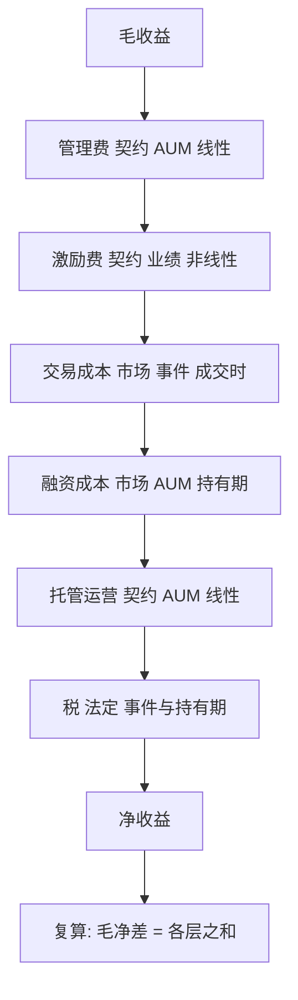

# 费用结构的分类

把费用说成「一个点」，等于把契约、摩擦与税三种性质不同的漏出压进同一个数；它们可谈判的程度、可度量的途径与对行为的影响各不相同。

<footer>—— 据 French, The Cost of Active Investing, Journal of Financial Economics, 2008 的成本分类整理</footer>

[上一课](/quant/ap-return-accounting)把收益钉成口径：同一本账按同一套子区间跑两遍，费前一遍、费后一遍，毛净差整段留给本课。缺口随之而来：**这截差额由哪些科目构成、各记在哪一列**。费用不是一个数而是一张表；分类错了，砍成本会砍错对象，归因会把摩擦当成管理人的功过。

## 问题

毛净差几百个基点里，管理费、业绩提成、托管与行政、佣金、价差、冲击、融资、税各占多少？分类错误的代价各不相同：把市场性摩擦（价差与冲击）当成契约费去「谈判压缩」，谈判桌上没有对手方；把业绩提成当线性折扣，会漏掉它作为路径期权的全部行为后果，见[业绩费与高水位](/quant/performance-fee-hwm)；把税漏出瀑布，组合层面的优化会整体错位，见[税务感知组合](/quant/tax-aware-portfolio)。缺口是一套可执行的分类：每个成本科目都要落进「性质、计提基准、显隐」三个维度。

### 三个分类维度

按**契约性**分：契约费（管理费、托管费、行政费）写在合同里；市场性成本（价差、冲击、滑点）由市场结构与订单行为决定，见[滑点归因](/quant/slippage-attribution)；法定成本（税、印花税，A 股口径见[费率结构](/quant/cn-fee-structure)）由辖区规则决定。按**计提基准**分：按 AUM 线性计提、按业绩非线性计提、按事件发生（申购赎回费、转换费）。按**显隐**分：显性账单（佣金、管理费，账上可读）与隐含在成交价里的部分（价差与冲击不出现在任何账单上，只能用执行对比估计）。三维齐全，一个科目才算「入了账」。

法国人估计美国主动投资的社会成本每年以千亿美元计，其中交易摩擦与费用各占大头；被动化先吃掉的是契约费那层，摩擦与税原样留在执行与持有层——分类决定了「省钱」能省到哪一层。

## 方法

把分类落成一张**费用瀑布**：毛收益、管理费、激励费、交易成本、融资成本、托管运营、税、净收益，逐层相减。每层带四个字段：科目性质（契约/市场/法定）、计提基准（AUM/事件/业绩）、频率（日计提、成交时、年度结晶）、数据来源（账单、成交回报、估值）。验收标准沿用做市课的三问：每一层的数从哪来、谁改过、依据哪条条款；毛净差必须等于各层之和，对不上就是有科目漏记或重复计入，而不是「四舍五入」。

## 机制

分类为什么必须先行：三个维度的成本服从不同的经济机制。契约费是谈判对象，对规模的弹性大，被动化与议价首先压缩它；市场性成本是市场结构的函数，随[持有期与换手](/quant/holding-horizon)与订单紧急度变化，只能用算法与执行纪律管理；法定成本是确定性的状态依赖漏出，管理它的手段是持有结构与时点，不是谈判。行为影响也不同：AUM 费不改变单期决策，业绩费改变管理人的风险选择——同样是几百个基点，写在哪一列，意味着完全不同的杠杆。Sharpe 的算术在此给出边界：主动作为一个整体扣费后必然输给被动整体；分类告诉你的是这必然发生**在哪几层**。

## 边界

费用如何进入几何收益、复利上吃掉多少终值，主干[费用对复合收益](/quant/fees-compounding)已算过，本课不重复公式；业绩费的路径期权结构与水位重置见[业绩费与高水位](/quant/performance-fee-hwm)。本课也不谈执行层面的成本优化——那属于交易执行课程，这里只要求成本**可归类、可复算**。瀑布扣完之后数字落到哪条曲线上，是下一课净值构造的事。

## 小结

- 费用是一张瀑布表，不是一个点；每个科目按性质、计提基准、显隐三维入账。
- 契约费、市场性成本、法定成本机制不同：谈判、执行、结构各自对应一层。
- 业绩费是非线性的路径条款，不能当线性折扣记。
- 毛净差必须等于瀑布各层之和，对不上是漏记，不是舍入。
- 出处：French, *The Cost of Active Investing*, Journal of Financial Economics, 2008；主动算术见 Sharpe, *Financial Analysts Journal*, 1991。
