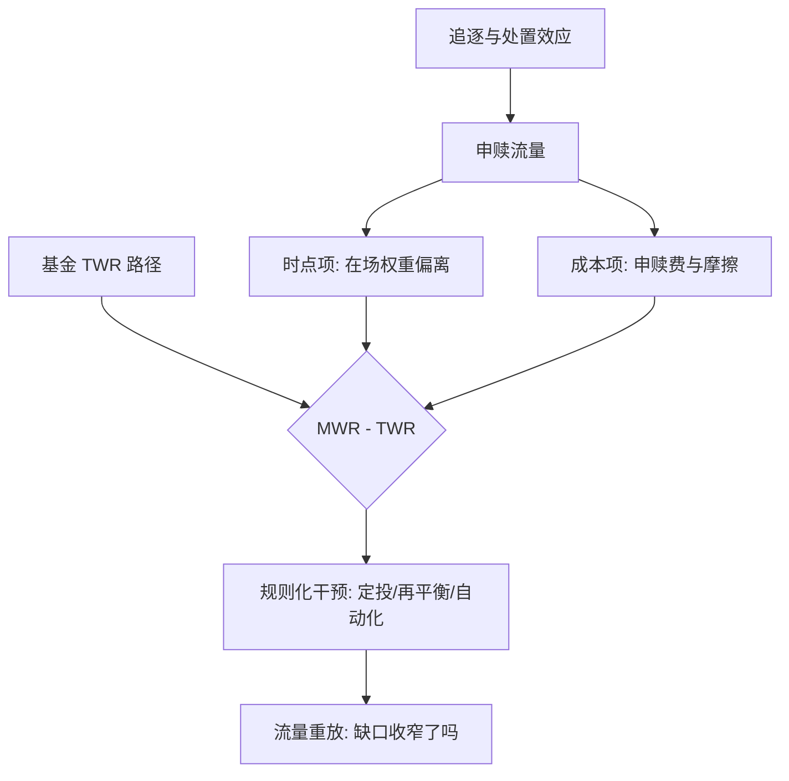
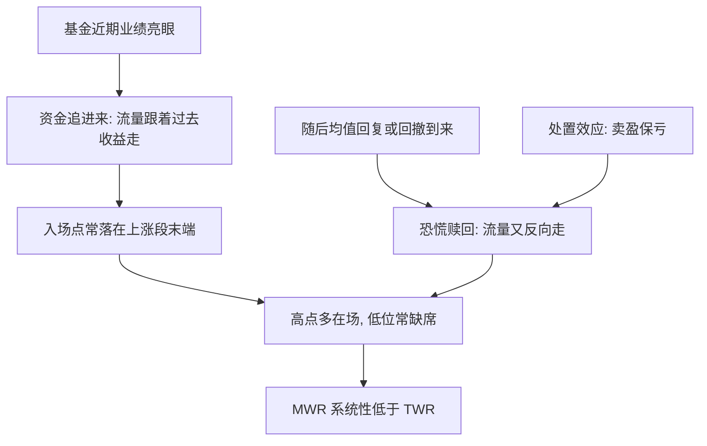

# 投资者行为损耗

投资者实际到手的美元加权回报，系统性地低于同期资产的时间加权回报：钱在高位进来，在低位出去。

<footer>—— Dichev, What Are Stock Investors' Actual Historical Returns? Evidence from Dollar-Weighted Returns, American Economic Review, 2007</footer>

[上一课](/quant/ap-performance-persistence)说明产品层的净超额持续性弱，且难测。评估的最后一层损耗不在产品里，而在持有人自己：同一只基金，时间加权收益与投资者实际拿到的美元加权收益之间，隔着一条方向稳定的缺口。本课把第一课并排报的两个口径，变成一张对账表。

## 问题

第一课说 TWR 剔除现金流时点、MWR 保留它，那是口径之争；现在是事实之争：$R_{\mathrm{MWR}}-R_{\mathrm{TWR}}$ 的差有多大、朝哪边偏。机制不复杂：申赎追逐近期业绩（见[基金流与回报追逐](/quant/fund-flows-chasing)），资金恰好在业绩高点在场、低点缺席——问题常常不是买了差的基金，而是好基金也被坏时点吃掉。Barber 与 Odean 对数千个个人账户的实证给出同向证据：交易越频繁，净收益越低，过度交易自己就把回报磨掉了。缺口是把它从 anecdote 变成可复算的年化数：缺口多大、拆成哪几项、什么规则能收窄它。

术语翻译：TWR（时间加权收益）衡量「基金本身赚多少」，申赎动作被剔除；MWR（美元加权收益）衡量「你的钱实际赚多少」，进出时点被完整计入。两者之差不是记账误差，而是行为损耗——钱高进低出，损耗就归你。

### 缺口的分解

行为损耗约等于两项之和：**时点项**——资金在场时的加权收益与全程收益之差；**成本项**——每次追涨杀跌付出的申赎费与市场摩擦。度量方法：同一基金池并行算 TWR 序列与按流量加权的 MWR，年化差就是缺口；实务口径如 Morningstar 的 Mind the Gap 系列，多年把缺口稳定测在每年 1.5 个百分点上下，且随市场周期放大缩小。

一笔干净的算术：基金第一年涨 50%、第二年跌 20%，TWR 为 $1.5\times 0.8-1=+20\%$；持有人在第一年末的高点才申购，其 MWR 是 $-20\%$。同一基金、同两年，两个口径差 40 个百分点——基金没骗人，时点把钱让了出去。

## 方法

做账户对账表：每个账户同报两条曲线——单位净值的 TWR 与账户市值加现金流的 IRR，差额年度化、按账户分层。归因：把缺口拆成时点项（各子区间在场权重乘该段收益，对比平均权重）与成本项（申赎费加摩擦，直接从第二课的费用瀑布读数）。干预评估：把规则化方案——定投、缴款自动化、[再平衡规则](/quant/rebalance-rules)、赎回冷静期——放进历史流量里重放，比较干预前后的 MWR 分布，而不是靠教育口号。

## 机制

缺口方向为什么稳定：流量对过去收益的弹性为正、对未来收益的弹性为负——追逐者系统性在均值回复点入场；处置效应（卖盈保亏）与可得性（近期新闻放大感知风险）把申赎时点推向分布两端。这不是教育能完全修复的：基金评价体系按 TWR 排名发星级，投资人看到的数与他拿到手的数本来就不是同一个；评价机制自己在校准错误的目标。机制修复是把时点判断从人移交给规则——定投消解入场时点，再平衡把「高抛低吸」变成无条件执行，税收损失收割同理（[税务感知组合](/quant/tax-aware-portfolio)）。规则不更聪明，规则只是不恐惧也不贪婪。

直觉类比：TWR 像一家餐厅全年的平均水平，MWR 像你专挑它上新闻最火的周末去排队的体验。餐厅没变差，是你的到场时点集中在了最拥挤的时候——追逐热度本身就把体验变糟了。

## 边界

行为损耗是账户层现象，不能拿来给基金评级翻案：考核管理人只看净 TWR（口径按第一课钉死），考核顾问与平台看 MWR 对账。缺口估计对流量数据质量敏感：外部转入转出与收益混淆会伪造时点项。个人账户的过度交易证据以 Barber–Odean 的美国样本为准，制度环境不同（申赎成本、税费、赎回时滞）幅度会移，方向机制不变。最后一课把八课合回一张图，评价到此可以闭环。

## 小结

- $R_{\mathrm{MWR}}-R_{\mathrm{TWR}}$ 是可复算的对账缺口，方向系统性为负。
- 缺口两项：时点项（在场权重偏离）加成本项（申赎费与摩擦）。
- 机制：追逐近期业绩与处置效应把时点推向分布两端，规则化干预可收窄。
- 考核分工：管理人看净 TWR，顾问与平台看 MWR 对账，不可互相顶替。
- 出处：Dichev, *American Economic Review*, 2007；Barber and Odean, *Journal of Finance*, 2000；缺口幅度据 Morningstar, Mind the Gap 系列报告整理。
