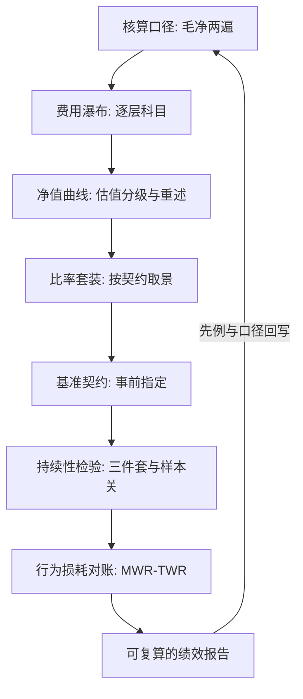
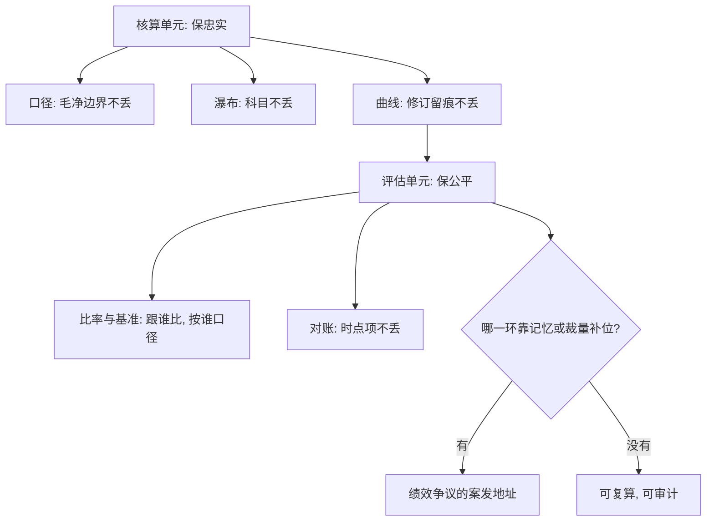

# 账户绩效收束

评价先于改进，口径先于评价：一张能复算的费用表、一条能重述的净值、一套事先指定的基准，比任何两位小数的年化都更接近「说得清」。

<footer>—— 据 CFA Institute, Global Investment Performance Standards（GIPS）与绩效评估实务整理；主动算术见 Sharpe, Financial Analysts Journal, 1991</footer>

[上一课](/quant/ap-investor-behavior-drag)把镜头从产品拉回持有人，用 MWR 对 TWR 的缺口合上了评估的最后一块。本课程到此收束。八课从「收益怎么算」走到「数字归谁」：核算单元立口径，评估单元立判据，本课把它们合回一张图，并标出与已修课程的接口。

## 问题

合起来要回答一个问题：**一份账户绩效报告能否从逐笔账本复算到每一个结论**，中途不经过任何人的裁量。链条是：[收益的核算口径](/quant/ap-return-accounting)给毛净两遍的收益数；[费用结构的分类](/quant/ap-fee-taxonomy)给逐层可复算的瀑布；[净值曲线的构造](/quant/ap-nav-construction)给可重述的测量仪器；[风险调整绩效的族谱](/quant/ap-riskadjusted-family)把曲线压成与契约匹配的效率数；[基准选择的争议](/quant/ap-benchmark-selection)钉住差分的减数；[绩效的持续性](/quant/ap-performance-persistence)给时间维度的证据及其设计约束；[投资者行为损耗](/quant/ap-investor-behavior-drag)给持有人实收的对账。任一环断了——口径混用、科目漏记、曲线不可重述、基准事后换——下游就用猜补齐，猜出来的「年化 15.3%」没有审计价值。

术语翻译：「复算」就是不听取任何人的口头解释，只拿原始账本、估值源与书面规则，让第三方独立重算出同一个数。能复算的报告才谈得上审计与 comparability（可比）；否则每个数字背后都站着一位「你得出示抗议才肯解释」的人。

验收沿用作市课的三问：这个数从哪来（账本与估值源）、谁改过（修订与基准变更留痕）、依据哪条规则（事前书面契约）。三问都指向文件，报告才立得住。

## 方法

把收束写成对照表：每课交付一个对象而不是一个知识点——口径字段、瀑布科目、曲线与修订档案、比率套装、基准条款、转移矩阵、缺口对账表。验收同样用三问，与做市课同构：绩效报告里的每个数字都能沿链回溯到账本与合同，链就是活的。与已修课程的接口逐个钉死：费用的复利算术在[费用对复合收益](/quant/fees-compounding)，业绩费的期权结构在[业绩费与高水位](/quant/performance-fee-hwm)；归因是收束之后的下一层算术，在[Brinson 归因](/quant/brinson)与[绩效归因的深化](/quant/pf-attribution-deep)；统计谦逊在[放气夏普](/quant/deflated-sharpe)与主干[业绩持续性](/quant/performance-persistence)。Sharpe 的算术给整门课程划上界：主动作为一个整体扣费后跑不赢被动——账户绩效能改善的，是整体内部的位置与损耗，不是整体对被动的算术。

## 机制

课程内部的机制主线：**先钉测量，再谈评价；每个比较先声明「跟谁比、按谁的口径」**。账户层与做市台同构，信息只进不丢：口径不丢毛净边界，瀑布不丢科目，曲线不丢估值层级与修订，基准不丢变更程序，对账不丢时点项。凡靠记忆与裁量补位的环节——「这个数大概是含分红的」「基准今年换了但差额不大」——都是绩效争议的案发地址。核算与评估的分工也在这条线上：核算单元（前三课）保证数字忠实，评估单元（后五课）保证比较公平；顺序不可倒置，因为公平的比较是忠实的数字的函数。

直觉类比：核算与评估的关系像田径比赛——先统一量尺和计时器（核算），才能比较谁跑得快（评估）。一个用公斤、一个用磅的举重比赛，名次再漂亮也没有意义；公平的比较是忠实的测量的函数，顺序反了全盘皆输。

## 边界

本课程刻意没有覆盖三块。其一，税：持有结构与实现时点对净值的侵蚀，[税务感知组合](/quant/tax-aware-portfolio)专课处理。其二，监管报送与 GIPS 合规的认证细节：列示规范、陈述要求与核验流程，属于合规工程。其三，多管理人账户的合计与费用分摊：比单账户多出加权与归属两层问题。归因细节与风险归因各有专课。树序的下一课程转向宏观与跨资产策略，视角从账户换到资产；评价的仪器留在本课程，测量纪律留在每一张报告里。

## 小结

- 八课一条链：口径、瀑布、曲线、比率、基准、持续性、行为对账，环环可复算。
- 每课交付一个对象；验收三问——从哪来、谁改过、依据哪条——都指向文件。
- 机制主线：先钉测量再谈评价；核算保忠实，评估保公平，顺序不可倒置。
- Sharpe 算术划上界：账户绩效改善的是整体内部的位置与损耗，不是整体输给被动的差额。
- 未覆盖的税、合规报送与多管理人合计各有专课，接口已标出。
- 出处：Sharpe, *Financial Analysts Journal*, 1991；口径与判据据 CFA Institute, *Global Investment Performance Standards* 及绩效评估实务整理。
