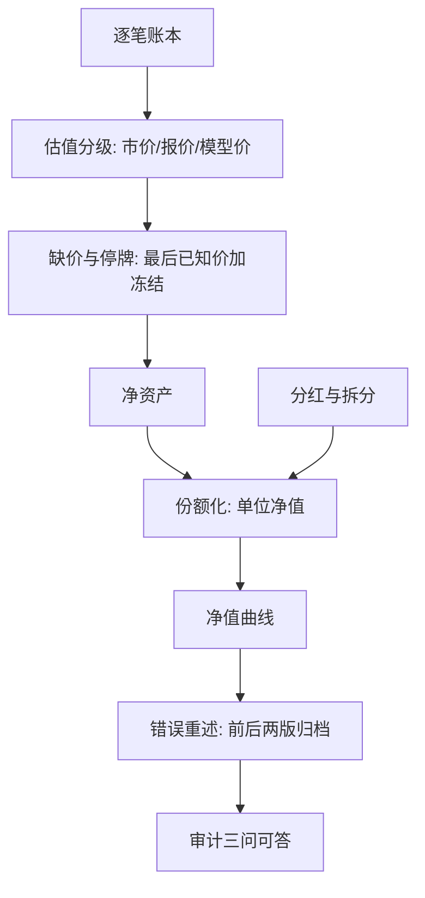
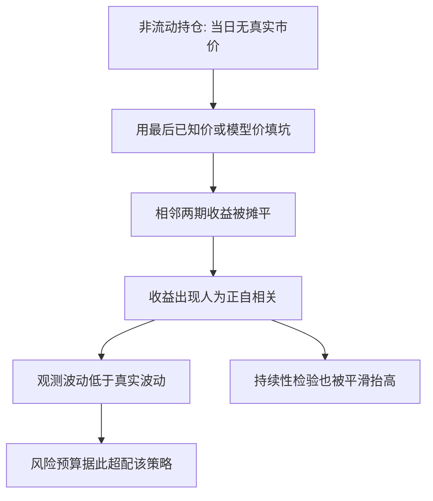

# 净值曲线的构造

平滑不是没有波动，是把波动搬进了看不见的估值假设里：报告收益的序列相关越高，离真实的波动越远。

<footer>—— Getmansky, Lo and Makarov, An Econometric Model of Serial Correlation and Illiquidity in Hedge Fund Returns, Journal of Financial Economics, 2004</footer>

[上一课](/quant/ap-fee-taxonomy)把毛净差拆成逐层可复算的费用瀑布。扣完之后，数字要落成一条**曲线**：日频、单位化、可重述。缺口在于：净值曲线看起来只是每天记一个数，实际是估值、分红、份额与修订四组决策的叠印；仪器造歪了，之后所有比率、排名与检验都建立在读不准的数上。

## 问题

四组决策各有坑。**盯市来源**：交易所收盘价、经纪报价、模型价、最后已知价——同一天可以有不同的「今天的值」；停牌、流动性差的债券与私募持仓让当日市价根本不存在。**分红与拆分**：除息缺口会让曲线在派息日假摔，不处理就制造出只存在于报表里的回撤。**份额化**：申购赎回改变净资产但不应改变单位净值，份额与净资产必须分开记。**错误与修订**：上月发现上月的价错了，曲线改不改、留不留痕。缺口是一条可复算、可重述的净值序列，能通过「数字从哪来、谁改过、依据哪条规则」的审计三问。

数字实例：单位净值 1.20 元的基金每单位派息 0.05 元，除息日净值直接跳到 1.15 元，图上是一根 −4.2% 的大阴线——但持有人账户里多了 0.05 元现金，一分没亏。不把派息还原回曲线，每次派息都会在图上造出一场假回撤。

### 平滑与失真

用最后已知价或模型价填坑，收益会获得人为的序列相关：观测波动被压缩、与流动资产的表观相关性下降。Getmansky–Lo–Makarov 把平滑写成真实收益与移动平均的卷积，并给出用自相关系数还原真实波动的做法。危害不在描述而在决策：把平滑后的低波动喂进风险平价或风险预算，会给这类策略系统性超配；VaR 与压力测试随之低估左尾。

月末估值是重灾区：持有大量非流动债的组合，月收益的一阶自相关可以显著为正；把观测波动直接当真实波动，同等风险预算下它的「效率」是估值节奏送的，不是策略挣的。

## 方法

先单位化：单位净值等于净资产除以份额，申购赎回同增减、分母分子同步，单位净值不动——这是第一课时间加权收益的精确载体。分红报两条：显式除息的净值与默认再投的累计净值。估值分级：市场收盘价为一级，可比报价为二级，模型价为三级，每个持仓标注层级，三级占比单列披露。停牌与缺价：用最后已知价加冻结标记，解除时按交易日补记，不跳变。修订政策：错误必须重述并留痕，修正前后两版曲线都归档——回改不留痕比错误本身更伤信任，因为下游所有引用的数都成了孤儿。

常见误区：初学者容易以为大额赎回会砸低单位净值。实际上赎回是按净值拿走属于自己的那份：净资产和份额同比例减少，像从一锅汤里舀走一碗，剩下的汤咸淡不变。会让净值跳变的是估值错误或分红漏记，不是申赎本身。

## 机制

净值曲线是后续一切评价的**测量仪器**：仪器失真，读数无意义。份额化把账户变成证券，使时间加权收益有了可复算的对象——单位净值的链式增长就是 TWR，申赎不再进入分子分母。平滑的机制值得记住：它等价于把真实收益与一个低通滤波卷积，二阶矩被压缩，压缩量可以从自相关结构里估出来；这也意味着**平滑污染持续性检验**——月频平滑的排序看起来更稳，「技能」的可信度被估值节奏抬高，评估单元要用还原后的收益重算。

直觉类比：平滑像把颠簸的山路画成一条平缓的曲线——地图看着好走，坑一个没少。用平滑后的波动做风险预算，等于照着美化过的地图配装备，真正的陡坡（左尾）出现时才发现头盔带少了。

## 边界

本课不回答曲线好不好——那是评估单元的比率与基准的事。估值分歧的仲裁层级与 IPV，做市课程已给出口径，此处不重复。曲线的抽样误差与统计检验不属于核算单元。平滑对持续性测量的具体污染方式，放到本课程[绩效的持续性](/quant/ap-performance-persistence)再算。

## 小结

- 净值曲线是估值、分红、份额、修订四组决策的叠印，不是每天记一个数。
- 估值要分级标注，缺价用最后已知价加冻结，解除后按交易日补记。
- 平滑把波动搬进估值假设：观测波动低估、相关性失真，可按自相关还原。
- 错误必须重述并留痕，修正前后两版都归档；回改不留痕比错误更伤。
- 出处：Getmansky, Lo and Makarov, *Journal of Financial Economics*, 2004；份额化与再投口径据 GIPS 惯例整理。
