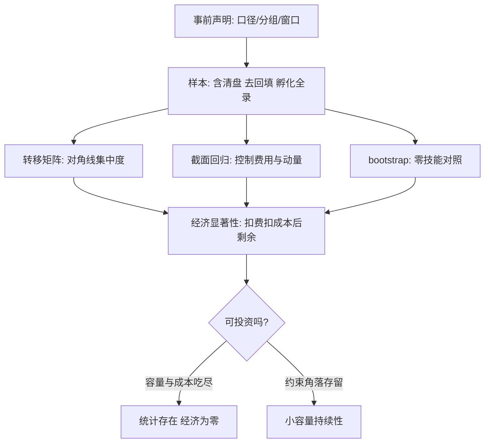

# 绩效的持续性

把赢家与输家按上年排名分组、再看下一年，对角线上的集中度弱得可怜；更要紧的是，测出多少持续性，取决于你怎么构造样本。

<footer>—— Carhart, On Persistence in Mutual Fund Performance, Journal of Finance, 1997；运气与技能见 Fama and French, Journal of Finance, 2010</footer>

[上一课](/quant/ap-benchmark-selection)把基准钉成事前契约，横向比较终于可信。缺口是时间维度：**今年的超额会不会重复**。产品层的结论主干[业绩持续性](/quant/performance-persistence)已经给出——扣费后持续性大半被动量与费用解释，技能被资金流摊薄；本课不重做那个实证，写**怎么测**：检验的构造选择如何制造或消灭「持续性」。

## 问题

持续性检验是设计敏感的测量：按毛收益还是净 alpha 分组、排序期与持有期各多长、是否控制费用与动量暴露、样本含不含已清盘基金——每一项都改变结论。错法有典型几种：排序期与持有期窗口重叠，相邻观测共享大半数据，t 统计量虚高；只看幸存者，右尾持续性被高估；用同一段公开动量在自变量与因变量两边出现，把市场现象记成经理手艺（Carhart 的教训）；对冲基金样本再叠回填偏差与孵化期筛选——只把孵化成功的记录放进历史，持续性凭空出现。缺口是一套事先声明、经得起样本构建盘问的检验流程。

### 检验的三件套

**转移矩阵**：上年分位乘下年分位，看对角线集中度是否超过随机置换。**截面回归**：下期净 alpha 对上期净 alpha 加控制变量（费用、规模、动量暴露），系数是持续性的直接估计。**bootstrap 对照**：Fama–French 的做法——在零技能假设下重抽截面，看观测到的极端业绩能否被运气生成。三件套共同的门槛在样本构建：含清盘、剔除回填、孵化记录全部入史，缺一样结论就漂。

用月度滚动数据分组（12 个月排序、往后 12 个月持有、步长 1 个月）会让相邻观测共享 11 个月样本，有效样本量远小于名义观测数；独立化要么拉长步长，要么按重叠块做 bootstrap。

## 方法

标准流程五步：事前声明口径（净、费用、基准、分组规则）；样本处理（含清盘、去回填、孵化全录）；跑三件套并报控制变量；bootstrap 零模型对照；子样本稳健性（发表前后、规模前后、费用档位前后）。最后报告**经济显著性**而不止 t 值：持续性系数折成年化超额是几个基点，扣掉申购费、跟踪成本与容量折价还剩多少。统计上存在、经济上不可投资是常态结果，不是检验失败。

## 机制

持续性弱更多是均衡结果而非测量失败：技能若存在且容量有限，资金追逐把规模推到容量上限，净 alpha 被摊薄到零附近（Berk–Green 的均衡逻辑）；费用差异是确定的、动量是公开的，两者足以填满排序矩阵里的大部分对角线。可投资的持续性只可能残留在容量受约束的角落——小规模、慢信号、封闭结构——而这些地方样本小、噪声大，恰恰是[多重检验](/quant/multiple-testing-factors)与[放气夏普](/quant/deflated-sharpe)最该盯防的地方：真实的角落持续性，与挖掘出来的假阳性，统计面貌几乎相同。上一课的净值平滑在这里补一刀：月频平滑让排序更稳，先把波动按自相关还原再测，才不把估值节奏当技能。

## 边界

产品层结论以主干课为准，本课不推翻也不重复；检验不外推到「如何选中未来的前十分位」——那是预测问题，样本里没有答案。个人账户里观察到的「持续性」，很大一部分是持有人自身行为的重复，这笔账转给下一课。

## 小结

- 持续性是设计敏感的测量：分组口径、窗口重叠、样本构建都改写结论。
- 三件套：转移矩阵、控制变量后的截面回归、零技能 bootstrap 对照。
- 样本三关：含清盘、去回填、孵化全录；缺一关结论就漂。
- 报经济显著性：扣费、扣成本、扣容量之后剩下的基点才算数。
- 出处：Carhart, *Journal of Finance*, 1997；Fama and French, *Journal of Finance*, 2010；Berk and Green, *Journal of Political Economy*, 2004。
