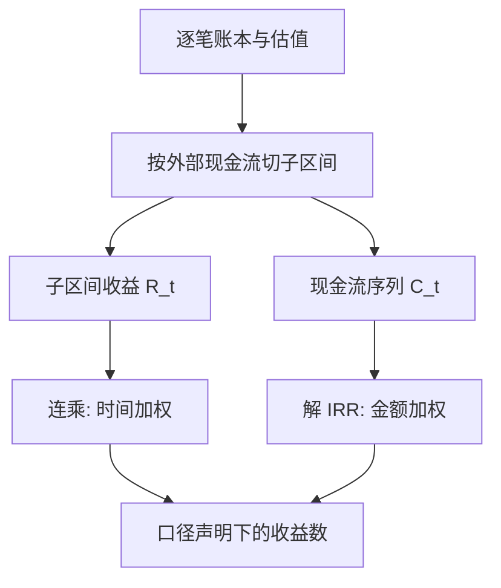

# 收益的核算口径

同一本账可以报出不止一个「收益」：现金流切在哪一刻、按谁的钱加权、分红算不算再投，每一条约定都在改写数字本身；口径不是细节，是收益的定义。

<footer>—— 据 CFA Institute, Global Investment Performance Standards（GIPS）的时间加权与金额加权口径整理</footer>

[上一课](/quant/omm-map)把期权做市台收成一条可审计的链：报价、落账、分桶、限额、执行、漂移、事件、仲裁，验收标准是「数字从哪来、谁改过、依据哪条规则」三问有文件答案。本课程「账户绩效与费用」问的是这条链的另一端：账本最终要折叠成哪几个数，投资人与管理层才说得清这个账户干得怎么样。第一课的缺口最基本：**「收益」这个数是怎么算出来的**。不先钉口径，后面的费用、净值、比率与基准全都悬空。后课默认已经读完本课。

## 问题

一个账户在一年内有申赎、分红、费用计提，「赚了多少」不再唯一。两个极端口径给出不同的数：时间加权把各子区间收益连乘，剔除现金进出时点的影响；金额加权按全部现金流的现值解一个内部收益率，恰恰保留时点。分红不再投与再投是两条曲线；毛收益与净收益之间隔着一张费用瀑布。口径不写死，两个账户的数字不可比，同一账户的两个月份也不可比，更谈不上审计。缺口是把「收益」定义成一组可执行的字段：子区间怎么切、收益怎么连、现金流归谁、毛净差记在哪。

## 方法

先切分：在每个**外部现金流**发生的时点把区间切开，现金流在期初进账时，子区间收益为

$$
R_t=\frac{V_t-V_{t-1}-F_t}{V_{t-1}},
$$

$V$ 是区间端点的市值，$F_t$ 是外部现金流（申购为正、赎回为负）。时间加权收益是链接：

$$
R_{\mathrm{TWR}}=\prod_t (1+R_t)-1.
$$

金额加权收益 $r$ 解

$$
\sum_t \frac{C_t}{(1+r)^t}=V_T,
$$

即把每笔投入与期末市值折现到同一起点。对数收益 $r_t=\ln(V_t/V_{t-1})$ 在时间上可加，是复算与连接的便利形式。分红视为对持有人的流出，除息后价值链连续；要报「分红再投」的累计净值，而不是除权缺口造成的假摔。最后，同一套子区间跑两遍——费前一遍、费后一遍——毛净差整段留给下一课的费用瀑布，不要把费用混进 $F_t$。

### 谁的收益

TWR 回答「策略的效率」，MWR 回答「这笔钱实际经历了什么」，两者都是合法口径，对象不同。机制上 TWR 把申赎时点当噪音剔除，因为时点是投资人的选择，不是策略的选择；MWR 恰恰把时点当成主体。

一笔钱月初 100 万涨 50% 到 150 万，月中再申购 150 万，月末横盘：时间加权报 $1.5\times 1.0-1=50\%$；金额加权解 $100y^2+150y=300$ 得约 $29\%$——后进的钱没吃到第一段涨幅。同一账户同一个月，两个口径差 21 个百分点。

## 机制

时间加权能成为产品评价的标准，是因为评价的对象是**可复制的决策序列**：把区间在现金流处切开再连乘，任何一段收益都不含「钱恰好在场」的运气，两个不同申购节奏的投资人面对同一条 TWR 曲线。金额加权则把时点计入主体，它是账户持有人体验的唯一忠实度量——第七课会用它对账。两条机制要求不同的算术：链接是乘法复合，跨账户汇总要用加权平均而不是把收益率相加；对数收益时间可加、截面上不可加权平均，算术收益恰好相反——混用两条加法规则，是绩效报告里最常见的静默错误，报表勾稽对不上多半死在这里。

## 边界

本课只钉口径。市值 $V_t$ 从哪来——盯市、模型价与停牌处理——是下一课净值构造的事；毛净差里各科目占多少，归费用分类课；收益数有多少抽样误差、能否当技能证据，留给评估单元的[放气夏普](/quant/deflated-sharpe)。归因是另一门算术：[Brinson 归因](/quant/brinson)与[绩效归因的深化](/quant/pf-attribution-deep)都要求收益先有口径，否则配置与选择的分母本身在漂。

## 小结

- 收益不是天赋的数，是一组口径字段：切分规则、连接方式、现金流归属、毛净分界。
- 时间加权剔除申赎时点，度量策略；金额加权保留时点，度量持有人体验。
- 对数收益时间可加、算术收益截面可加权平均；两条加法规则不可混用。
- 分红与除权要显式处理，报告「再投」口径，否则派息日会出现假摔。
- 毛净两遍同口径复算，差额整段交给费用瀑布，不混进外部现金流。
- 出处：据 CFA Institute, *Global Investment Performance Standards* 的时间加权与金额加权口径整理。
