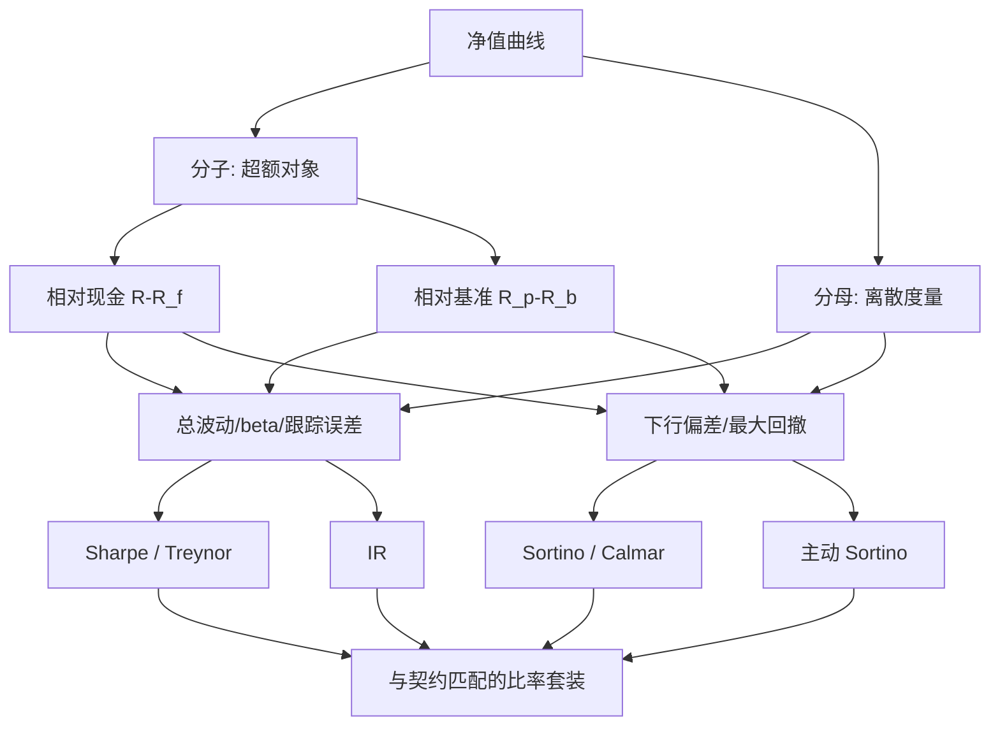

# 风险调整绩效的族谱

每一个风险调整比率都是一次压缩：分子选哪段超额，分母认哪一种离散；压缩方式不同，同一个组合的名次就不同。

<footer>—— Sharpe, Mutual Fund Performance, Journal of Business, 1966；主动效率见 Grinold and Kahn, Active Portfolio Management</footer>

[上一课](/quant/ap-nav-construction)交付了一条可复算的净值曲线。曲线只回答「赚了多少」，评估单元的缺口是「值不值这个风险」。单个比率的公式、年化与抽样误差，主干[IR / Sharpe / Sortino](/quant/ir-sharpe)已经写透；本课写**族谱**：这些比率从哪两个轴上生出来、各自服务什么契约、选错了会错在哪。

## 问题

收益不可比：杠杆与运气都能把收益率抬上去，必须除以风险才能横比。但「风险」至少三种——总波动、主动波动（跟踪误差）、下行偏差；「超额」至少两种——相对现金、相对基准。分子分母的组合生出一族比率，每个成员回答不同的问题。选错成员的典型错法：给没有基准契约的绝对收益产品报 IR，分子里根本没有主动收益；给指数增强报总波动 Sharpe，把 beta 波动算成了管理人的成本；事后把 Sortino 的最低可接受收益调到让比率最大的位置——这是数据窥探，不是风险度量。

### 两个轴与三代成员

分子轴是**超额对象**：相对现金 $R-R_f$，或相对基准 $R_p-R_b$。分母轴是**离散度量**：全体标准差、系统性 beta、跟踪误差、下行偏差、最大回撤。族谱按此展开：Treynor（1965）取 $R-R_f$ 除以 beta，只罚系统性风险；Sharpe（1966）取 $R-R_f$ 除以总波动，度量总风险效率；Jensen（1968）放弃分母，把 CAPM 残差直接当 alpha；Grinold–Kahn 的 IR 换成主动收益除以跟踪误差，度量主动效率；Sortino（1991）把分母换成相对目标的下行偏差；Calmar 一族用年化收益除以最大回撤，把路径深度请回来，见[最大回撤与 Calmar](/quant/drawdown-calmar)。三代演化的方向一致：从对称总风险，到主动风险，到非对称与路径敏感的风险。

同一份回测可以同时报出 Sharpe 1.6 与 Calmar 0.3：前者看不见 40% 的回撤，后者看不见回撤之外的全部路径。族谱成员不是竞争者，是对不同风险观的取景。

## 方法

选型的判据不是「哪个更科学」，而是**产品契约承诺哪种效率**。绝对收益产品报 Sharpe 加回撤类；指数增强与主动股票报 IR 加跟踪误差；不对称或左尾敏感的产品加 Sortino 与压力情景。报告出整套而不是挑最大的一个——只展示三家里最好的那个，与挑最好的回测是同一种选择偏差。族谱是地图，地图不替代测量精度：短样本上比率分布极宽，两位小数的排名常常超出可分辨精度。

## 机制

家族共享一个弱点：都是「一阶除二阶」的压缩，丢掉路径与极端分位。排序可翻转的机制就在分母的矩上：负偏、肥尾的策略会高估 Sharpe，因为标准差看不见偏的方向；Sortino 部分修正左尾，但仍忽略极端分位；回撤类只认最深一点，对恢复速度与回撤频率全盲。机制上不存在全功能比率，只存在「对哪类风险敏感」的取向——这就是族谱而不是排行的原因。再叠加抽样误差与被选择过的夏普（[放气夏普](/quant/deflated-sharpe)），任何单点评级都要先问样本长度与试验次数。

## 边界

比率不含成本与容量：毛 Sharpe 很高、净 Sharpe 近零的换手策略不少见，见[交易成本后的可交易性](/quant/net-edge)；也不含税务与终值目标——效用、Kelly 与回撤限额都不是比率能替代的对象。基准从哪来、能不能投资、超额差分的减数怎么钉死，是下一课的事。

## 小结

- 族谱两轴：分子选超额对象（现金/基准），分母认离散（总波动/beta/跟踪误差/下行/回撤）。
- 三代演化：CAPM 系（Treynor、Sharpe、Jensen）到主动系（IR）到非正态路径系（Sortino、Calmar）。
- 选型跟着产品契约走，报套装不挑最大；事后调参数是数据窥探。
- 全家族都丢路径与极端分位，且带抽样误差；单点评级先问样本与试验次数。
- 出处：Sharpe, *Journal of Business*, 1966；Sortino and van der Meer, *Journal of Portfolio Management*, 1991；Grinold and Kahn, *Active Portfolio Management*。
