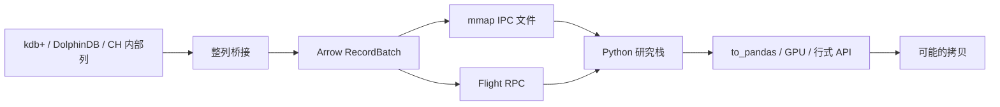

# Apache Arrow 零拷贝

    
列式内存布局一旦在进程之间成为契约，分析就可以指向同一段缓冲区，而不必在每次语言边界上把表拆成行、再拼回来——拷贝不是计算，却常常比计算更贵。

    <footer>—— 据 Apache Arrow 对列式内存格式、IPC 与 Flight 的说明</footer>

量化研究栈是多语言的：行情库是 q 或 C++，特征是 Python，模型是另一份 Python 或 JVM，回测又回到 C++。[kdb+](/quant/kdb-plus)、[DolphinDB](/quant/dolphindb)、[ClickHouse](/quant/clickhouse-finance-ts) 各自有内部布局，一旦导出变成 CSV 或逐行 JDBC，列存的优势在门口被交回去。Apache Arrow 定义一份语言无关的列式内存规格：RecordBatch、Schema、缓冲对齐与空值位图。所谓零拷贝，指的是在这份规格被双方遵守时，读者可以 mmap 或共享内存指向同一缓冲区，而不再分配第三份行式对象。本篇写这份契约解决什么、何时其实仍在拷贝、以及金融时序作为批数据如何沿着 IPC/Flight 走。它是数据面架构，不是行情源。

## 问题

一次「把当天成交交给 pandas」的典型路径是：数据库按行序列化，驱动在客户端建行对象，pandas 再转成列。三份内存、两次解析，CPU 花在移动字节。Arrow 把表规定为若干等长列缓冲：值数组、可选偏移（变长）、空值位图。Python、Java、C++、Rust 只要实现同一规格，就可以交换指针。问题变成：金融字段能否自然落进这些缓冲（时间戳精度、字典编码的符号、嵌套的深度快照），以及哪些边界会强迫拷贝——例如要变成带索引的 pandas Series、要做非对齐运算、或要越过不能共享内存的机器。

第二个问题是流与批。Arrow 的 IPC 是一批一批的 RecordBatch，Flight 把同一思想放到 RPC。它适合「扫描一段分区」的研究作业，不适合单笔成交的微秒回调。把 Arrow 塞进 tickerplant 热路径，会把批协议用成消息队列。

### 布局契约：Schema 与缓冲

Schema 声明字段名、类型、可空性、字典。时间用 `timestamp[ns]` 还是 `timestamp[us]`，必须在数据契约里冻结，否则 Python 与 C++ 各自「本地默认」会制造 1000 倍的错位。符号用字典编码（integer 码 + 字符串表）接近 kdb+ 的枚举：比较走整数，显示走表。变长字符串没有字典时，偏移数组使随机访问仍是 $O(1)$ 定位到片段，但缓存局部性不如定长。空值位图让「价为空」不必用 NaN 哨兵——金融里 NaN 与真正缺失不是一回事，应显式分开。

零拷贝是布局契约的推论，不是所有 Arrow API 的默认行为。`to_pandas()` 在旧版本会拷贝；即使零拷贝模式，一旦你改了那一列，所有权规则也会强制复制。说「我们用了 Arrow」不等于「我们没有拷贝」。

## 方法

研究作业的推荐边界是文件或 Flight，而不是 pickle。落盘用 Arrow IPC 文件或 Parquet（磁盘上的列式，读入时可解码到 Arrow）。进程内用共享内存或内存映射 IPC。跨主机用 Flight：协议带着 Schema 与批次，避免 HTTP JSON。批次大小按列投影后的字节计：太小则 RPC 开销主导，太大则尾延迟与失败重试变贵。分区与 [点时](/quant/point-in-time) 目录对齐——每个批次对应确定的交易日与版本，这样模型训练才能引用「某一份不可变批」而不是「当时库里碰巧是什么」。

从行情库导出时，做一次显式投影：只要后面用到的列。把 L2 十档拆成结构体列还是拆成 20 个标量列，要看下游。结构体保持物理相邻；标量列更易被只读两档的作业裁剪。不要在 Arrow 里用 JSON 字符串存簿，那是把列式外壳套在行式内容上。

### 字典、时间与复权列

字典需要约定：码表是全局一张，还是每批次一张。全局表让多日连接不必反复解码，但新上市代码要能追加；每批次一张更简单，合并时要重映射。复权因子应作为单独列随批走，而不是在导出时把价格改写成「已复权」却不留原始价——研究与会计会同时需要两者。时间列保留交易所时钟与到达时钟两列，见事件驱动回测对因果的要求；Arrow 不会替你选哪一列当索引。

校验应在边界上做：行数、空值计数、时间单调性、符号字典覆盖。失败则拒绝批次，而不是在 pandas 里「fillna 继续」。这与 [Tick 清洗](/quant/tick-cleaning) 的失败即停是同一纪律，只是对象从消息变成 RecordBatch。

## 机制

零拷贝能成立，是因为读者对缓冲只读、且生命周期短于提供者的映射。IPC 文件把 Schema 与若干 RecordBatch 写成可 mmap 的布局；操作系统把文件页送进页缓存，多个 Python 进程可以映射同一文件而不各持一份。Flight 在 TCP 上传同一布局，通常至少有一次网络拷贝，但避免了二次序列化。Plasma 一类的共享内存对象存储曾把「对象 ID → 缓冲」做进进程外服务，Arrow 生态后来更多靠 Flight 与文件。机制上要记住：网络、GPU 上传、以及任何需要行式 API 的库，都会打破零拷贝。

与数据库内部布局的关系：Arrow 不是 kdb+ 列文件，也不是 ClickHouse part。桥接层负责把内部列转成 Arrow 缓冲。好的桥接是整列 `memcpy` 或直接包装已对齐的缓冲；坏的桥接是按单元格走回调。评估一个「Arrow 连接器」应看它是否整列转换，而不是看它是否 import 了 `pyarrow`。

### 所有权、可变与语言边界

Python 的 GC、C++ 的析构、JVM 的堆外内存，对同一缓冲有不同的释放规则。Arrow 用引用计数或明确的父对象保持缓冲活着。把缓冲交给会原地修改的算法（某些排序、某些填充），必须先 `copy`。金融管道里，默认把批次当不可变：新特征写成新列或新批次，不改输入。这与 MergeTree 的不可变 parts、与点时分区的不可变快照是同一哲学在内存里的对应。

GPU 与 Arrow 的交集是另一份布局（例如设备上的列式）。主机 Arrow 到设备往往是一次 DMA 拷贝。不要把「CPU 上零拷贝」宣传成训练循环没有数据移动。

## 边界

Arrow 不管交易日历，不管复权语义，不管权限。Schema 演进（加列、改字典）必须版本化，否则旧读者会解错。超宽的深度快照会使单一 RecordBatch 超过合理内存；应按时间切批，而不是按「一天一行」。嵌套列表表示变长档位时，偏移稍错就会静默读到别人的量——对嵌套列的校验比对标量更严。

不要用 Arrow 当 WAL。不要把 pickle 的 numpy 数组改个扩展名叫做 Arrow。不要在热路径上为每一笔成交建一个 RecordBatch。跨团队共享时，把 Schema 登记下来，像接口一样评审，而不是在笔记本里随手改列名。

零拷贝降低的是边界税，不是算法复杂度。特征若仍是逐行 Python 循环，省掉的序列化会被解释器吃回去。Arrow 与向量化计算是配套的；只换格式不换循环，收益很小。

## 小结

- Apache Arrow 用语言无关的列式内存规格，使进程之间可以共享缓冲，而不是反复行式序列化。
- 零拷贝成立于只读、同布局、生命周期受控；pandas、网络、GPU 与原地修改会打破它。
- 金融字段要冻结时间精度、符号字典与缺失语义；批次与点时分区对齐。
- 与行情库的桥应整列转换；热路径仍用专用内存表，Arrow 服务批研究。
- Schema 要当接口来版本化。
- 出处：Apache Arrow 列式格式、IPC 与 Flight 文档。
