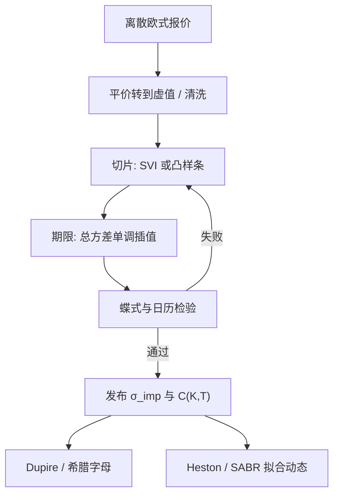

# 隐波插值 arbitrage-free

    
离散执行价上的隐含波动率只是一组点；插值必须把这些点连成对执行价凸、对期限不引入日历套利的价格曲面，否则做市簿在自己的中间价上就已经可被静态收取。

    <footer>—— Gatheral, The Volatility Surface, Wiley, 2006；无套利参数化见 Gatheral and Jacquier, Quantitative Finance, 2014</footer>

[上一课](/quant/ag-weather-premium)把外汇与商品课序收在农产品天气升水。本课打开期权做市细节。市场给出的是有限的看涨看跌报价，不是连续函数 $\sigma_{\mathrm{imp}}(K,T)$。[隐含波动率曲面](/quant/vol-surface) 把这些点定义成 Black 坐标；做市与风险管理还要把缺档补上，并对外推翼部。插值若在波动率坐标里随便拉线性或三次样条，对应的看涨价格 $C(K,T)$ 很容易对 $K$ 失去凸性，或对 $T$ 出现日历倒挂。Jim Gatheral 把无套利写成对总方差切片的约束，并与 SVI 一类参数化配套；后续的 SSVI 给出跨期限的充分条件。本篇写插值层：如何从离散报价生成一张可送进 [Dupire](/quant/dupire) 与希腊字母引擎的曲面。动力学模型 [Heston](/quant/heston)、[SABR](/quant/sabr) 是另一层，不能代替无套利插值。

## 问题

固定折现与远期 $F_T$，欧式看涨 $C(K,T)$ 必须满足：对 $K$ 凸且递减（看涨），蝶式非负；对适当定义的日历，更长期限不能更便宜。Breeden–Litzenberger 要求 $\partial^2 C/\partial K^2\ge 0$。把 $C$ 经 Black 公式写成 $\sigma_{\mathrm{imp}}$ 后，这些不等式变成对 $\sigma_{\mathrm{imp}}$ 的微分约束，不是「波动率曲线看起来光滑」那么弱。线性插 $\sigma_{\mathrm{imp}}(K)$ 在执行价格子上几乎总会在某处产生负密度；在期限上线性插 $\sigma_{\mathrm{imp}}$ 则常破坏总方差递增。

工程问题因此是：在哪一个坐标插、用什么形状族、如何处理买卖价差与缺失翼。插值的服务对象是价格与密度，隐含波动只是中间语言。若插完之后还要用 Heston 去拟合同一张曲面，Heston 的五个参数通常过不了所有点——那是模型风险，应落在残差上，而不是反过来让插值去迁就某个随机波动参数集。

### 总方差比波动率更接近日历约束

记 $w(k,T)=\sigma_{\mathrm{imp}}^2(k,T)\,T$，$k=\ln(K/F_T)$。无日历套利的一个常用充分条件是：对固定 $k$（或对固定 Delta，视报价惯例），$w(\cdot,T)$ 随 $T$ 递增。插 $\sigma_{\mathrm{imp}}$ 本身时，短端 $T$ 很小，$\sigma$ 的一点噪声会被 $1/\sqrt{T}$ 放大；插 $w$ 再开方回去，期限维更稳。执行价维仍要保证 $C$ 凸，这不是 $w$ 递增能自动给出的，还要对切片形状设限，见 [SVI / SSVI](/quant/svi-ssvi) 与 [蝶式与日历](/quant/butterfly-calendar-arb)。

外汇按 Delta 报价、股票按执行价报价。插值应在市场的自然坐标上进行，再映射到 $K$ 做凸性检验。把 25-delta 点当成 $K=0.75S$ 去插，无套利检查的是一张错位的格子。

## 方法

**先把报价变成欧式中间价。** 用看跌看涨平价把实值转到虚值，剔除提前行权溢价（个股美式）与明显的锁报价。买卖价差内选中间或选更可能无套利的一侧；强迫穿过全部脏点会牺牲凸性。远期必须与所用的利率、股息（或借券）一致，否则偏斜是持有成本误差。

**切片：凸参数化或约束样条。** 一类是参数族：SVI 的五个参数、SABR 的 $\alpha,\rho,\nu$（$\beta$ 常固定）。参数族若满足 Gatheral–Jacquier 一类条件，切片内无静态套利，翼部渐近受控。另一类是带约束的样条：在 $C(K)$ 上做凸回归（Ait-Sahalia–Duarte 一类思想），或 Kahale 的无套利插值，直接保证节点间凸。Andreasen–Huge 用一维有限差分正向扩散，从今日的局部方差把曲面「长」出来，得到可微且无套利的插值，适合要送进 PDE 的场景。

**期限：总方差插值加单调约束。** 两个上市到期 $T_1\lt T_2$ 之间，对固定 $k$ 令 $w(k,T)$ 在 $w(k,T_1)$ 与 $w(k,T_2)$ 之间单调插值（常线性）。若短端 $w$ 已高于长端，先修正切片（涨买卖价、拒绝锁报价），不要靠插值「抹平」一个已经可日历套利的输入。得到 $C(K,T)$ 后，用有限差分或自动微分检查蝶式与日历，不合格则回到参数约束，而不是在希腊字母上加补丁。

### 翼部：Lee 矩与切断

Lee（2004）给出总方差对 $|k|$ 的渐近与风险中性矩的关系：翼不能比线性增长更快到任意陡。无约束样条在远翼会拉出负密度或无限矩。做法是：在最后一个可靠报价之外切到 SVI 的线性翼、或切到指定的极限斜率，并保证与最后一点 $C^1$ 或至少 $C^0$ 相接。外推是假设，应单独做 Vega 分桶，避免远翼假设污染 ATM 对冲，见 [Delta / Gamma / Vega 对冲](/quant/greeks-hedge)。

## 机制

无套利插值保证的是：存在一个风险中性边际族，与所插的欧式价格一致，且日历相容。它不保证存在扩散、不保证存在随机波动过程，更不保证明日微笑如何移动。因此插值层回答「今天的香草表有没有内部矛盾」；[Heston](/quant/heston) 与 [SABR](/quant/sabr) 回答「微笑从何种动态来、Delta 应如何随现货搬」。把 SABR 单到期拟合直接当跨到期插值，期限维通常无套利失败，因为原文摄动针对固定 $T$。把 Heston 当插值器，五个参数过拟合短端就牺牲长端，且短端陡峭偏斜往往拟合不足。

做市中间价若自身可蝶式套利，做市商会成为被收割的对象：对手用三档执行价锁定数理上为正的收益，风险只剩执行与保证金。这与「模型算错障碍期权」不同，是静态的。插值质量的第一检验是：用自己的中间价曲面能否扫出正的蝶式或日历；能，就还不是一张可发布的曲面。

### 与局部波动、参数模型的衔接

Dupire 公式的分母是蝶式。插值若在密度上振荡，局部波动会爆炸或变负。故生产顺序常是：无套利插值（或 Andreasen–Huge）得到光滑 $C$ → 抽 $\sigma_{\mathrm{loc}}$ → 再决定是否用 SLV 把 Heston 动态与残差微笑缝在一起。SVI/SSVI 可解析求导，适合这一管道。SABR 适合单到期标记与交易语言，跨到期仍要靠总方差拼接，不能假设同一个 $\alpha$ 过程服务所有上市月。

「校准了 Heston 所以曲面无套利」不成立。Heston 价格作为 $K$ 的函数通常凸，但校准目标若是隐含波动残差最小，离散执行价上仍可能因插值或权重点而局部破凸。无套利是对发布曲面的硬约束，不是对动力学模型的自动赠品。

## 边界与工程取舍

买卖价差宽时，「无套利中间价」可能不存在：买价凸、卖价凸，中间不凸。此时应报告区间，而不是虚构一个穿过所有中间价的光滑曲面。短到期隔夜期权的 $T$ 对交易日历极度敏感，总方差几乎是隔夜跳的方差，插值不要跨过周末当普通隔夜，见 [隔夜跳空对冲](/quant/overnight-gap-hedge)。美式、期货期权、日经乘数与外汇 Delta 惯例，都会让「同一公式」插错对象。

参数化过拟合当日，次日参数跳，对冲比不稳——这是插值过度灵活的代价。约束越强（SSVI、凸回归），残差越大，但希腊字母更稳。选择取决于：曲面是为了给香草做市（更贴点），还是为了给奇异与局部波动供数（更光滑、更无套利）。Gatheral 的书给出约束与参数化，不是某一交易所的官方插值算法。

在隐含波动上做三次样条、再对价格检查凸性「大多数时候通过」，不是无套利插值。通过应是构造保证，或每次发布强制扫描；抽样检查会在压力日的翼部失效，而那一天密度最重要。

## 小结

- 无套利插值的对象是欧式价格的凸性与日历，隐含波动只是坐标。
- 期限维优先插总方差并保持递增；执行价维用 SVI/凸样条/Andreasen–Huge，避免负密度。
- 翼部外推受 Lee 矩约束，且应与近翼报价光滑相接。
- Heston 与 SABR 提供动态与单到期标记，不替代跨执行价、跨到期的无套利拼接。
- 中间价若可静态套利，做市簿在发布前就已经亏了期望。
- 出处：Gatheral, *The Volatility Surface*, 2006；Gatheral and Jacquier, *Arbitrage-free SVI volatility surfaces*, QF, 2014；Lee, *The Moment Formula*, 2004；Dupire, 1994。
