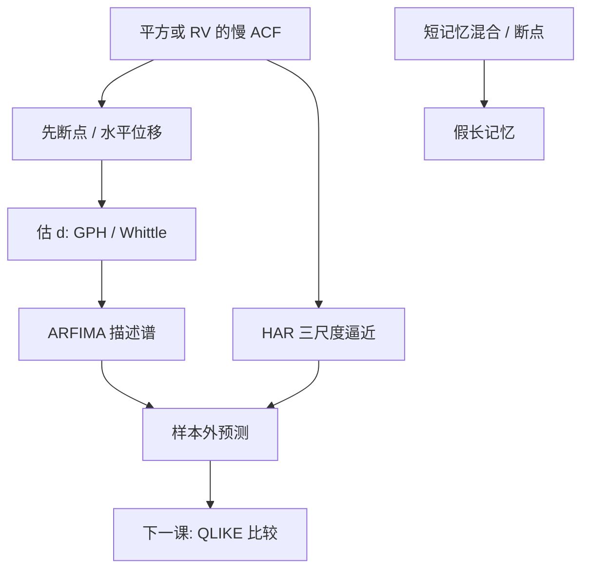

# ARFIMA 与长记忆

把差分阶数从整数放到 0 与 1 之间，谱密度在零频处像幂函数发散，自相关按双曲线衰减；这是长记忆的线性模板，不是证明经济里真有无穷记忆。

<footer>—— Granger and Joyeux, An Introduction to Long-Memory Time Series Models and Fractional Differencing, Journal of Time Series Analysis, 1980；Hosking, Fractional Differencing, Biometrika, 1981</footer>

[Chow](/quant/chow-test) 已经警告：几次水平跳会让 ACF 看起来拖很远。若断点之后平方或 RV 的相关仍像 $k^{2d-1}$ 衰减，$d\in(0,0.5)$，Granger–Joyeux 与 Hosking 的 ARFIMA$(p,d,q)$ 提供短记忆 ARMA 装不下的谱。Andersen、Bollerslev、Diebold、Labys 把已实现波动的长记忆写成经验事实；[HAR](/quant/har-rv) 用三尺度 AR 去**逼近**同一外观而不估 $d$。本课缺口：何时值得估分整，何时 HAR/断点更老实。下一课把预测比较换成 QLIKE，因为长记忆模型的胜负必须在样本外、用对波动正当的损失。

## 问题

分数差分 $(1-L)^d y_t=\eta_t$，$d=0$ 短记忆，$d=1$ 单位根，$0<d<0.5$ 平稳长记忆：$\sum|\gamma_k|=\infty$ 但过程仍弱平稳。ARFIMA 再给 $\eta_t$ 套 ARMA。问题是估计 $d$（Geweke–Porter-Hudak 对数周期图、Whittle、精确时域似然）以及识别：$d$ 与高阶 AR、与结构突变、与体制混合（Granger 的聚合论证） observationally 纠缠。

日收益本身通常不是长记忆；**平方与 RV** 才是。对收益水平套 ARFIMA 是错对象。对 RV，Corsi 的 HAR 用日周月约束 AR(22) 近似长记忆，估计稳、保正性。ARFIMA 的 $d$ 在短样本噪，预测还要保证正的波动。

### 假长记忆

Diebold 与 Inoue 等说明：忽略断点时 $\hat d$ 偏上。GARCH 的 $\alpha+\beta\approx 1$ 是短记忆的慢指数，有限样本 ACF 也可拖尾。应先：分段或允许水平位移，再估 $d$；对照 HAR 的样本外。对象是谱的零频形状，不是「市场有记忆」的叙事。

$d>0.5$ 非平稳；对 RV 若估到 0.4–0.45，应怀疑断点或近单位根，而不是宣称更强的长记忆。对数 RV 常更接近平稳，HAR 也常建在 $\log RV$ 上。

## 方法

**估计。** 两步：先半参数估 $d$（GPH 在低频带），再对分数差分序列估 ARMA；或联合极大似然。带宽（GPH 用多少低频点）是另一设定，类似 HAC。多元长记忆（共积分）更重，本课不展开。

**预测。** 分数差分的截断 AR 无穷阶，预测用截断或状态空间近似。多步预测向均值回复极慢。风控若需要均值回复的期限结构，HAR 的三 $\beta$ 更好解释。ARFIMA 适合描述谱、做检验 $d=0$，不一定适合生产预测。

**与 FIGARCH。** Baillie、Bollerslev、Mikkelsen 的 FIGARCH 把分整放进方差方程。估计更脆、正性约束难。有 RV 时，对 RV 做 HAR/ARFIMA 通常优于对日收益做 FIGARCH。无 RV 时 FIGARCH 是备选，须报告是否顶在边界。

### 检验 $d=0$

相对短记忆 ARMA 的似然比或 GPH 的 $t$。水平受短记忆污染（带宽太大把高频当低频）。应固定带宽网格报告。拒绝 $d=0$ 不等于拒绝「HAR 足够」——HAR 也能产生很慢的 ACF。

## 机制

分数差分的二项式展开系数像 $k^{d-1}/\Gamma(d)$，把无穷滞后以双曲线权加总，故 ACF 慢衰。机制是线性滤波器的零频奇异，不是交易者真的记住无穷过去。Müller 的异质市场、Corsi 的 HAR 用有限个期限混合逼近同一谱——短记忆混合可以在关心的滞后范围内模仿 $d$。

聚合：许多短记忆截面加总可出现长记忆（Granger）。行业波动加总到指数 RV，会看起来更长记忆。应对单资产与指数分别估 $d$，不要把指数的 $d$ 写成个股性质。

已实现核、预平均改变的是 RV 的测量误差。测量误差会把 $d$ 估低（噪声更像短记忆）。比较 $d$ 须固定 RV 构造，见 [rv-noise](/quant/rv-noise)。

### 与 QLIKE 的交接

样本内 $\hat d$ 显著、样本外 HAR 赢，应以预测为准。下一课 Patton 的 QLIKE 说明：波动预测不能用 MSE 在带噪代理上公平比较。ARFIMA vs HAR vs GARCH 的赛必须用正当损失和 RV 代理。

## 边界与工程取舍

$T<1000$ 日估 $d$ 很噪。多元、缺失、隔夜拼接会污染低频谱。不要对价格水平 ARFIMA$(0,d,0)$ 再解释为「可预测」——那是近单位根。不要用 $\hat d$ 做交易信号。

工程：RV 预测默认 HAR；用 ARFIMA 做 $d=0$ 的描述与稳健性。先断点、再分整。下一课给出比较这些模型的损失函数。

## 小结

- ARFIMA 用分整 $d$ 产生双曲线 ACF，对象是波动类序列的谱，不是日收益均值。
- 断点、近 IGARCH、聚合会假扮长记忆；先分段再估 $d$。
- HAR 用有约束短记忆逼近同一外观，估计更稳，常是预测默认。
- 测量噪声压低 $\hat d$；比较须固定 RV 定义。
- 出处：Granger and Joyeux, *Journal of Time Series Analysis*, 1980；Hosking, *Biometrika*, 1981；已实现波动长记忆见 Andersen, Bollerslev, Diebold and Labys；HAR 见 Corsi, 2009；假长记忆见 Diebold and Inoue。
