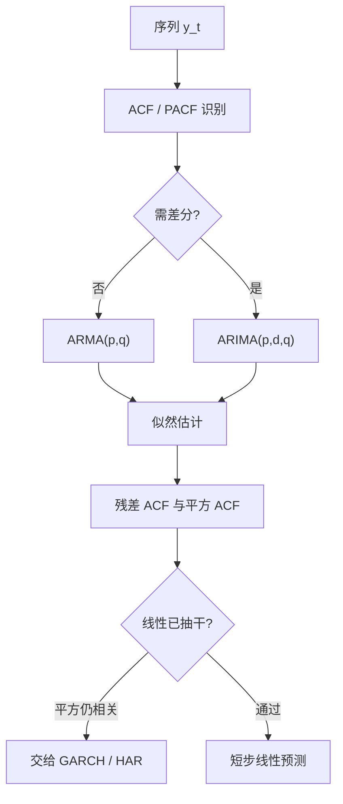

# ARMA / ARIMA

先识别自相关与偏自相关揭示的滞后结构，再估计，再诊断残差是否已成白噪声；模型是为了把可预测的线性依赖抽干，而不是为了把序列讲圆。

<footer>—— Box and Jenkins, Time Series Analysis: Forecasting and Control, 1970</footer>

资产价格的线性可预测性很弱，平方与波动的线性可预测性很强。Box 与 Jenkins 的 ARMA / ARIMA 是处理后一类、以及利率、利差、宏观总量时的基准：把平稳（或差分后平稳）序列写成有限阶自回归加有限阶滑动平均。Wold 定理说，纯非确定性平稳过程有无穷阶滑动平均表示；ARMA 是用有理谱密度去逼近它。本篇写识别–估计–诊断循环在金融里能做什么、不能做什么。它不承担波动聚集——那是 [GARCH](/quant/garch) 的对象——也不处理价格水平是否有单位根，那是下一篇的预备。

## 问题

设 $\{y_t\}$ 弱平稳、均值为 $\mu$。ARMA$(p,q)$ 为

$$
\phi(L)(y_t-\mu)=\theta(L)\varepsilon_t,
$$

$\phi(L)=1-\phi_1 L-\cdots-\phi_p L^p$，$\theta(L)=1+\theta_1 L+\cdots+\theta_q L^q$，$\varepsilon_t$ 白噪声。若水平非平稳而差分 $d$ 次后是 ARMA，则称 ARIMA$(p,d,q)$。问题是：给定一段金融时间序列，线性依赖的记忆有多长、该用差分还是用原水平、以及残差里剩下的是真噪声还是条件异方差。

日收益的 ACF 往往在滞后 1 之后接近零（除了微观结构造成的负一阶，见 [微观结构噪声](/quant/microstructure-noise)）。把 ARMA 硬套在收益上，通常得到小系数、样本外 $R^2$ 接近零。同一套工具用在已实现波动、利率、汇率差上，ACF 可以拖得很长。Box–Jenkins 的对象是**二阶线性结构**，不是「股价明天涨不涨」的叙事。

### 识别靠 ACF 与 PACF，不是靠把阶数开到最大

纯 AR$(p)$ 的 PACF 在 $p$ 后截尾，ACF 拖尾；纯 MA$(q)$ 相反；混合则双拖尾。这是高斯线性过程的总体性质。有限样本里，长记忆、结构突变、GARCH 都会让 ACF 看起来「需要很多滞后」。Box 与 Jenkins 强调简约：先小阶，再看残差 ACF 与 Ljung–Box。用信息准则在过大的 $(p,q)$ 网格上搜，等于把样本内拟合当识别。

收益的「AR(1) 显著」常常是非同步交易或买卖弹跳，不是可交易动量。把指数成分股的日收益套 AR(1) 再当信号，会把薄股票的滞后 beta 当成 alpha。先问对象是价格发现还是预期收益，再决定要不要保留这一阶。

## 方法

**估计。** 高斯极大似然（含精确或条件似然）是默认；创新算法处理 MA 的初值。系数须落在平稳与可逆域：$\phi(z)=0$ 的根在单位圆外，MA 可逆同样要求。不可逆 MA 与过大 AR 可以表示同一自相关，识别不唯一，这是混合模型要保持简约的原因。

**诊断。** 残差应无线性自相关；标准化残差的平方若仍有 ACF，说明线性均值已经抽干、方差还没有——应停在 ARMA 均值，把方差交给 ARCH/GARCH，而不是把 ARMA 阶数加到平方的记忆也被「近似」进去。过差分（$d$ 过大）会引入可逆性边缘的 MA 单位根，预测区间失真。

**预测。** 最小均方误差预测是条件期望的线性投影。ARMA 的多步预测随步长回到均值（平稳）或回到差分后的均值（ARIMA 的水平则随 $d$ 呈多项式趋势）。金融上把 ARIMA 用在波动或利差上做短步预测是本分；用在股价水平上做长步点预测，是把单位根的不确定性当成可忽略的漂移。

### 季节与日历不是同一套滞后

隔夜、周末、到期日会在均值与方差上造成日历效应，见 [日历效应与隔夜](/quant/calendar-overnight)。Box–Jenkins 的季节 ARIMA 针对固定周期（月度的 12、季度的 4）。把交易日的「星期几」当成季节 $s=5$，有时能洗掉一点均值，但波动的星期几效应更强，仍应放进方差方程或虚拟变量，而不是靠抬高 $q$ 去吸收。到期日与假期是不规则日历，季节差分帮不上。

## 机制

AR 项把过去的 $y$ 当状态，MA 项把过去的冲击当状态。Kalman 滤波把 ARMA 写成有限维线性状态空间，预测与似然是同一套递推。经济含义通常稀薄：利率的 AR(1) 可以说成政策惯性，股票 RV 的 AR 可以说成波动持续，但系数并不识别结构冲击。Box–Jenkins 本就是简化、预测导向的，不是结构 VARs。

长记忆外观可以来自短记忆的混合（Granger 的聚合论证），也可以来自未建模的水平漂移。HAR 用日、周、月 RV 的混合去逼近长记忆，见 [HAR 已实现波动](/quant/har-rv)，那是在 RV 这个已经平稳（或近平稳）的对象上做有约束的 AR；对价格水平先差分再 ARMA，与对 RV 直接 AR，对象不同。把股价套 ARIMA$(0,1,1)$ 再解释 MA 系数，常常只是在拟合微观结构或偶尔的均回复幻觉。

信息准则惩罚参数个数，不惩罚你对同一序列试了多少种变换。对数、季节差分、外生回归项，每一种都是一次设定搜索。报告应预先声明变换，并把准则比较限制在该声明内。

### 外生变量与干预

带外生回归元的 ARMAX 可以把宏观意外、虚拟干预放进均值。干预分析（Box–Tiao）适合已知日期的政策或指数调整。不要把未来才发布的宏观变量放进 $t$ 的回归元。与 [体制切换](/quant/regime-switching-premia) 相比，干预是可观测的日期哑变量，体制是潜状态；前者识别清晰、泛化差，后者泛化故事强、滤波噪声大。

## 边界与工程取舍

金融收益的主要结构在方差与尾部，不在条件均值。ARMA 作为收益预测器，样本外几乎总输给历史均值；作为残差预白化、或作为波动与利差的短期模型，仍然有用。结构突变会使全样本 AR 系数变成两段体制的加权，预测偏向错误均值——此时分段或切换优于加阶。单位根附近，AR 的最小二乘偏下，预测区间应靠自助法或局部到单位根的渐近，而不是标准 $t$。

工程上：对交易信号，先差分或先取收益，再考虑是否值得一个 AR(1)；对风控输入（RV、高低价波幅），ARMA/HAR 是合理均值层，再叠加 GARCH 或已实现测量。不要用自动 ARIMA 搜出来的高阶模型去对几百只股票批量定价，过拟合会伪装成截面 IC。计算上，精确似然对长 MA 要小心初值；日频全市场扫描用条件似然或状态空间即可。

Ljung–Box 在残差上「通过」只说明线性相关被抽干。平方相关、符号非对称、周末跳空都可以还在。把诊断通过当成「模型正确」，会把 GARCH 效应误判成均值已完成任务。

## 小结

- Box–Jenkins 的 ARMA 用有限阶 AR 与 MA 逼近平稳序列的线性依赖；ARIMA 在差分后再做同一件事。
- 识别依赖 ACF/PACF 与简约原则；在过大网格上用信息准则搜阶，是样本内拟合。
- 日收益的线性可预测性通常很弱；同一工具对波动、利率、利差更有对象。
- 残差平方仍自相关，应停在均值层、把方差交给 ARCH 类模型，而不是抬高 ARMA 阶数。
- 过差分、单位根附近的偏倚、结构突变，都会让标准预测区间假窄。
- 出处：Box and Jenkins, *Time Series Analysis: Forecasting and Control*, 1970；后续诊断与季节形式见 Box–Jenkins–Reinsel 版本。
