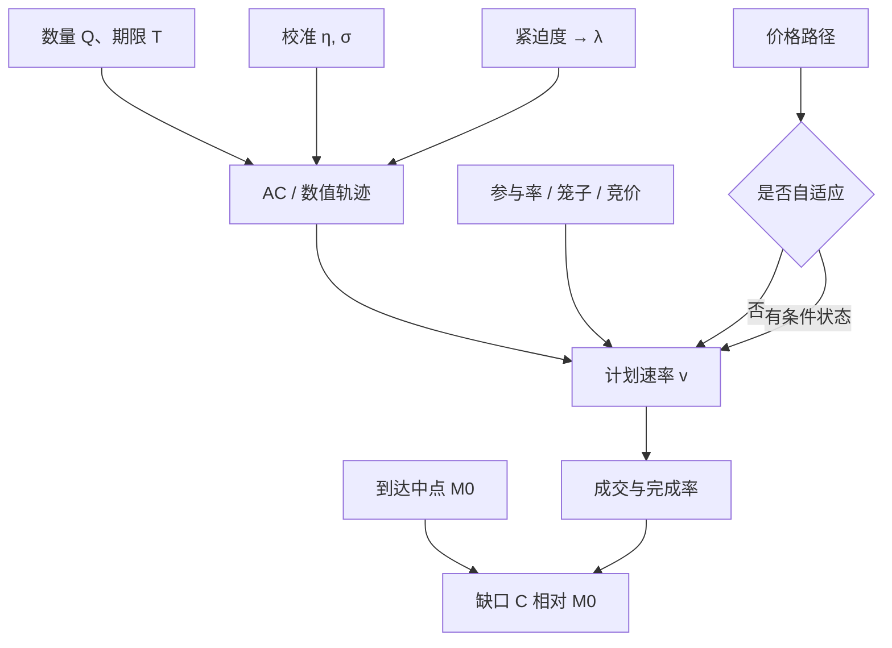

# 到达价格算法

    
参照到达时刻的中间价来规划速率，实施缺口的冲击与时机风险被写进同一条可调的紧迫度；它优化的是相对决策（或到达）的成本分布，不是相对全日 VWAP 的追踪误差。

    <footer>—— 据 Perold 的实施缺口会计；Almgren and Chriss 的均值–方差执行；Kissell 对到达价算法的实务表述</footer>

经纪商名单里的 Arrival Price / Implementation Shortfall 算法，名义上做一件事：在期限 $T$ 内完成母单，使成交相对到达中点 $M_0$ 的缺口在期望与风险之间可调。这与 [TWAP / VWAP / POV](/quant/twap-vwap-pov) 不同——那些日程对齐时钟或成交量；到达价对齐的是 [实施缺口](/quant/implementation-shortfall) 的参照点。Almgren–Chriss 提供均值–方差前沿；Kissell 等人把紧迫度（urgency）当成客户可理解的旋钮，把前沿上的一点翻译成「更在乎冲击」或「更在乎完成」。本篇写参照点、紧迫度、自适应与评价。无漂移时基准轨迹应是确定性的，见 [Gatheral–Schied](/quant/gatheral-schied)；价格触发是额外假设，必须单独检验。

## 问题

母单在 $t_0$ 到达执行台，数量 $Q$，方向给定，截止 $T$（日终、信号半衰期或客户指定）。若立刻市价，缺口几乎全是冲击，时机风险接近零。若按 VWAP 拖满 $T$，冲击较低，但 $M_t-M_0$ 可能先走，未完成部分在 $T$ 变成机会成本。到达价算法要选 $v_t$，使

$$
C=\int_0^T v_t\bigl(P_t-M_0\bigr)\,\mathrm{d}t + \bigl(Q-q_T\bigr)(M_T-M_0)+\text{费用}
$$

的期望与某风险度量可接受。$P_t$ 含你自己的冲击。问题的第一句是锁 $M_0$：是第一笔可交易报价、还是指令进入智能路由的时刻。内部延误（经理决策到 $t_0$）不应由到达价算法负责，也不应让算法用更早的价格当参照来「看起来更好」。

第二句是紧迫度如何进入 $v_t$。客户说「中等」没有单位。必须映射到 AC 的 $\lambda$、$T$、或参与率上限。映射不写死，同一名称在不同经纪商下是不同策略，TCA 不可比。

### 基准是到达价，不是 VWAP

用全日 VWAP 评价到达价算法，会惩罚在成交稀疏时仍按风险前倾的路径，奖励尾盘去贴市场均价的行为。到达价算法的设计目标与 VWAP 基准冲突。评价应报：$C$ 相对 $M_0$、完成率、参与率路径、以及相对同期市场（不含自己）的时机项。可以**额外**报 VWAP 短fall 作为描述统计，但不能当主优化目标。自己的成交计入市场 VWAP 时，高参与率下「跑赢 VWAP」部分是自比。

$T$ 由信号衰减给定时，到达价算法没有权利为了降低 $\eta v$ 而私自延长。延长等于改写投资决策。算法只能在给定 $T$ 内沿前沿移动。

## 方法

静态日程：用 AC 线性临时冲击得到 $x_t=Q\sinh(\kappa(T-t))/\sinh(\kappa T)$，再映射到分桶目标量。$\kappa$ 由 $\eta,\sigma,\lambda$ 决定；$\eta$ 来自[临时冲击校准](/quant/almgren-temp-calib)，$\sigma$ 来自到达时的预测波动，$\lambda$ 来自紧迫度。U 形成交量下，应在体积时钟或分段 $\sigma_t$ 上写同一问题，而不是在墙上时钟匀速再贴一个「到达价」标签。

自适应：让 $\kappa$ 或剩余量目标随 $M_t-M_0$ 变化。常见启发式：价格有利（买入时下跌）则加快，把好价格锁进已实现缺口；价格不利则减慢（赌回复）或加快（控制美元风险）。这两支符号相反，必须在产品说明里写死。无漂移基准下，期望意义的最优不看 $M_t$；自适应若存在，应来自条件波动、条件弹性、成交量突发、或明确的短期 $\mu$，而不是来自随机漫步的已实现增量。

约束：每桶参与率封顶、价格笼子、不得交易的竞价时段、完成率下限（接近 $T$ 时允许提高 $\kappa$）。完成率下限与冲击目标冲突：强制完成会在末端制造块交易，类似 OW 的终端块，但往往发生在流动性最差的收盘附近。应把「允许未完成」当成政策，未完成进机会成本，而不是口头到达价、实际必须 100% 完成。

### 紧迫度、λ 与参与率如何互译

一张表比一个形容词有用。例如：低紧迫 $\leftrightarrow$ 低 $\lambda$、长 $T$、低参与率上限，轨迹近匀速；高紧迫 $\leftrightarrow$ 高 $\lambda$ 或短 $T$，轨迹前倾。参与率封顶会截断前倾：$\kappa$ 再大，单桶也打不出超过 $p_{\max}$ 的量，剩余被推后，实际路径比理论双曲正弦更平，风险比客户以为的更大。因此到达价产品必须同时报理论 $\kappa$ 与约束下的可行路径。多资产到达价还含对冲腿：卖 A 时买指数期货降余量 beta，对冲腿的到达价与股票腿分开记账，否则期货滑点会被藏进「股票执行很好」。

$$
\kappa=\kappa(\eta,\sigma,\lambda,T),\qquad
v_t=\min\bigl(v_t^{\mathrm{AC}},\,p_{\max}u_t,\,v^{\mathrm{limit}}_t\bigr).
$$

$u_t$ 为市场成交速率。截断之后要重新分配剩余量，否则 $T$ 时刻会出现非预期的清扫。

## 机制

到达价算法把投资决策的纸面组合与市场摩擦接起来：参照点锁在 $t_0$，之后每一单位速率同时产生冲击（通过簿与永久项）和风险削减（余量下降）。紧迫度是把交易台风险预算翻译成货币的旋钮。自适应机制若基于价格，等于把已实现 $M_t$ 当作信息；在有效市场、无漂移下它不提供期望，只提供路径依赖的风险转移——有利路径上短fall 更好看，不利路径上更差，平均值未必改善。

与 VWAP 机制的差别是激励。VWAP 日程在市场放量时加量，可能与知情流挤在一起；到达价前倾常发生在到达后前一段，与开盘后的价格发现重叠。指数再平衡日所有到达价母单若都在上午前倾，会制造内生冲击，模型里当作外生布朗的 $\sigma$ 被低估。

### 完成、放弃与机会成本

$T$ 到达仍未完成，缺口的第二项 $(Q-q_T)(M_T-M_0)$ 归算法还是归「客户不许延长」？必须事先归属。允许放弃时，算法有动机在不利路径上停止，这会改善已执行部分的均价、恶化总 IS。不允许放弃时，末端清扫主导最差分位数。两种产品不应混名。A 股涨跌停使完成不可行，应自动转入下一可交易日并重设到达价或保留原 $M_0$——这也必须事先规定，否则 TCA 会把制度约束当成算法失败。

「到达价」三字在营销里常被贴到任何非 VWAP 的算法上。审计要看参照价字段、紧迫度到 $\lambda$ 的表、以及是否允许未完成。缺任何一项，名称没有内容。

## 边界与工程取舍

平方根临时冲击下闭式 AC 不可用，应用数值最优或启发式前倾再校准。暗池与明簿混合路由改变瞬时冲击，单一 $\eta$ 不够，见[暗池路由](/quant/dark-pool-routing)。开收盘竞价的成交不应按连续 $v$ 建模。T+1 使当日买入不能用于对冲性的反向到达价，多空组合要拆腿。

不要事后挑选紧迫度使样本短fall 最低再报告——那是对 $\lambda$ 的过拟合。不要用包含自身冲击的 VWAP 证明到达价更优。核对：分紧迫度的短fall 均值与分位数、完成率、参与率路径、以及与静态 TWAP 对照；按 ADV 与波动分层，避免只在大盘上好看。拥挤日单独报告。

$\lambda$ 的单位仍是「多承担一单位执行方差，愿意多付多少期望短fall」。把紧迫度写成 1–5 的整数而不给对照表，交易台无法把产品与 AC 前沿对齐。

## 小结

- 到达价算法以 $M_0$ 为参照优化实施缺口，与 VWAP 追踪是不同目标，评价不应主用全日 VWAP。
- 紧迫度必须映射到 $\lambda$、$T$ 或参与率上限；约束截断后的可行路径才是真实产品。
- 无漂移下基准为确定性轨迹；价格触发自适应要有条件波动、弹性或可检验的 $\mu$，并看短fall 分布。
- 完成率政策决定末端块与机会成本归属，须事先写死。
- $\eta$ 与紧迫度应同源校准，拥挤日与竞价时段单独处理。
- 出处：Perold, *The Implementation Shortfall*, Journal of Portfolio Management, 1988；Almgren and Chriss, *Optimal Execution of Portfolio Transactions*, Journal of Risk, 2000/2001；Kissell, *The Science of Algorithmic Trading and Portfolio Management* 对到达价与紧迫度的实务框架。
