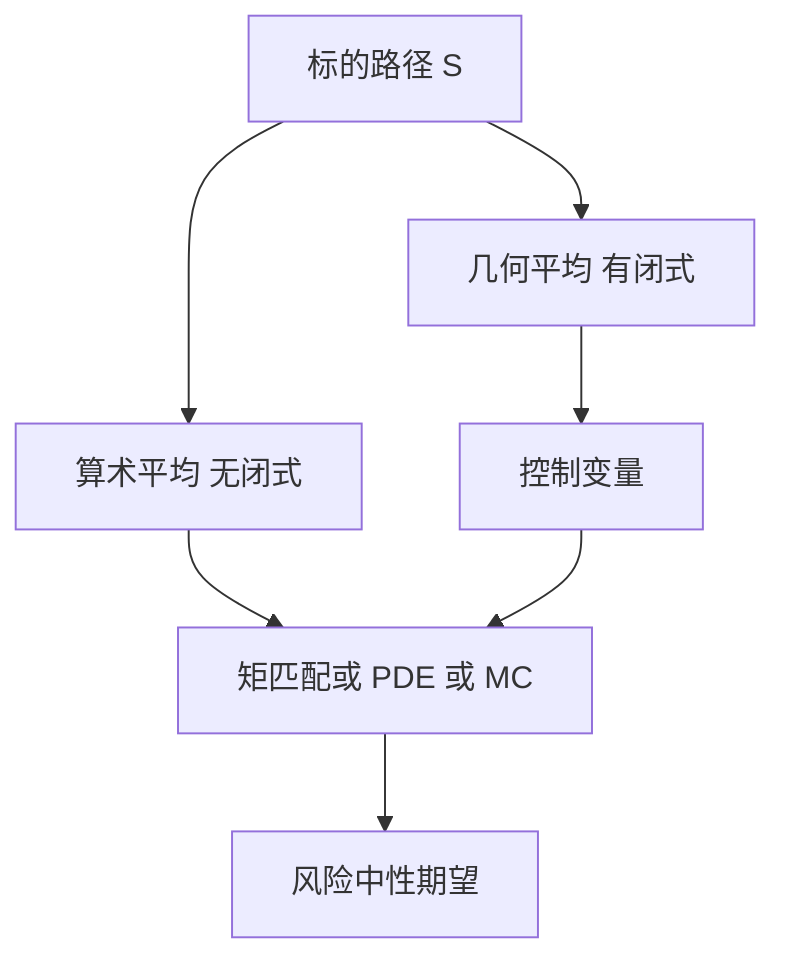

# 亚式期权

算术平均没有封闭的对数正态密度，几何平均才有；定价亚式，先承认平均把路径压成一个状态，再决定是近似分布还是模拟。

<footer>—— Kemna and Vorst, A Pricing Method for Options Based on Average Asset Values, Journal of Banking & Finance, 1990</footer>

[上一课](/quant/hf-forecast-loss)把高频预测的损失函数收在计量课序末尾。本课打开衍生品进阶：香草只看 $S_T$，奇异把路径统计量写进支付。缺口不是再推一遍 [BSM](/quant/bsm)，而是：**平均价格如何改写状态变量与复制。** 后课默认已经分清几何亚式的闭式与算术亚式的近似/模拟，以及连续平均对离散采样的差。

## 问题

亚式看涨支付 $\bigl(\bar S-K\bigr)^+$，其中 $\bar S$ 是连续或离散的算术（或几何）平均。平均降低对终点跳价的敏感，也降低对单日操纵收盘的敏感，因此在商品、外汇与员工股权计划里被当成「更稳的行权价」。问题是：算术平均破坏对数正态，[风险中性定价](/quant/risk-neutral-pricing)仍成立，闭式却没有。把亚式当「波动更低的香草」用 ATM 隐波去套，漏掉的是平均窗口、采样频率与已经实现的部分平均——这些都是状态，不是一个常数 vol 折减。

几何平均 $G_T=\exp\bigl(T^{-1}\int_0^T\ln S_t\mathrm{d}t\bigr)$ 在 GBM 下仍对数正态，Kemna–Vorst 给出闭式，并把它当算术亚式的控制变量。Turnbull–Wakeman、Levy 则对算术平均做矩匹配：用对数正态去贴 $\mathbb{E}[A_T]$ 与 $\mathrm{Var}(A_T)$。本课要的是这条分工，不是再把 BSM 公式抄一遍。

### 部分平均已经实现，不是还在 $t=0$

存续期内 $\bar S$ 有一段已经锁进采样。有效状态是 $(S_t,A_t)$ 或 $(S_t,G_t)$，剩余平均对终点的权重随时间下降。Gamma 与 Vega 因此随「还剩几次采样」塌缩，不能用同一张香草曲面去读整段生命期。离散采样（每日收盘）与连续积分的差，量级类似障碍的离散监控，但对象是均值而不是首次命中，不要把 [障碍监控频率](/quant/barrier-monitoring) 的平移公式直接套过来。

亚式降低的是对 $S_T$ 的凸性，不是把波动率变成历史已实现波动。定价仍用风险中性路径上的平均，对冲仍要对 $S$ 与隐波，只是希腊值被平均核平滑了。

## 方法

几何亚式：把 $\ln G_T$ 的均值方差写成 $r,q,\sigma,T$ 的显式函数，再套 Black 公式。算术亚式：矩匹配、Curran 条件期望、PDE 在 $(S,A)$ 上、或 [蒙特卡洛](/quant/mc-pricing) 配几何控制变量。已经实现的采样从 $A_t$ 扣掉，只对剩余区间模拟。固定执行价与浮动执行价（$\bigl(S_T-\bar S\bigr)^+$）不是同一合约：后者更像用平均当随机 $K$。

校准不要另做一张「亚式曲面」。先用香草校准的 [局部波动](/quant/dupire) 或 [Heston](/quant/heston) 生成路径，再对平均支付取期望。用香草隐波直接当亚式隐波，等于假装平均与终点是同一测度下的同一边际。

## 机制

平均是路径的低通滤波器：$S$ 的高频噪声被积分掉，支付对终点 Dirac 式的依赖变成对整段轨迹的均匀（或指数）权重。几何平均对应 $\ln S$ 的积分，与 GBM 的线性结构对齐，所以有闭式；算术平均对应 $S$ 本身的积分，生成函数不是对数正态。控制变量之所以有效，是因为两条平均高度相关，差的方差远小于算术支付本身。

对冲上，Delta 跟踪的是「剩余平均对 $S$ 的敏感」，不是香草的 $N(d_1)$。临近最后一次采样，亚式塌成几乎锁定的远期，Gamma 消失。这与香草到期日的 Gamma 爆炸相反。

## 边界

矩匹配在短期限、低波动、平均窗口覆盖大部分到期时够用；障碍靠近、强偏斜、离散采样很少时会偏。Curran 方法对价内更稳。局部波动能重现香草微笑，未必重现亚式对偏斜的暴露——平均对尾部的权重与香草不同。商品亚式还要叠加远期曲线与季节性，对象在后课商品期权，本课不把 WTI 日历当股权 GBM。

不要把亚式写成「防操纵所以无模型风险」。采样时点、是否用 VWAP、是否剔除涨跌停，全是合约条款；条款没写清，估值引擎就会用错测度。

## 小结

- 亚式把支付从 $S_T$ 换成路径平均；几何有闭式，算术要近似或模拟。
- 已实现部分平均是状态；希腊值随剩余采样塌缩，与香草到期 Gamma 相反。
- 用香草模型生成路径再取平均，不要另造一张亚式隐波去套 BSM。
- 出处：Kemna and Vorst, *JBF*, 1990；Turnbull and Wakeman, *Journal of Financial and Quantitative Analysis*, 1991。
