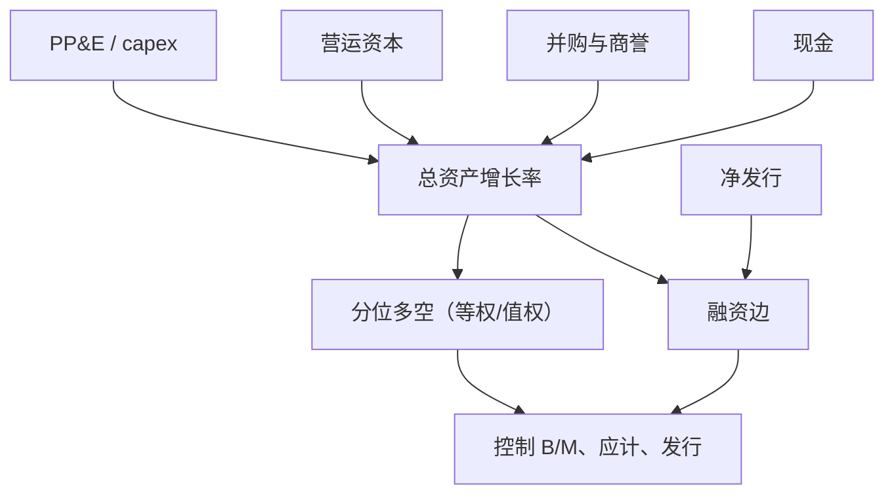

# 资产增长异常

总资产增长率最高的公司，随后截面收益显著更低；这一模式覆盖资本开支、并购、存货与营运资本，不能单用市场 β 解释。

<footer>—— Cooper, Gulen & Schill, Asset Growth and the Cross-Section of Stock Returns, Journal of Finance, 2008</footer>

[投资与资产增长](/quant/investment-factor) 一文以 CMA、q 理论与 capex 对照为主。本篇回到 Cooper、Gulen、Schill 2008 年的异常本身：排序键是总资产增长率 $\Delta A_t/A_{t-1}$，主张它比单一资本开支更单调、更宽。Fama–French 后来把低减高做成 CMA，组合定义与 2×3 权重并不等于 CGS 的十分位等权。读本文是为了复制 2008 年的分解，并把它和[应计](/quant/accruals-anomaly)、[净发行](/quant/net-issuance) 放在同一张资产负债表上，而不是再讲一遍五因子构造。

## 问题

股利贴现与 q 理论都暗示：给定当前市值，预期投资高则内部收益率低，事后收益应低。投资的观测有窄有宽。窄的是 capex/销售或 capex/资产（Titman–Wei–Xie）；宽的是总资产增长，含收购、应收、存货、现金、商誉。CGS 的问题是：哪一个会计增长对收益的排序最干净？若总资产赢了，机制就不能只讲「建厂过多」，还要能讲并购与营运资本。

三因子用 B/M 间接抓了一部分：高投资压低未来账面市值比、抬高当期估值。CGS 报告在控制 B/M、规模、动量之后总资产增长仍预测负收益，故不是纯价值、纯动量。需要进一步问：控制应计与净发行之后还剩多少——因为营运资本应计和发股扩张是 $\Delta A$ 的组件。

### 为什么总资产比 capex 更「宽」也更「脏」

$$
\mathrm{AG}_t=\frac{A_t-A_{t-1}}{A_{t-1}}
$$

分子可以拆成流动资产、长期经营资产、现金、以及其他。CGS 发现多个组件都带负号，不只是 PP&E。这支持「扩张这一类行为」被错误定价或被贴现，而不是某个科目的会计怪癖。代价是解释权分散：现金堆积不像帝国建造；商誉跳跃是并购溢价。CMA 沿用总资产口径，空头腿因此含收购机器。若产品故事是「反对乱并购」，应直接用并购指示变量，而不是默认 AG 十分位。

HML 的空头是低 B/M；AG 的空头是高增长。两者经常重叠（成长公司爱扩张），不是恒等。低 B/M 且不扩张、高 B/M 且猛扩张的格子，才是价值和投资分开的证据。

## 方法

每年用已公布年报算 AG，滞后对齐到 6 月，NYSE 断点，等权与价值加权都要报。CGS 主结果对等权更强，价值加权仍在但更薄——与应计类似的容量结构。持有一年。稳健性：按规模分层、按 B/M 分层、剔除金融、缩尾极端并购。分解回归：把 AG 换成各组件，或在 Fama–MacBeth 里同时放 AG、应计、净发行、NOA 增长。

与 CMA 对齐：CMA 是规模 2×3、价值加权、低减高；CGS 常是十分位对冲。同一数据上两条腿相关高，α 的 t 值不能互相当独立样本。复制五因子用 CMA；复制 2008 年论文用 AG 十分位，并声明加权。

### 组件分解是论文的心脏

把 $\Delta A$ 拆成：现金、非现金流动资产、PP&E、其他长期资产（含商誉）。再从融资边拆：留存收益、净发行、净债务。经营资产增长与净发行往往都预测负收益；现金增长更弱或视估值而定。这一张分解表决定你站哪条机制：若只有 PP&E 显著，像 capex 异常；若应收存货也显著，像应计；若只有净发行显著，AG 只是融资的马甲。原文的主张是多组件同时工作，因而总资产是便捷的充分统计量。

## 机制

q 理论：低风险溢价 → 高边际 q → 高投资 → 低后续收益。预测宏观上投资高的年份市场随后也弱，微观上 AG 与事后收益负相关。代理：自由现金流充裕时经理扩张，NPV 为负的项目随后被证伪。会计：扩张抬高当期应计与未来折旧，投资者对盈利水平反应不足，于是 AG 像「未来失望」的代理。三条在 CGS 样本里分不开，但对冲不同：贴现率冲击、治理、盈余公告。

与动量的时间冲突：赢家里有一批刚完成扩张叙事的公司，AG 空头与 WML 多头短期打架。与价值：价值股往往少扩张，CMA/AG 与 HML 正相关。危机后 capex 冰冻，低 AG 多头拥挤，一旦资本开支周期重启，异常回撤。换手低（年度财务）不代表经济暴露平滑。

### 发表后与五因子时代

CMA 把 AG 写进标准模型之后，再报一个「资产增长 α」而不对 CMA 正交，没有信息。剩余问题变成：十分位等权 AG 在大盘价值加权 CMA 之外还有没有可交易的一块？若只存在于微型盘并购，则 2008 年表格的经济意义要降级。q 因子同样用投资，对 AG 的吸收更直接。应把 CGS 异常当成发现投资定价的关键证据，而不是永远独立于 CMA 的第七个因子。

长期反转是价格路径；AG 是资产负债表路径。控制过去三年收益后 AG 仍常显著，故不要把本文写成 De Bondt–Thaler 的会计版。反之，价格大跌本身会通过市值而非资产改变 B/M，两条腿仍应分开。

## 边界与工程取舍

前视：用未公布年报的期末资产会造假溢价。季度资产加快信号，季节性与并购确认时点变噪。跨国：IFRS 商誉与并购会计切换会打断 AG 序列。A 股借壳、重组可让总资产一年翻数倍，等权空头被少数点主导，必须缩尾或单独分组。金融业资产即产品，默认剔除。

不要把高 capex 的基本面故事翻成正的预期收益——截面符号是负的。不要把 CMA、capex 多空、AG 十分位三条一起放进回归当三个 α。容量：大盘价值加权可交易；等权高 AG 空头含不可借券的收购机器。与应计、净发行的重叠见各自专文，实施时选一个主键。

出处：Cooper, Gulen & Schill, *Journal of Finance*, 2008。capex 异常见 Titman, Wei & Xie, 2004。CMA 见 Fama & French, 2015；q 因子见 Hou, Xue & Zhang, 2015。构造对照见[投资与资产增长](/quant/investment-factor)。不要把 CMA 的 2×3 定义写进 2008 年论文。

## 小结

- 高总资产增长预测低收益，组件宽于 capex，含并购与营运资本。
- 等权强于价值加权；与 CMA 同向但组合定义不同，不能并列为两个 α。
- 须控制价值、应计与净发行，并检查微型盘并购是否驱动空头。
- 机制可以是 q、代理或盈利失望；换手低并不等于路径平滑。
- 出处：Cooper, Gulen & Schill, Journal of Finance, 2008。
